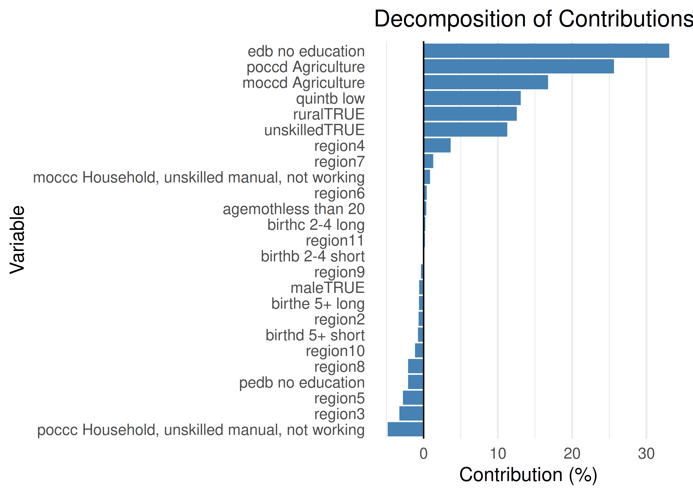
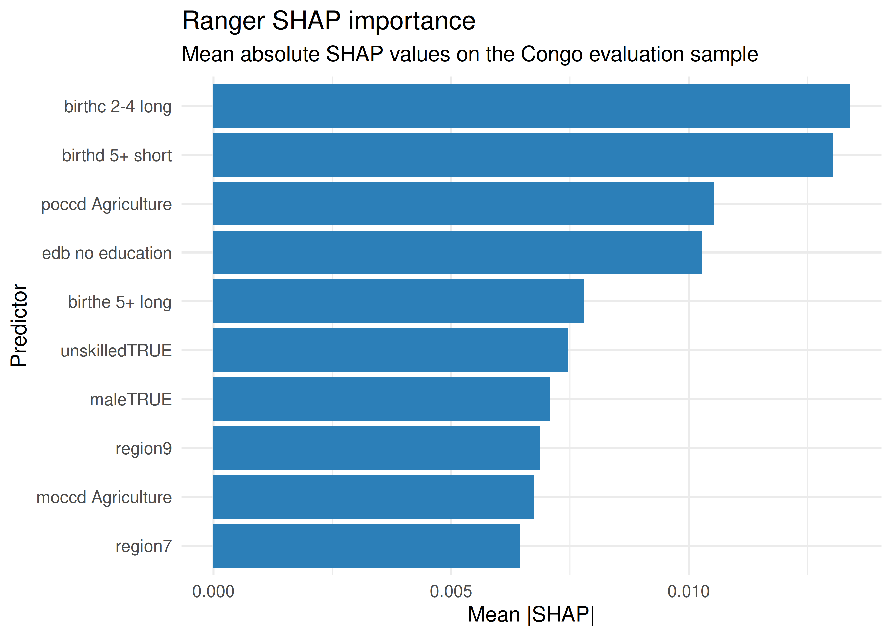
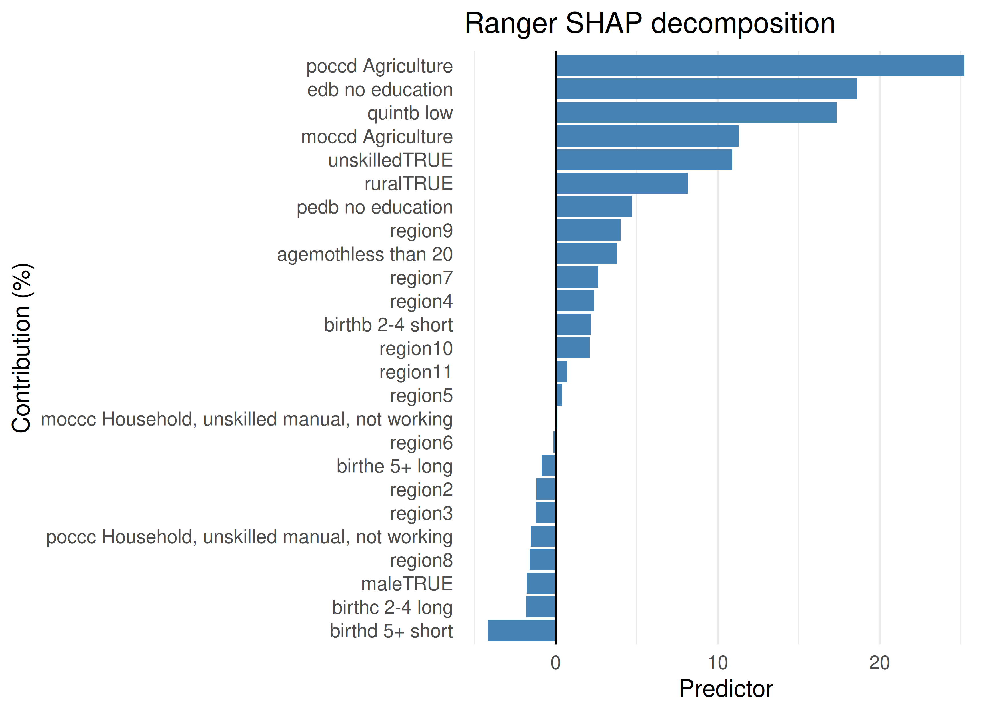
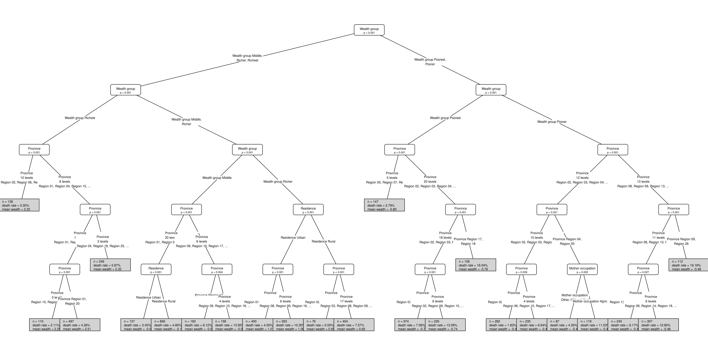
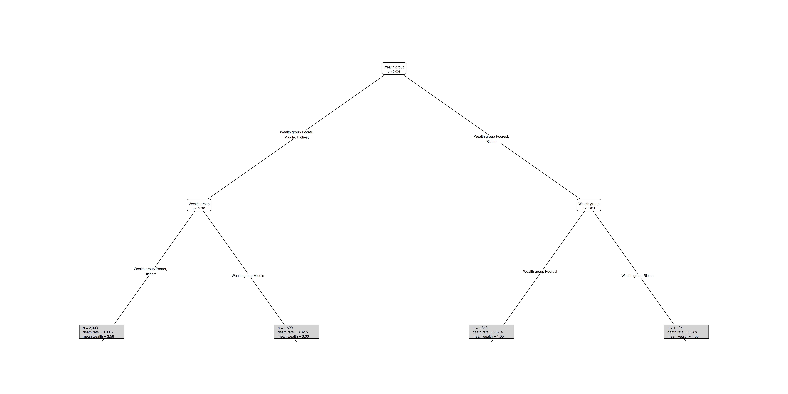

# Analysis RDC data
Niko Speybroeck
2025-09-14

<link href="RDC_analysis_v3_Hasselt_files/libs/lightable-0.0.1/lightable.css" rel="stylesheet" />

## RDC Analysis (Congo Example)

|  | Estimate | Std. Error | t value | Pr(\>\|t\|) |
|:---|---:|---:|---:|---:|
| (Intercept) | -2.83 | 0.25 | -11.45 | 0.00 |
| quintb low | 0.07 | 0.12 | 0.58 | 0.56 |
| unskilledTRUE | 0.20 | 0.13 | 1.48 | 0.14 |
| maleTRUE | 0.24 | 0.08 | 2.86 | 0.00 |
| birthb 2-4 short | 0.00 | 0.16 | -0.02 | 0.98 |
| birthc 2-4 long | -0.51 | 0.14 | -3.74 | 0.00 |
| birthd 5+ short | 0.42 | 0.19 | 2.25 | 0.03 |
| birthe 5+ long | -0.40 | 0.19 | -2.10 | 0.04 |
| agemothless than 20 | 0.03 | 0.15 | 0.22 | 0.83 |
| ruralTRUE | 0.09 | 0.14 | 0.67 | 0.51 |
| edb no education | 0.34 | 0.12 | 2.80 | 0.01 |
| pedb no education | -0.04 | 0.12 | -0.30 | 0.76 |
| moccc Household, unskilled manual, not working | -0.02 | 0.16 | -0.11 | 0.91 |
| moccd Agriculture | 0.14 | 0.18 | 0.78 | 0.44 |
| poccc Household, unskilled manual, not working | 0.24 | 0.14 | 1.64 | 0.10 |
| poccd Agriculture | 0.22 | 0.14 | 1.58 | 0.12 |
| region2 | 0.18 | 0.28 | 0.62 | 0.53 |
| region3 | -0.08 | 0.29 | -0.28 | 0.78 |
| region4 | 0.17 | 0.28 | 0.59 | 0.55 |
| region5 | -0.17 | 0.32 | -0.52 | 0.61 |
| region6 | -0.33 | 0.34 | -0.97 | 0.33 |
| region7 | 0.41 | 0.26 | 1.58 | 0.11 |
| region8 | 0.22 | 0.27 | 0.81 | 0.42 |
| region9 | 0.43 | 0.26 | 1.68 | 0.09 |
| region10 | 0.07 | 0.24 | 0.30 | 0.77 |
| region11 | 0.02 | 0.30 | 0.08 | 0.94 |

Coeffcients Table 2 in https://jech.bmj.com/content/67/8/667

|  | Contribution (%) | Contribution (Abs) | Elasticity | Concentration Index | lower 5% | upper 5% |
|:---|---:|---:|---:|---:|---:|---:|
| residual | 0.00 | 0.00 | 0.00 | NA | NA | NA |
| quintb low | 13.08 | 0.01 | -0.01 | -0.56 | -0.57 | -0.55 |
| unskilledTRUE | 11.26 | 0.01 | -0.05 | -0.13 | -0.14 | -0.12 |
| maleTRUE | -0.60 | 0.00 | -0.05 | 0.01 | -0.01 | 0.02 |
| birthb 2-4 short | -0.01 | 0.00 | 0.00 | -0.02 | -0.05 | 0.02 |
| birthc 2-4 long | 0.22 | 0.00 | 0.08 | 0.00 | -0.02 | 0.02 |
| birthd 5+ short | -0.76 | 0.00 | -0.02 | 0.02 | -0.01 | 0.06 |
| birthe 5+ long | -0.63 | 0.00 | 0.05 | -0.01 | -0.03 | 0.01 |
| agemothless than 20 | 0.37 | 0.00 | -0.01 | -0.03 | -0.05 | -0.02 |
| ruralTRUE | 12.53 | 0.01 | -0.02 | -0.29 | -0.30 | -0.28 |
| edb no education | 33.08 | 0.02 | -0.08 | -0.22 | -0.23 | -0.21 |
| pedb no education | -2.10 | 0.00 | 0.00 | -0.28 | -0.30 | -0.26 |
| moccc Household, unskilled manual, not working | 0.86 | 0.00 | 0.00 | 0.27 | 0.24 | 0.29 |
| moccd Agriculture | 16.76 | 0.01 | -0.03 | -0.27 | -0.28 | -0.26 |
| poccc Household, unskilled manual, not working | -4.83 | 0.00 | -0.01 | 0.20 | 0.17 | 0.24 |
| poccd Agriculture | 25.63 | 0.01 | -0.05 | -0.29 | -0.30 | -0.28 |
| region2 | -0.67 | 0.00 | 0.00 | 0.12 | 0.06 | 0.18 |
| region3 | -3.27 | 0.00 | 0.01 | -0.32 | -0.35 | -0.29 |
| region4 | 3.64 | 0.00 | -0.01 | -0.22 | -0.25 | -0.18 |
| region5 | -2.79 | 0.00 | 0.01 | -0.19 | -0.22 | -0.15 |
| region6 | 0.40 | 0.00 | 0.01 | 0.04 | -0.02 | 0.10 |
| region7 | 1.29 | 0.00 | -0.01 | -0.11 | -0.18 | -0.05 |
| region8 | -2.10 | 0.00 | 0.00 | 0.26 | 0.20 | 0.32 |
| region9 | -0.36 | 0.00 | -0.02 | 0.01 | -0.03 | 0.05 |
| region10 | -1.17 | 0.00 | 0.00 | 0.16 | 0.13 | 0.19 |
| region11 | 0.16 | 0.00 | 0.00 | -0.08 | -0.12 | -0.04 |

Decomposition Contributions (WDW) Table 3 in
https://jech.bmj.com/content/67/8/667

## Proof Of Concept: Ranger Model With SHAP

| feature                                        | permutation_importance |
|:-----------------------------------------------|-----------------------:|
| poccd Agriculture                              |                  0.003 |
| birthe 5+ long                                 |                  0.002 |
| moccd Agriculture                              |                  0.002 |
| agemothless than 20                            |                  0.002 |
| ruralTRUE                                      |                  0.002 |
| pedb no education                              |                  0.001 |
| birthd 5+ short                                |                  0.001 |
| birthc 2-4 long                                |                  0.001 |
| quintb low                                     |                  0.001 |
| edb no education                               |                  0.001 |
| unskilledTRUE                                  |                  0.001 |
| moccc Household, unskilled manual, not working |                  0.001 |
| region7                                        |                  0.000 |
| poccc Household, unskilled manual, not working |                  0.000 |
| birthb 2-4 short                               |                  0.000 |
| maleTRUE                                       |                  0.000 |
| region8                                        |                  0.000 |
| region6                                        |                  0.000 |
| region4                                        |                  0.000 |
| region5                                        |                  0.000 |
| region11                                       |                  0.000 |
| region3                                        |                  0.000 |
| region2                                        |                  0.000 |
| region10                                       |                  0.000 |
| region9                                        |                  0.000 |

Ranger permutation importance on the Congo dataset

| n | mean_prediction | concentration_index | shap_sum | additivity_gap | centered_rank_sum | prediction_source |
|---:|---:|---:|---:|---:|---:|:---|
| 300 | 0.11 | -0.12 | -0.12 | 0 | 0 | prediction |

Diagnostics for the ranger SHAP concentration decomposition

| feature                                        | D_k_SHAP | pct_contribution |
|:-----------------------------------------------|---------:|-----------------:|
| birthd 5+ short                                |    0.005 |            -4.20 |
| birthc 2-4 long                                |    0.002 |            -1.82 |
| maleTRUE                                       |    0.002 |            -1.81 |
| region8                                        |    0.002 |            -1.61 |
| poccc Household, unskilled manual, not working |    0.002 |            -1.54 |
| region3                                        |    0.002 |            -1.23 |
| region2                                        |    0.001 |            -1.21 |
| birthe 5+ long                                 |    0.001 |            -0.87 |
| region6                                        |    0.000 |            -0.15 |
| moccc Household, unskilled manual, not working |    0.000 |             0.11 |
| region5                                        |    0.000 |             0.39 |
| region11                                       |   -0.001 |             0.71 |
| region10                                       |   -0.003 |             2.10 |
| birthb 2-4 short                               |   -0.003 |             2.17 |
| region4                                        |   -0.003 |             2.38 |
| region7                                        |   -0.003 |             2.63 |
| agemothless than 20                            |   -0.005 |             3.78 |
| region9                                        |   -0.005 |             4.00 |
| pedb no education                              |   -0.006 |             4.70 |
| ruralTRUE                                      |   -0.010 |             8.14 |
| unskilledTRUE                                  |   -0.013 |            10.89 |
| moccd Agriculture                              |   -0.014 |            11.29 |
| quintb low                                     |   -0.021 |            17.33 |
| edb no education                               |   -0.023 |            18.61 |
| poccd Agriculture                              |   -0.031 |            25.22 |

Ranger SHAP decomposition on the Congo evaluation sample

## Add party kit

       grid_id  metric mincriterion minsplit minbucket minprob maxdepth mean_score
         <int>  <char>        <num>    <int>     <int>   <num>    <int>      <num>
    1:     219 roc_auc         0.15       50       100    0.01        5       0.58
       sd_score mean_terminal_nodes fits_completed
          <num>               <num>          <int>
    1:    0.031                  21              5

| grid_id | metric | mincriterion | minsplit | minbucket | minprob | maxdepth | mean_score | sd_score | mean_terminal_nodes | fits_completed |
|---:|:---|---:|---:|---:|---:|---:|---:|---:|---:|---:|
| 219 | roc_auc | 0.15 | 50 | 100 | 0.010 | 5 | 0.58 | 0.031 | 20.6 | 5 |
| 220 | roc_auc | 0.05 | 100 | 100 | 0.010 | 5 | 0.58 | 0.031 | 20.6 | 5 |
| 217 | roc_auc | 0.05 | 50 | 100 | 0.010 | 5 | 0.58 | 0.031 | 20.6 | 5 |
| 221 | roc_auc | 0.09 | 100 | 100 | 0.010 | 5 | 0.58 | 0.031 | 20.6 | 5 |
| 225 | roc_auc | 0.15 | 200 | 100 | 0.010 | 5 | 0.58 | 0.031 | 20.6 | 5 |
| 197 | roc_auc | 0.09 | 200 | 100 | 0.005 | 5 | 0.58 | 0.031 | 20.6 | 5 |
| 218 | roc_auc | 0.09 | 50 | 100 | 0.010 | 5 | 0.58 | 0.031 | 20.6 | 5 |
| 222 | roc_auc | 0.15 | 100 | 100 | 0.010 | 5 | 0.58 | 0.031 | 20.6 | 5 |
| 170 | roc_auc | 0.09 | 200 | 100 | 0.001 | 5 | 0.58 | 0.031 | 20.6 | 5 |
| 169 | roc_auc | 0.05 | 200 | 100 | 0.001 | 5 | 0.58 | 0.031 | 20.6 | 5 |
| 194 | roc_auc | 0.09 | 100 | 100 | 0.005 | 5 | 0.58 | 0.031 | 20.6 | 5 |
| 193 | roc_auc | 0.05 | 100 | 100 | 0.005 | 5 | 0.58 | 0.031 | 20.6 | 5 |
| 196 | roc_auc | 0.05 | 200 | 100 | 0.005 | 5 | 0.58 | 0.031 | 20.6 | 5 |
| 198 | roc_auc | 0.15 | 200 | 100 | 0.005 | 5 | 0.58 | 0.031 | 20.6 | 5 |
| 191 | roc_auc | 0.09 | 50 | 100 | 0.005 | 5 | 0.58 | 0.031 | 20.6 | 5 |
| 224 | roc_auc | 0.09 | 200 | 100 | 0.010 | 5 | 0.58 | 0.031 | 20.6 | 5 |
| 166 | roc_auc | 0.05 | 100 | 100 | 0.001 | 5 | 0.58 | 0.031 | 20.6 | 5 |
| 195 | roc_auc | 0.15 | 100 | 100 | 0.005 | 5 | 0.58 | 0.031 | 20.6 | 5 |
| 168 | roc_auc | 0.15 | 100 | 100 | 0.001 | 5 | 0.58 | 0.031 | 20.6 | 5 |
| 171 | roc_auc | 0.15 | 200 | 100 | 0.001 | 5 | 0.58 | 0.031 | 20.6 | 5 |
| 192 | roc_auc | 0.15 | 50 | 100 | 0.005 | 5 | 0.58 | 0.031 | 20.6 | 5 |
| 167 | roc_auc | 0.09 | 100 | 100 | 0.001 | 5 | 0.58 | 0.031 | 20.6 | 5 |
| 164 | roc_auc | 0.09 | 50 | 100 | 0.001 | 5 | 0.58 | 0.031 | 20.6 | 5 |
| 163 | roc_auc | 0.05 | 50 | 100 | 0.001 | 5 | 0.58 | 0.031 | 20.6 | 5 |
| 223 | roc_auc | 0.05 | 200 | 100 | 0.010 | 5 | 0.58 | 0.031 | 20.6 | 5 |
| 190 | roc_auc | 0.05 | 50 | 100 | 0.005 | 5 | 0.58 | 0.031 | 20.6 | 5 |
| 165 | roc_auc | 0.15 | 50 | 100 | 0.001 | 5 | 0.58 | 0.031 | 20.6 | 5 |
| 172 | roc_auc | 0.05 | 50 | 200 | 0.001 | 5 | 0.57 | 0.031 | 19.0 | 5 |
| 176 | roc_auc | 0.09 | 100 | 200 | 0.001 | 5 | 0.57 | 0.031 | 19.0 | 5 |
| 179 | roc_auc | 0.09 | 200 | 200 | 0.001 | 5 | 0.57 | 0.031 | 19.0 | 5 |
| 202 | roc_auc | 0.05 | 100 | 200 | 0.005 | 5 | 0.57 | 0.031 | 19.0 | 5 |
| 173 | roc_auc | 0.09 | 50 | 200 | 0.001 | 5 | 0.57 | 0.031 | 19.0 | 5 |
| 228 | roc_auc | 0.15 | 50 | 200 | 0.010 | 5 | 0.57 | 0.031 | 19.0 | 5 |
| 234 | roc_auc | 0.15 | 200 | 200 | 0.010 | 5 | 0.57 | 0.031 | 19.0 | 5 |
| 174 | roc_auc | 0.15 | 50 | 200 | 0.001 | 5 | 0.57 | 0.031 | 19.0 | 5 |
| 177 | roc_auc | 0.15 | 100 | 200 | 0.001 | 5 | 0.57 | 0.031 | 19.0 | 5 |
| 207 | roc_auc | 0.15 | 200 | 200 | 0.005 | 5 | 0.57 | 0.031 | 19.0 | 5 |
| 226 | roc_auc | 0.05 | 50 | 200 | 0.010 | 5 | 0.57 | 0.031 | 19.0 | 5 |
| 180 | roc_auc | 0.15 | 200 | 200 | 0.001 | 5 | 0.57 | 0.031 | 19.0 | 5 |
| 230 | roc_auc | 0.09 | 100 | 200 | 0.010 | 5 | 0.57 | 0.031 | 19.0 | 5 |
| 203 | roc_auc | 0.09 | 100 | 200 | 0.005 | 5 | 0.57 | 0.031 | 19.0 | 5 |
| 206 | roc_auc | 0.09 | 200 | 200 | 0.005 | 5 | 0.57 | 0.031 | 19.0 | 5 |
| 229 | roc_auc | 0.05 | 100 | 200 | 0.010 | 5 | 0.57 | 0.031 | 19.0 | 5 |
| 199 | roc_auc | 0.05 | 50 | 200 | 0.005 | 5 | 0.57 | 0.031 | 19.0 | 5 |
| 200 | roc_auc | 0.09 | 50 | 200 | 0.005 | 5 | 0.57 | 0.031 | 19.0 | 5 |
| 201 | roc_auc | 0.15 | 50 | 200 | 0.005 | 5 | 0.57 | 0.031 | 19.0 | 5 |
| 205 | roc_auc | 0.05 | 200 | 200 | 0.005 | 5 | 0.57 | 0.031 | 19.0 | 5 |
| 231 | roc_auc | 0.15 | 100 | 200 | 0.010 | 5 | 0.57 | 0.031 | 19.0 | 5 |
| 227 | roc_auc | 0.09 | 50 | 200 | 0.010 | 5 | 0.57 | 0.031 | 19.0 | 5 |
| 204 | roc_auc | 0.15 | 100 | 200 | 0.005 | 5 | 0.57 | 0.031 | 19.0 | 5 |
| 232 | roc_auc | 0.05 | 200 | 200 | 0.010 | 5 | 0.57 | 0.031 | 19.0 | 5 |
| 233 | roc_auc | 0.09 | 200 | 200 | 0.010 | 5 | 0.57 | 0.031 | 19.0 | 5 |
| 178 | roc_auc | 0.05 | 200 | 200 | 0.001 | 5 | 0.57 | 0.031 | 19.0 | 5 |
| 175 | roc_auc | 0.05 | 100 | 200 | 0.001 | 5 | 0.57 | 0.031 | 19.0 | 5 |
| 33 | roc_auc | 0.15 | 100 | 100 | 0.005 | 3 | 0.55 | 0.027 | 7.6 | 5 |
| 1 | roc_auc | 0.05 | 50 | 100 | 0.001 | 3 | 0.55 | 0.027 | 7.6 | 5 |
| 28 | roc_auc | 0.05 | 50 | 100 | 0.005 | 3 | 0.55 | 0.027 | 7.6 | 5 |
| 62 | roc_auc | 0.09 | 200 | 100 | 0.010 | 3 | 0.55 | 0.027 | 7.6 | 5 |
| 2 | roc_auc | 0.09 | 50 | 100 | 0.001 | 3 | 0.55 | 0.027 | 7.6 | 5 |
| 32 | roc_auc | 0.09 | 100 | 100 | 0.005 | 3 | 0.55 | 0.027 | 7.6 | 5 |
| 58 | roc_auc | 0.05 | 100 | 100 | 0.010 | 3 | 0.55 | 0.027 | 7.6 | 5 |
| 60 | roc_auc | 0.15 | 100 | 100 | 0.010 | 3 | 0.55 | 0.027 | 7.6 | 5 |
| 61 | roc_auc | 0.05 | 200 | 100 | 0.010 | 3 | 0.55 | 0.027 | 7.6 | 5 |
| 63 | roc_auc | 0.15 | 200 | 100 | 0.010 | 3 | 0.55 | 0.027 | 7.6 | 5 |
| 3 | roc_auc | 0.15 | 50 | 100 | 0.001 | 3 | 0.55 | 0.027 | 7.6 | 5 |
| 4 | roc_auc | 0.05 | 100 | 100 | 0.001 | 3 | 0.55 | 0.027 | 7.6 | 5 |
| 5 | roc_auc | 0.09 | 100 | 100 | 0.001 | 3 | 0.55 | 0.027 | 7.6 | 5 |
| 6 | roc_auc | 0.15 | 100 | 100 | 0.001 | 3 | 0.55 | 0.027 | 7.6 | 5 |
| 7 | roc_auc | 0.05 | 200 | 100 | 0.001 | 3 | 0.55 | 0.027 | 7.6 | 5 |
| 8 | roc_auc | 0.09 | 200 | 100 | 0.001 | 3 | 0.55 | 0.027 | 7.6 | 5 |
| 9 | roc_auc | 0.15 | 200 | 100 | 0.001 | 3 | 0.55 | 0.027 | 7.6 | 5 |
| 29 | roc_auc | 0.09 | 50 | 100 | 0.005 | 3 | 0.55 | 0.027 | 7.6 | 5 |
| 30 | roc_auc | 0.15 | 50 | 100 | 0.005 | 3 | 0.55 | 0.027 | 7.6 | 5 |
| 31 | roc_auc | 0.05 | 100 | 100 | 0.005 | 3 | 0.55 | 0.027 | 7.6 | 5 |
| 34 | roc_auc | 0.05 | 200 | 100 | 0.005 | 3 | 0.55 | 0.027 | 7.6 | 5 |
| 35 | roc_auc | 0.09 | 200 | 100 | 0.005 | 3 | 0.55 | 0.027 | 7.6 | 5 |
| 36 | roc_auc | 0.15 | 200 | 100 | 0.005 | 3 | 0.55 | 0.027 | 7.6 | 5 |
| 55 | roc_auc | 0.05 | 50 | 100 | 0.010 | 3 | 0.55 | 0.027 | 7.6 | 5 |
| 56 | roc_auc | 0.09 | 50 | 100 | 0.010 | 3 | 0.55 | 0.027 | 7.6 | 5 |
| 57 | roc_auc | 0.15 | 50 | 100 | 0.010 | 3 | 0.55 | 0.027 | 7.6 | 5 |
| 59 | roc_auc | 0.09 | 100 | 100 | 0.010 | 3 | 0.55 | 0.027 | 7.6 | 5 |
| 211 | roc_auc | 0.05 | 100 | 300 | 0.005 | 5 | 0.55 | 0.030 | 14.4 | 5 |
| 212 | roc_auc | 0.09 | 100 | 300 | 0.005 | 5 | 0.55 | 0.030 | 14.4 | 5 |
| 208 | roc_auc | 0.05 | 50 | 300 | 0.005 | 5 | 0.55 | 0.030 | 14.4 | 5 |
| 216 | roc_auc | 0.15 | 200 | 300 | 0.005 | 5 | 0.55 | 0.030 | 14.4 | 5 |
| 235 | roc_auc | 0.05 | 50 | 300 | 0.010 | 5 | 0.55 | 0.030 | 14.4 | 5 |
| 238 | roc_auc | 0.05 | 100 | 300 | 0.010 | 5 | 0.55 | 0.030 | 14.4 | 5 |
| 243 | roc_auc | 0.15 | 200 | 300 | 0.010 | 5 | 0.55 | 0.030 | 14.4 | 5 |
| 241 | roc_auc | 0.05 | 200 | 300 | 0.010 | 5 | 0.55 | 0.030 | 14.4 | 5 |
| 184 | roc_auc | 0.05 | 100 | 300 | 0.001 | 5 | 0.55 | 0.030 | 14.4 | 5 |
| 188 | roc_auc | 0.09 | 200 | 300 | 0.001 | 5 | 0.55 | 0.030 | 14.4 | 5 |
| 239 | roc_auc | 0.09 | 100 | 300 | 0.010 | 5 | 0.55 | 0.030 | 14.4 | 5 |
| 240 | roc_auc | 0.15 | 100 | 300 | 0.010 | 5 | 0.55 | 0.030 | 14.4 | 5 |
| 181 | roc_auc | 0.05 | 50 | 300 | 0.001 | 5 | 0.55 | 0.030 | 14.4 | 5 |
| 186 | roc_auc | 0.15 | 100 | 300 | 0.001 | 5 | 0.55 | 0.030 | 14.4 | 5 |
| 189 | roc_auc | 0.15 | 200 | 300 | 0.001 | 5 | 0.55 | 0.030 | 14.4 | 5 |
| 236 | roc_auc | 0.09 | 50 | 300 | 0.010 | 5 | 0.55 | 0.030 | 14.4 | 5 |
| 183 | roc_auc | 0.15 | 50 | 300 | 0.001 | 5 | 0.55 | 0.030 | 14.4 | 5 |
| 187 | roc_auc | 0.05 | 200 | 300 | 0.001 | 5 | 0.55 | 0.030 | 14.4 | 5 |
| 213 | roc_auc | 0.15 | 100 | 300 | 0.005 | 5 | 0.55 | 0.030 | 14.4 | 5 |
| 185 | roc_auc | 0.09 | 100 | 300 | 0.001 | 5 | 0.55 | 0.030 | 14.4 | 5 |
| 214 | roc_auc | 0.05 | 200 | 300 | 0.005 | 5 | 0.55 | 0.030 | 14.4 | 5 |
| 210 | roc_auc | 0.15 | 50 | 300 | 0.005 | 5 | 0.55 | 0.030 | 14.4 | 5 |
| 242 | roc_auc | 0.09 | 200 | 300 | 0.010 | 5 | 0.55 | 0.030 | 14.4 | 5 |
| 237 | roc_auc | 0.15 | 50 | 300 | 0.010 | 5 | 0.55 | 0.030 | 14.4 | 5 |
| 209 | roc_auc | 0.09 | 50 | 300 | 0.005 | 5 | 0.55 | 0.030 | 14.4 | 5 |
| 215 | roc_auc | 0.09 | 200 | 300 | 0.005 | 5 | 0.55 | 0.030 | 14.4 | 5 |
| 182 | roc_auc | 0.09 | 50 | 300 | 0.001 | 5 | 0.55 | 0.030 | 14.4 | 5 |
| 20 | roc_auc | 0.09 | 50 | 300 | 0.001 | 3 | 0.54 | 0.050 | 7.6 | 5 |
| 51 | roc_auc | 0.15 | 100 | 300 | 0.005 | 3 | 0.54 | 0.050 | 7.6 | 5 |
| 53 | roc_auc | 0.09 | 200 | 300 | 0.005 | 3 | 0.54 | 0.050 | 7.6 | 5 |
| 73 | roc_auc | 0.05 | 50 | 300 | 0.010 | 3 | 0.54 | 0.050 | 7.6 | 5 |
| 80 | roc_auc | 0.09 | 200 | 300 | 0.010 | 3 | 0.54 | 0.050 | 7.6 | 5 |
| 23 | roc_auc | 0.09 | 100 | 300 | 0.001 | 3 | 0.54 | 0.050 | 7.6 | 5 |
| 25 | roc_auc | 0.05 | 200 | 300 | 0.001 | 3 | 0.54 | 0.050 | 7.6 | 5 |
| 26 | roc_auc | 0.09 | 200 | 300 | 0.001 | 3 | 0.54 | 0.050 | 7.6 | 5 |
| 47 | roc_auc | 0.09 | 50 | 300 | 0.005 | 3 | 0.54 | 0.050 | 7.6 | 5 |
| 50 | roc_auc | 0.09 | 100 | 300 | 0.005 | 3 | 0.54 | 0.050 | 7.6 | 5 |
| 52 | roc_auc | 0.05 | 200 | 300 | 0.005 | 3 | 0.54 | 0.050 | 7.6 | 5 |
| 74 | roc_auc | 0.09 | 50 | 300 | 0.010 | 3 | 0.54 | 0.050 | 7.6 | 5 |
| 76 | roc_auc | 0.05 | 100 | 300 | 0.010 | 3 | 0.54 | 0.050 | 7.6 | 5 |
| 78 | roc_auc | 0.15 | 100 | 300 | 0.010 | 3 | 0.54 | 0.050 | 7.6 | 5 |
| 79 | roc_auc | 0.05 | 200 | 300 | 0.010 | 3 | 0.54 | 0.050 | 7.6 | 5 |
| 19 | roc_auc | 0.05 | 50 | 300 | 0.001 | 3 | 0.54 | 0.050 | 7.6 | 5 |
| 21 | roc_auc | 0.15 | 50 | 300 | 0.001 | 3 | 0.54 | 0.050 | 7.6 | 5 |
| 77 | roc_auc | 0.09 | 100 | 300 | 0.010 | 3 | 0.54 | 0.050 | 7.6 | 5 |
| 27 | roc_auc | 0.15 | 200 | 300 | 0.001 | 3 | 0.54 | 0.050 | 7.6 | 5 |
| 48 | roc_auc | 0.15 | 50 | 300 | 0.005 | 3 | 0.54 | 0.050 | 7.6 | 5 |
| 49 | roc_auc | 0.05 | 100 | 300 | 0.005 | 3 | 0.54 | 0.050 | 7.6 | 5 |
| 54 | roc_auc | 0.15 | 200 | 300 | 0.005 | 3 | 0.54 | 0.050 | 7.6 | 5 |
| 81 | roc_auc | 0.15 | 200 | 300 | 0.010 | 3 | 0.54 | 0.050 | 7.6 | 5 |
| 22 | roc_auc | 0.05 | 100 | 300 | 0.001 | 3 | 0.54 | 0.050 | 7.6 | 5 |
| 75 | roc_auc | 0.15 | 50 | 300 | 0.010 | 3 | 0.54 | 0.050 | 7.6 | 5 |
| 24 | roc_auc | 0.15 | 100 | 300 | 0.001 | 3 | 0.54 | 0.050 | 7.6 | 5 |
| 46 | roc_auc | 0.05 | 50 | 300 | 0.005 | 3 | 0.54 | 0.050 | 7.6 | 5 |
| 138 | roc_auc | 0.15 | 50 | 100 | 0.010 | 4 | 0.54 | 0.038 | 13.2 | 5 |
| 140 | roc_auc | 0.09 | 100 | 100 | 0.010 | 4 | 0.54 | 0.038 | 13.2 | 5 |
| 86 | roc_auc | 0.09 | 100 | 100 | 0.001 | 4 | 0.54 | 0.038 | 13.2 | 5 |
| 90 | roc_auc | 0.15 | 200 | 100 | 0.001 | 4 | 0.54 | 0.038 | 13.2 | 5 |
| 143 | roc_auc | 0.09 | 200 | 100 | 0.010 | 4 | 0.54 | 0.038 | 13.2 | 5 |
| 82 | roc_auc | 0.05 | 50 | 100 | 0.001 | 4 | 0.54 | 0.038 | 13.2 | 5 |
| 84 | roc_auc | 0.15 | 50 | 100 | 0.001 | 4 | 0.54 | 0.038 | 13.2 | 5 |
| 114 | roc_auc | 0.15 | 100 | 100 | 0.005 | 4 | 0.54 | 0.038 | 13.2 | 5 |
| 117 | roc_auc | 0.15 | 200 | 100 | 0.005 | 4 | 0.54 | 0.038 | 13.2 | 5 |
| 137 | roc_auc | 0.09 | 50 | 100 | 0.010 | 4 | 0.54 | 0.038 | 13.2 | 5 |
| 83 | roc_auc | 0.09 | 50 | 100 | 0.001 | 4 | 0.54 | 0.038 | 13.2 | 5 |
| 85 | roc_auc | 0.05 | 100 | 100 | 0.001 | 4 | 0.54 | 0.038 | 13.2 | 5 |
| 89 | roc_auc | 0.09 | 200 | 100 | 0.001 | 4 | 0.54 | 0.038 | 13.2 | 5 |
| 110 | roc_auc | 0.09 | 50 | 100 | 0.005 | 4 | 0.54 | 0.038 | 13.2 | 5 |
| 115 | roc_auc | 0.05 | 200 | 100 | 0.005 | 4 | 0.54 | 0.038 | 13.2 | 5 |
| 141 | roc_auc | 0.15 | 100 | 100 | 0.010 | 4 | 0.54 | 0.038 | 13.2 | 5 |
| 88 | roc_auc | 0.05 | 200 | 100 | 0.001 | 4 | 0.54 | 0.038 | 13.2 | 5 |
| 112 | roc_auc | 0.05 | 100 | 100 | 0.005 | 4 | 0.54 | 0.038 | 13.2 | 5 |
| 87 | roc_auc | 0.15 | 100 | 100 | 0.001 | 4 | 0.54 | 0.038 | 13.2 | 5 |
| 111 | roc_auc | 0.15 | 50 | 100 | 0.005 | 4 | 0.54 | 0.038 | 13.2 | 5 |
| 113 | roc_auc | 0.09 | 100 | 100 | 0.005 | 4 | 0.54 | 0.038 | 13.2 | 5 |
| 116 | roc_auc | 0.09 | 200 | 100 | 0.005 | 4 | 0.54 | 0.038 | 13.2 | 5 |
| 136 | roc_auc | 0.05 | 50 | 100 | 0.010 | 4 | 0.54 | 0.038 | 13.2 | 5 |
| 139 | roc_auc | 0.05 | 100 | 100 | 0.010 | 4 | 0.54 | 0.038 | 13.2 | 5 |
| 144 | roc_auc | 0.15 | 200 | 100 | 0.010 | 4 | 0.54 | 0.038 | 13.2 | 5 |
| 109 | roc_auc | 0.05 | 50 | 100 | 0.005 | 4 | 0.54 | 0.038 | 13.2 | 5 |
| 142 | roc_auc | 0.05 | 200 | 100 | 0.010 | 4 | 0.54 | 0.038 | 13.2 | 5 |
| 100 | roc_auc | 0.05 | 50 | 300 | 0.001 | 4 | 0.54 | 0.034 | 11.6 | 5 |
| 103 | roc_auc | 0.05 | 100 | 300 | 0.001 | 4 | 0.54 | 0.034 | 11.6 | 5 |
| 130 | roc_auc | 0.05 | 100 | 300 | 0.005 | 4 | 0.54 | 0.034 | 11.6 | 5 |
| 154 | roc_auc | 0.05 | 50 | 300 | 0.010 | 4 | 0.54 | 0.034 | 11.6 | 5 |
| 157 | roc_auc | 0.05 | 100 | 300 | 0.010 | 4 | 0.54 | 0.034 | 11.6 | 5 |
| 129 | roc_auc | 0.15 | 50 | 300 | 0.005 | 4 | 0.54 | 0.034 | 11.6 | 5 |
| 132 | roc_auc | 0.15 | 100 | 300 | 0.005 | 4 | 0.54 | 0.034 | 11.6 | 5 |
| 133 | roc_auc | 0.05 | 200 | 300 | 0.005 | 4 | 0.54 | 0.034 | 11.6 | 5 |
| 155 | roc_auc | 0.09 | 50 | 300 | 0.010 | 4 | 0.54 | 0.034 | 11.6 | 5 |
| 159 | roc_auc | 0.15 | 100 | 300 | 0.010 | 4 | 0.54 | 0.034 | 11.6 | 5 |
| 160 | roc_auc | 0.05 | 200 | 300 | 0.010 | 4 | 0.54 | 0.034 | 11.6 | 5 |
| 101 | roc_auc | 0.09 | 50 | 300 | 0.001 | 4 | 0.54 | 0.034 | 11.6 | 5 |
| 104 | roc_auc | 0.09 | 100 | 300 | 0.001 | 4 | 0.54 | 0.034 | 11.6 | 5 |
| 105 | roc_auc | 0.15 | 100 | 300 | 0.001 | 4 | 0.54 | 0.034 | 11.6 | 5 |
| 106 | roc_auc | 0.05 | 200 | 300 | 0.001 | 4 | 0.54 | 0.034 | 11.6 | 5 |
| 108 | roc_auc | 0.15 | 200 | 300 | 0.001 | 4 | 0.54 | 0.034 | 11.6 | 5 |
| 127 | roc_auc | 0.05 | 50 | 300 | 0.005 | 4 | 0.54 | 0.034 | 11.6 | 5 |
| 128 | roc_auc | 0.09 | 50 | 300 | 0.005 | 4 | 0.54 | 0.034 | 11.6 | 5 |
| 131 | roc_auc | 0.09 | 100 | 300 | 0.005 | 4 | 0.54 | 0.034 | 11.6 | 5 |
| 134 | roc_auc | 0.09 | 200 | 300 | 0.005 | 4 | 0.54 | 0.034 | 11.6 | 5 |
| 156 | roc_auc | 0.15 | 50 | 300 | 0.010 | 4 | 0.54 | 0.034 | 11.6 | 5 |
| 102 | roc_auc | 0.15 | 50 | 300 | 0.001 | 4 | 0.54 | 0.034 | 11.6 | 5 |
| 107 | roc_auc | 0.09 | 200 | 300 | 0.001 | 4 | 0.54 | 0.034 | 11.6 | 5 |
| 135 | roc_auc | 0.15 | 200 | 300 | 0.005 | 4 | 0.54 | 0.034 | 11.6 | 5 |
| 158 | roc_auc | 0.09 | 100 | 300 | 0.010 | 4 | 0.54 | 0.034 | 11.6 | 5 |
| 162 | roc_auc | 0.15 | 200 | 300 | 0.010 | 4 | 0.54 | 0.034 | 11.6 | 5 |
| 161 | roc_auc | 0.09 | 200 | 300 | 0.010 | 4 | 0.54 | 0.034 | 11.6 | 5 |
| 11 | roc_auc | 0.09 | 50 | 200 | 0.001 | 3 | 0.54 | 0.044 | 7.6 | 5 |
| 12 | roc_auc | 0.15 | 50 | 200 | 0.001 | 3 | 0.54 | 0.044 | 7.6 | 5 |
| 37 | roc_auc | 0.05 | 50 | 200 | 0.005 | 3 | 0.54 | 0.044 | 7.6 | 5 |
| 38 | roc_auc | 0.09 | 50 | 200 | 0.005 | 3 | 0.54 | 0.044 | 7.6 | 5 |
| 39 | roc_auc | 0.15 | 50 | 200 | 0.005 | 3 | 0.54 | 0.044 | 7.6 | 5 |
| 43 | roc_auc | 0.05 | 200 | 200 | 0.005 | 3 | 0.54 | 0.044 | 7.6 | 5 |
| 67 | roc_auc | 0.05 | 100 | 200 | 0.010 | 3 | 0.54 | 0.044 | 7.6 | 5 |
| 69 | roc_auc | 0.15 | 100 | 200 | 0.010 | 3 | 0.54 | 0.044 | 7.6 | 5 |
| 70 | roc_auc | 0.05 | 200 | 200 | 0.010 | 3 | 0.54 | 0.044 | 7.6 | 5 |
| 71 | roc_auc | 0.09 | 200 | 200 | 0.010 | 3 | 0.54 | 0.044 | 7.6 | 5 |
| 14 | roc_auc | 0.09 | 100 | 200 | 0.001 | 3 | 0.54 | 0.044 | 7.6 | 5 |
| 16 | roc_auc | 0.05 | 200 | 200 | 0.001 | 3 | 0.54 | 0.044 | 7.6 | 5 |
| 17 | roc_auc | 0.09 | 200 | 200 | 0.001 | 3 | 0.54 | 0.044 | 7.6 | 5 |
| 18 | roc_auc | 0.15 | 200 | 200 | 0.001 | 3 | 0.54 | 0.044 | 7.6 | 5 |
| 40 | roc_auc | 0.05 | 100 | 200 | 0.005 | 3 | 0.54 | 0.044 | 7.6 | 5 |
| 42 | roc_auc | 0.15 | 100 | 200 | 0.005 | 3 | 0.54 | 0.044 | 7.6 | 5 |
| 44 | roc_auc | 0.09 | 200 | 200 | 0.005 | 3 | 0.54 | 0.044 | 7.6 | 5 |
| 65 | roc_auc | 0.09 | 50 | 200 | 0.010 | 3 | 0.54 | 0.044 | 7.6 | 5 |
| 66 | roc_auc | 0.15 | 50 | 200 | 0.010 | 3 | 0.54 | 0.044 | 7.6 | 5 |
| 41 | roc_auc | 0.09 | 100 | 200 | 0.005 | 3 | 0.54 | 0.044 | 7.6 | 5 |
| 45 | roc_auc | 0.15 | 200 | 200 | 0.005 | 3 | 0.54 | 0.044 | 7.6 | 5 |
| 10 | roc_auc | 0.05 | 50 | 200 | 0.001 | 3 | 0.54 | 0.044 | 7.6 | 5 |
| 15 | roc_auc | 0.15 | 100 | 200 | 0.001 | 3 | 0.54 | 0.044 | 7.6 | 5 |
| 64 | roc_auc | 0.05 | 50 | 200 | 0.010 | 3 | 0.54 | 0.044 | 7.6 | 5 |
| 68 | roc_auc | 0.09 | 100 | 200 | 0.010 | 3 | 0.54 | 0.044 | 7.6 | 5 |
| 72 | roc_auc | 0.15 | 200 | 200 | 0.010 | 3 | 0.54 | 0.044 | 7.6 | 5 |
| 13 | roc_auc | 0.05 | 100 | 200 | 0.001 | 3 | 0.54 | 0.044 | 7.6 | 5 |
| 99 | roc_auc | 0.15 | 200 | 200 | 0.001 | 4 | 0.54 | 0.037 | 13.4 | 5 |
| 95 | roc_auc | 0.09 | 100 | 200 | 0.001 | 4 | 0.54 | 0.037 | 13.4 | 5 |
| 124 | roc_auc | 0.05 | 200 | 200 | 0.005 | 4 | 0.54 | 0.037 | 13.4 | 5 |
| 93 | roc_auc | 0.15 | 50 | 200 | 0.001 | 4 | 0.54 | 0.037 | 13.4 | 5 |
| 121 | roc_auc | 0.05 | 100 | 200 | 0.005 | 4 | 0.54 | 0.037 | 13.4 | 5 |
| 91 | roc_auc | 0.05 | 50 | 200 | 0.001 | 4 | 0.54 | 0.037 | 13.4 | 5 |
| 146 | roc_auc | 0.09 | 50 | 200 | 0.010 | 4 | 0.54 | 0.037 | 13.4 | 5 |
| 147 | roc_auc | 0.15 | 50 | 200 | 0.010 | 4 | 0.54 | 0.037 | 13.4 | 5 |
| 151 | roc_auc | 0.05 | 200 | 200 | 0.010 | 4 | 0.54 | 0.037 | 13.4 | 5 |
| 152 | roc_auc | 0.09 | 200 | 200 | 0.010 | 4 | 0.54 | 0.037 | 13.4 | 5 |
| 96 | roc_auc | 0.15 | 100 | 200 | 0.001 | 4 | 0.54 | 0.037 | 13.4 | 5 |
| 97 | roc_auc | 0.05 | 200 | 200 | 0.001 | 4 | 0.54 | 0.037 | 13.4 | 5 |
| 120 | roc_auc | 0.15 | 50 | 200 | 0.005 | 4 | 0.54 | 0.037 | 13.4 | 5 |
| 122 | roc_auc | 0.09 | 100 | 200 | 0.005 | 4 | 0.54 | 0.037 | 13.4 | 5 |
| 126 | roc_auc | 0.15 | 200 | 200 | 0.005 | 4 | 0.54 | 0.037 | 13.4 | 5 |
| 92 | roc_auc | 0.09 | 50 | 200 | 0.001 | 4 | 0.54 | 0.037 | 13.4 | 5 |
| 94 | roc_auc | 0.05 | 100 | 200 | 0.001 | 4 | 0.54 | 0.037 | 13.4 | 5 |
| 125 | roc_auc | 0.09 | 200 | 200 | 0.005 | 4 | 0.54 | 0.037 | 13.4 | 5 |
| 145 | roc_auc | 0.05 | 50 | 200 | 0.010 | 4 | 0.54 | 0.037 | 13.4 | 5 |
| 150 | roc_auc | 0.15 | 100 | 200 | 0.010 | 4 | 0.54 | 0.037 | 13.4 | 5 |
| 153 | roc_auc | 0.15 | 200 | 200 | 0.010 | 4 | 0.54 | 0.037 | 13.4 | 5 |
| 123 | roc_auc | 0.15 | 100 | 200 | 0.005 | 4 | 0.54 | 0.037 | 13.4 | 5 |
| 119 | roc_auc | 0.09 | 50 | 200 | 0.005 | 4 | 0.54 | 0.037 | 13.4 | 5 |
| 149 | roc_auc | 0.09 | 100 | 200 | 0.010 | 4 | 0.54 | 0.037 | 13.4 | 5 |
| 98 | roc_auc | 0.09 | 200 | 200 | 0.001 | 4 | 0.54 | 0.037 | 13.4 | 5 |
| 118 | roc_auc | 0.05 | 50 | 200 | 0.005 | 4 | 0.54 | 0.037 | 13.4 | 5 |
| 148 | roc_auc | 0.05 | 100 | 200 | 0.010 | 4 | 0.54 | 0.037 | 13.4 | 5 |

Cross-validated tuning summary for the DRC v8 CI-based partykit tree

## kenya analysis

       grid_id  metric mincriterion minsplit minbucket minprob maxdepth mean_score
         <int>  <char>        <num>    <int>     <int>   <num>    <int>      <num>
    1:       1 roc_auc         0.05      100       100   0.001        2       0.49
       sd_score mean_terminal_nodes fits_completed
          <num>               <num>          <int>
    1:    0.019                 3.6              5

| grid_id | metric | mincriterion | minsplit | minbucket | minprob | maxdepth | mean_score | sd_score | mean_terminal_nodes | fits_completed |
|---:|:---|---:|---:|---:|---:|---:|---:|---:|---:|---:|
| 1 | roc_auc | 0.05 | 100 | 100 | 0.001 | 2 | 0.49 | 0.019 | 3.6 | 5 |
| 2 | roc_auc | 0.09 | 100 | 100 | 0.001 | 2 | 0.49 | 0.019 | 3.6 | 5 |
| 3 | roc_auc | 0.15 | 100 | 100 | 0.001 | 2 | 0.49 | 0.019 | 3.6 | 5 |
| 4 | roc_auc | 0.05 | 200 | 100 | 0.001 | 2 | 0.49 | 0.019 | 3.6 | 5 |
| 5 | roc_auc | 0.09 | 200 | 100 | 0.001 | 2 | 0.49 | 0.019 | 3.6 | 5 |
| 6 | roc_auc | 0.15 | 200 | 100 | 0.001 | 2 | 0.49 | 0.019 | 3.6 | 5 |
| 7 | roc_auc | 0.05 | 100 | 200 | 0.001 | 2 | 0.49 | 0.019 | 3.6 | 5 |
| 8 | roc_auc | 0.09 | 100 | 200 | 0.001 | 2 | 0.49 | 0.019 | 3.6 | 5 |
| 9 | roc_auc | 0.15 | 100 | 200 | 0.001 | 2 | 0.49 | 0.019 | 3.6 | 5 |
| 10 | roc_auc | 0.05 | 200 | 200 | 0.001 | 2 | 0.49 | 0.019 | 3.6 | 5 |
| 11 | roc_auc | 0.09 | 200 | 200 | 0.001 | 2 | 0.49 | 0.019 | 3.6 | 5 |
| 12 | roc_auc | 0.15 | 200 | 200 | 0.001 | 2 | 0.49 | 0.019 | 3.6 | 5 |
| 13 | roc_auc | 0.05 | 100 | 100 | 0.005 | 2 | 0.49 | 0.019 | 3.6 | 5 |
| 14 | roc_auc | 0.09 | 100 | 100 | 0.005 | 2 | 0.49 | 0.019 | 3.6 | 5 |
| 15 | roc_auc | 0.15 | 100 | 100 | 0.005 | 2 | 0.49 | 0.019 | 3.6 | 5 |
| 16 | roc_auc | 0.05 | 200 | 100 | 0.005 | 2 | 0.49 | 0.019 | 3.6 | 5 |
| 17 | roc_auc | 0.09 | 200 | 100 | 0.005 | 2 | 0.49 | 0.019 | 3.6 | 5 |
| 18 | roc_auc | 0.15 | 200 | 100 | 0.005 | 2 | 0.49 | 0.019 | 3.6 | 5 |
| 19 | roc_auc | 0.05 | 100 | 200 | 0.005 | 2 | 0.49 | 0.019 | 3.6 | 5 |
| 20 | roc_auc | 0.09 | 100 | 200 | 0.005 | 2 | 0.49 | 0.019 | 3.6 | 5 |
| 21 | roc_auc | 0.15 | 100 | 200 | 0.005 | 2 | 0.49 | 0.019 | 3.6 | 5 |
| 22 | roc_auc | 0.05 | 200 | 200 | 0.005 | 2 | 0.49 | 0.019 | 3.6 | 5 |
| 23 | roc_auc | 0.09 | 200 | 200 | 0.005 | 2 | 0.49 | 0.019 | 3.6 | 5 |
| 24 | roc_auc | 0.15 | 200 | 200 | 0.005 | 2 | 0.49 | 0.019 | 3.6 | 5 |
| 25 | roc_auc | 0.05 | 100 | 100 | 0.001 | 4 | 0.49 | 0.018 | 5.4 | 5 |
| 26 | roc_auc | 0.09 | 100 | 100 | 0.001 | 4 | 0.49 | 0.018 | 5.4 | 5 |
| 27 | roc_auc | 0.15 | 100 | 100 | 0.001 | 4 | 0.49 | 0.018 | 5.4 | 5 |
| 28 | roc_auc | 0.05 | 200 | 100 | 0.001 | 4 | 0.49 | 0.018 | 5.4 | 5 |
| 29 | roc_auc | 0.09 | 200 | 100 | 0.001 | 4 | 0.49 | 0.018 | 5.4 | 5 |
| 30 | roc_auc | 0.15 | 200 | 100 | 0.001 | 4 | 0.49 | 0.018 | 5.4 | 5 |
| 31 | roc_auc | 0.05 | 100 | 200 | 0.001 | 4 | 0.49 | 0.018 | 5.4 | 5 |
| 32 | roc_auc | 0.09 | 100 | 200 | 0.001 | 4 | 0.49 | 0.018 | 5.4 | 5 |
| 33 | roc_auc | 0.15 | 100 | 200 | 0.001 | 4 | 0.49 | 0.018 | 5.4 | 5 |
| 34 | roc_auc | 0.05 | 200 | 200 | 0.001 | 4 | 0.49 | 0.018 | 5.4 | 5 |
| 35 | roc_auc | 0.09 | 200 | 200 | 0.001 | 4 | 0.49 | 0.018 | 5.4 | 5 |
| 36 | roc_auc | 0.15 | 200 | 200 | 0.001 | 4 | 0.49 | 0.018 | 5.4 | 5 |
| 37 | roc_auc | 0.05 | 100 | 100 | 0.005 | 4 | 0.49 | 0.018 | 5.4 | 5 |
| 38 | roc_auc | 0.09 | 100 | 100 | 0.005 | 4 | 0.49 | 0.018 | 5.4 | 5 |
| 39 | roc_auc | 0.15 | 100 | 100 | 0.005 | 4 | 0.49 | 0.018 | 5.4 | 5 |
| 40 | roc_auc | 0.05 | 200 | 100 | 0.005 | 4 | 0.49 | 0.018 | 5.4 | 5 |
| 41 | roc_auc | 0.09 | 200 | 100 | 0.005 | 4 | 0.49 | 0.018 | 5.4 | 5 |
| 42 | roc_auc | 0.15 | 200 | 100 | 0.005 | 4 | 0.49 | 0.018 | 5.4 | 5 |
| 43 | roc_auc | 0.05 | 100 | 200 | 0.005 | 4 | 0.49 | 0.018 | 5.4 | 5 |
| 44 | roc_auc | 0.09 | 100 | 200 | 0.005 | 4 | 0.49 | 0.018 | 5.4 | 5 |
| 45 | roc_auc | 0.15 | 100 | 200 | 0.005 | 4 | 0.49 | 0.018 | 5.4 | 5 |
| 46 | roc_auc | 0.05 | 200 | 200 | 0.005 | 4 | 0.49 | 0.018 | 5.4 | 5 |
| 47 | roc_auc | 0.09 | 200 | 200 | 0.005 | 4 | 0.49 | 0.018 | 5.4 | 5 |
| 48 | roc_auc | 0.15 | 200 | 200 | 0.005 | 4 | 0.49 | 0.018 | 5.4 | 5 |
| 50 | roc_auc | 0.09 | 100 | 100 | 0.001 | 5 | 0.49 | 0.019 | 6.4 | 5 |
| 59 | roc_auc | 0.09 | 200 | 200 | 0.001 | 5 | 0.49 | 0.019 | 6.4 | 5 |
| 57 | roc_auc | 0.15 | 100 | 200 | 0.001 | 5 | 0.49 | 0.019 | 6.4 | 5 |
| 62 | roc_auc | 0.09 | 100 | 100 | 0.005 | 5 | 0.49 | 0.019 | 6.4 | 5 |
| 49 | roc_auc | 0.05 | 100 | 100 | 0.001 | 5 | 0.49 | 0.019 | 6.4 | 5 |
| 60 | roc_auc | 0.15 | 200 | 200 | 0.001 | 5 | 0.49 | 0.019 | 6.4 | 5 |
| 61 | roc_auc | 0.05 | 100 | 100 | 0.005 | 5 | 0.49 | 0.019 | 6.4 | 5 |
| 65 | roc_auc | 0.09 | 200 | 100 | 0.005 | 5 | 0.49 | 0.019 | 6.4 | 5 |
| 66 | roc_auc | 0.15 | 200 | 100 | 0.005 | 5 | 0.49 | 0.019 | 6.4 | 5 |
| 71 | roc_auc | 0.09 | 200 | 200 | 0.005 | 5 | 0.49 | 0.019 | 6.4 | 5 |
| 72 | roc_auc | 0.15 | 200 | 200 | 0.005 | 5 | 0.49 | 0.019 | 6.4 | 5 |
| 51 | roc_auc | 0.15 | 100 | 100 | 0.001 | 5 | 0.49 | 0.019 | 6.4 | 5 |
| 54 | roc_auc | 0.15 | 200 | 100 | 0.001 | 5 | 0.49 | 0.019 | 6.4 | 5 |
| 55 | roc_auc | 0.05 | 100 | 200 | 0.001 | 5 | 0.49 | 0.019 | 6.4 | 5 |
| 56 | roc_auc | 0.09 | 100 | 200 | 0.001 | 5 | 0.49 | 0.019 | 6.4 | 5 |
| 58 | roc_auc | 0.05 | 200 | 200 | 0.001 | 5 | 0.49 | 0.019 | 6.4 | 5 |
| 63 | roc_auc | 0.15 | 100 | 100 | 0.005 | 5 | 0.49 | 0.019 | 6.4 | 5 |
| 67 | roc_auc | 0.05 | 100 | 200 | 0.005 | 5 | 0.49 | 0.019 | 6.4 | 5 |
| 68 | roc_auc | 0.09 | 100 | 200 | 0.005 | 5 | 0.49 | 0.019 | 6.4 | 5 |
| 69 | roc_auc | 0.15 | 100 | 200 | 0.005 | 5 | 0.49 | 0.019 | 6.4 | 5 |
| 52 | roc_auc | 0.05 | 200 | 100 | 0.001 | 5 | 0.49 | 0.019 | 6.4 | 5 |
| 53 | roc_auc | 0.09 | 200 | 100 | 0.001 | 5 | 0.49 | 0.019 | 6.4 | 5 |
| 64 | roc_auc | 0.05 | 200 | 100 | 0.005 | 5 | 0.49 | 0.019 | 6.4 | 5 |
| 70 | roc_auc | 0.05 | 200 | 200 | 0.005 | 5 | 0.49 | 0.019 | 6.4 | 5 |

Cross-validated tuning summary for the Kenya CI-based partykit tree

## DRC version 8 survey
