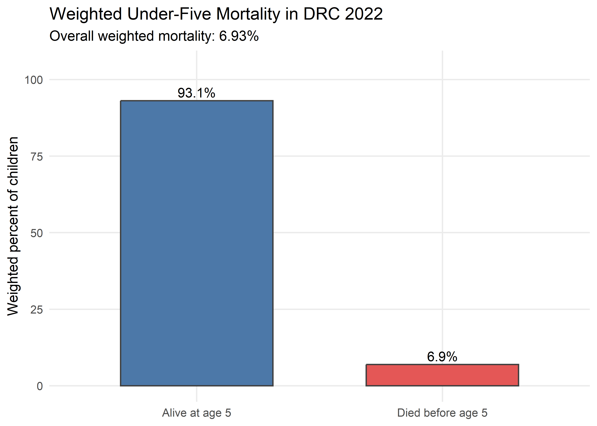
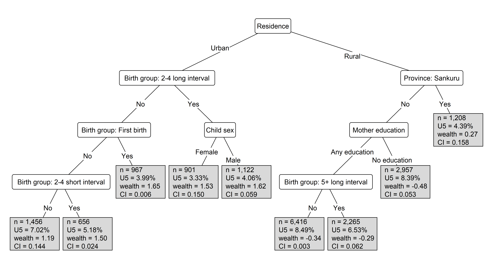
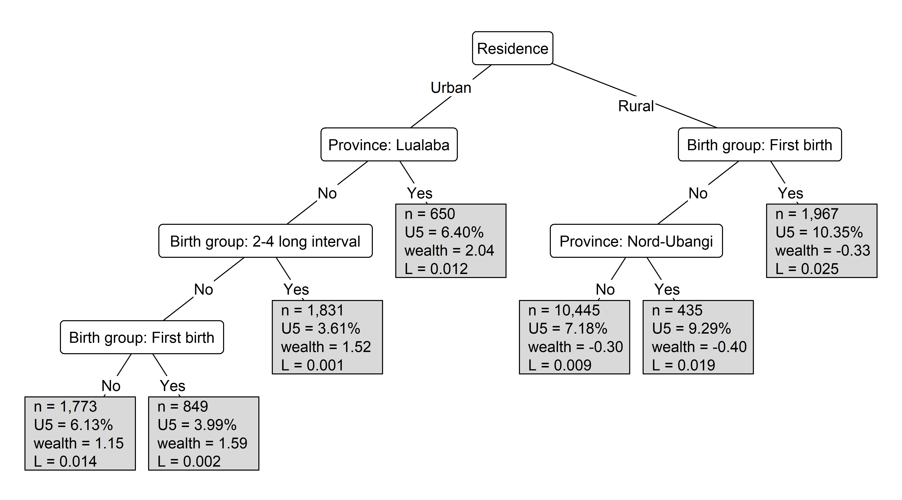
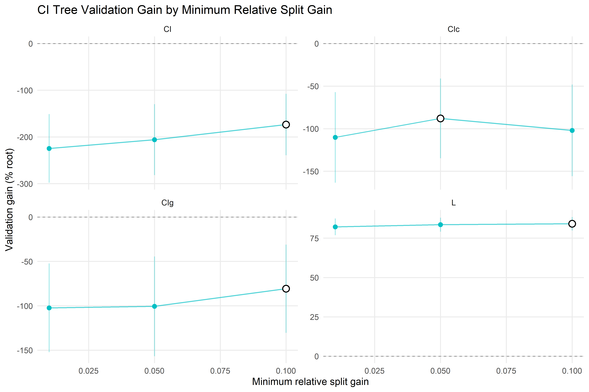
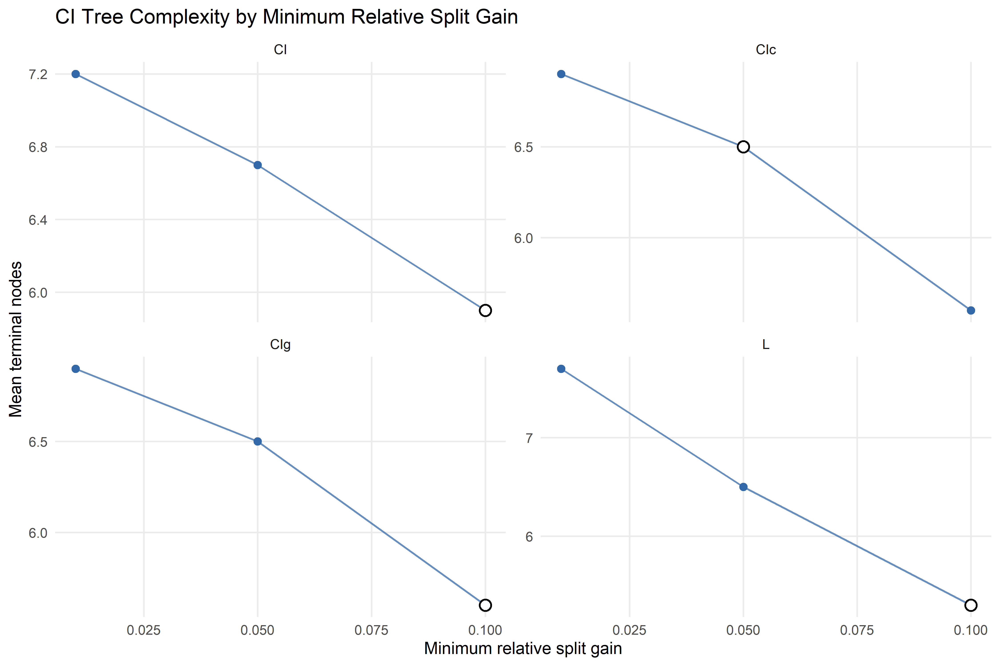

# DRC 2022 CI Trees


``` r
knitr::opts_chunk$set(
  fig.width = 10,
  fig.height = 6,
  dpi = 500,
  dev = "png"
)

library(data.table)
library(ggplot2)
library(grid)
library(knitr)
library(ineqTrees)
library(partykit)
library(here)

source(here("R", "report_helpers.R"))

criterion_types <- c("CI", "CIg", "CIc", "L")
tuning_metrics <- c("validation_gain", "relative_validation_gain")

# Keep run controls in one place so the slow tuning chunks use the same settings.
analysis_rows <- as.integer(params$analysis_rows)
if (is.na(analysis_rows) || analysis_rows <= 0L) {
  analysis_rows <- 1L
}

tuning_folds <- max(2L, as.integer(params$tuning_folds))
save_results <- isTRUE(params$save_results)
```

# Read 2022 Data

``` r
source_data_file <- here::here("data", "drc_data.rda")
load(here::here("data", "drc_data.rda"))
drc_2022_raw <- as.data.table(drc_data)
```

# Clean Data

``` r
weighted_mean_safe <- function(x, w) {
    keep <- stats::complete.cases(x, w) & w > 0
    if (!any(keep)) {
        return(NA_real_)
    }
    stats::weighted.mean(x[keep], w[keep])
}

sample_analysis_rows <- function(data, use_full = TRUE, 
n = 10000L, seed = 20260628) {
    if (isTRUE(use_full) || nrow(data) <= n) {
        return(copy(data))
    }
    set.seed(seed)
    data[sort(sample.int(nrow(data), n))]
}

clean_raw_drc_data <- function(drc_dt) {
    drc_dt <- copy(drc_dt)

    # Convert DHS-labelled columns to plain numeric values before recoding.
    drc_dt[, `:=`(
        b5_num = as.numeric(b5),
        b7_num = as.numeric(b7),
        v191_num = as.numeric(v191),
        v190_num = as.numeric(v190),
        v025_num = as.numeric(v025),
        v024_num = as.integer(v024),
        v133_num = as.numeric(v133),
        v012_num = as.numeric(v012),
        v701_num = as.numeric(v701),
        v717_num = as.numeric(v717),
        v705_num = as.numeric(v705),
        bord_num = as.numeric(bord),
        b11_num = as.numeric(b11),
        b4_num = as.numeric(b4),
        v005_num = as.numeric(v005),
        PSU = as.integer(cluster_id)
    )]

    province_labels <- c(
        "1" = "Kinshasa", "2" = "Kwango", "3" = "Kwilu",
        "4" = "Mai-Ndombe", "5" = "Kongo Central", "6" = "Equateur",
        "7" = "Mongala", "8" = "Nord-Ubangi", "9" = "Sud-Ubangi",
        "10" = "Tshuapa", "11" = "Kasai", "12" = "Kasai Central",
        "13" = "Kasai Oriental", "14" = "Lomami", "15" = "Sankuru",
        "16" = "Haut-Katanga", "17" = "Haut-Lomami", "18" = "Lualaba",
        "19" = "Tanganyika", "20" = "Maniema", "21" = "Nord-Kivu",
        "22" = "Bas-Uele", "23" = "Haut-Uele", "24" = "Ituri",
        "25" = "Tshopo", "26" = "Sud-Kivu"
    )

    drc_dt[, `:=`(
        sample_weight = v005_num / 1000000,

        # Use the continuous DHS wealth score for the concentration-index rank.
        wealth = v191_num / 100000,
        quint = fcase(
            v190_num %in% c(1, 2), "Low household wealth",
            v190_num %in% c(3, 4, 5), "High household wealth"
        ),
        reg = province_labels[as.character(v024_num)],
        rural = fcase(v025_num == 1, FALSE, v025_num == 2, TRUE, default = NA),
        ed = fcase(v133_num == 0, "No education", 
        !is.na(v133_num), "Any education"),
        ped = fcase(v701_num == 0, "No education",
         v701_num %in% c(1, 2, 3), "Any education"),
        mocc = fcase(
            v717_num %in% c(0, 6, 9, 97), "Household, unskilled, not working",
            v717_num %in% c(4, 5, 10), "Agriculture",
            v717_num %in% c(1, 2, 3, 7, 8, 96), "Other"
        ),
        pocc = fcase(
            v705_num %in% c(0, 6, 9, 97), "Household, unskilled, not working",
            v705_num %in% c(4, 5, 10), "Agriculture",
            v705_num %in% c(1, 2, 3, 7, 8, 96), "Other"
        ),
        agemoth = fcase(v012_num < 20, "Less than 20",
         v012_num >= 20, "20 or more"),
        male = fcase(b4_num == 1, TRUE, b4_num == 2, FALSE),
        birth = fcase(
            bord_num == 1, "First birth",
            bord_num %in% 2:4 & !is.na(b11_num) & b11_num < 24, 
            "2-4 short interval",
            bord_num %in% 2:4 & !is.na(b11_num) & b11_num >= 24, 
            "2-4 long interval",
            bord_num > 4 & !is.na(b11_num) & b11_num < 24,
             "5+ short interval",
            bord_num > 4 & !is.na(b11_num) & b11_num >= 24, 
            "5+ long interval"
        ),

        # Count deaths before 60 months as under-five deaths; later deaths are not U5 deaths.
        deadu5_num = fcase(
            b5_num == 0 & !is.na(b7_num) & b7_num < 60, 1,
            b5_num == 1, 0,
            b5_num == 0 & !is.na(b7_num) & b7_num >= 60, 0
        ),
        unskilled = fcase(
            v717_num %in% c(0, 6, 9) | v705_num %in% c(0, 6, 9), TRUE,
            !is.na(v717_num) | !is.na(v705_num), FALSE
        )
    )]

    # Keep only the variables used by the 2007 tree specification.
    congo_dt <- na.omit(drc_dt[, .(
        wealth, deadu5_num, quint, unskilled, male, birth, agemoth, rural,
        ed, ped, mocc, pocc, reg, sample_weight, PSU
    )])

    congo_dt[, `:=`(
        quint = factor(quint, levels = c("High household wealth", 
        "Low household wealth")),
        unskilled = factor(unskilled, levels = c(FALSE, TRUE),
         labels = c("No", "Yes")),
        male = factor(male, levels = c(FALSE, TRUE), 
        labels = c("Female", "Male")),
        birth = factor(
            birth,
            levels = c("First birth", "2-4 short interval",
             "2-4 long interval", "5+ short interval", 
             "5+ long interval")
        ),
        agemoth = factor(agemoth, levels = c("20 or more", "Less than 20")),
        rural = factor(rural, levels = c(FALSE, TRUE),
         labels = c("Urban", "Rural")),
        ed = factor(ed, levels = c("Any education", "No education")),
        ped = factor(ped, levels = c("Any education", "No education")),
        mocc = factor(mocc, levels = c("Other", "Household, 
        unskilled, not working", "Agriculture")),
        pocc = factor(pocc, levels = c("Other", "Household,
         unskilled, not working", "Agriculture")),
        reg = factor(reg, levels = unname(province_labels))
    )]

    congo_dt[sample_weight > 0]
}

clean_existing_model_data <- function(model_dt) {
    model_dt <- as.data.table(copy(model_dt))
    needed <- c(
        "wealth", "deadu5_num", "sample_weight",
         "PSU", "quint", "unskilled", "male", "birth",
        "agemoth", "rural", "ed", "ped", "mocc", "pocc", "reg"
    )
    missing <- setdiff(needed, names(model_dt))
    if (length(missing)) {
        stop("Cleaned model data is missing: ", 
        paste(missing, collapse = ", "), call. = FALSE)
    }
    model_dt <- na.omit(model_dt[, ..needed])
    model_dt[sample_weight > 0]
}

if (all(c("b5", "b7", "v191", "v005") %in% names(drc_2022_raw))) {
    # Raw DHS export: build the model variables from the DHS column names.
    congo_clean_dt <- clean_raw_drc_data(drc_2022_raw)
} else {
    # Already-cleaned file: only standardise types and complete cases.
    congo_clean_dt <- clean_existing_model_data(drc_2022_raw)
}

congo_clean_dt_full <- copy(congo_clean_dt)
congo_clean_dt <- sample_analysis_rows(
    congo_clean_dt_full,
    use_full = analysis_rows == 1L,
    n = analysis_rows,
    seed = 20260628
)

raw_congo_var_labels <- c(
    quint = "Household wealth",
    unskilled = "Low-skill household",
    male = "Child sex",
    birth = "Birth group",
    agemoth = "Mother age",
    rural = "Residence",
    ed = "Mother education",
    ped = "Partner education",
    mocc = "Mother occupation",
    pocc = "Partner occupation",
    reg = "Province"
)
raw_congo_predictors <- names(raw_congo_var_labels)

mortality_summary <- data.table(
    rows_full = nrow(congo_clean_dt_full),
    rows_used = nrow(congo_clean_dt),
    weighted_n_used = sum(congo_clean_dt$sample_weight),
    weighted_u5_mortality_percent = 100 * weighted_mean_safe(
        congo_clean_dt$deadu5_num,
        congo_clean_dt$sample_weight
    )
)

#knitr::kable(mortality_summary, digits = 2)
```

# Overall Mortality

``` r
mortality_plot_dt <- congo_clean_dt[
    ,
    .(
        weighted_n = sum(sample_weight),
        unweighted_n = .N
    ),
    by = .(status = factor(
        fifelse(deadu5_num == 1, "Died before age 5", "Alive at age 5"),
        levels = c("Alive at age 5", "Died before age 5")
    ))
]
mortality_plot_dt[, weighted_percent := 100 * weighted_n / sum(weighted_n)]

mortality_rate <- mortality_plot_dt[
    status == "Died before age 5",
    weighted_percent
]

ggplot(mortality_plot_dt, aes(
    x = status,
    y = weighted_percent, fill = status
)) +
    geom_col(width = 0.62, color = "gray25", show.legend = FALSE) +
    geom_text(
        aes(label = sprintf("%.1f%%", weighted_percent)),
        vjust = -0.35,
        size = 4
    ) +
    scale_fill_manual(values = c(
        "Alive at age 5" = "#4C78A8",
        "Died before age 5" = "#E45756"
    )) +
    scale_y_continuous(limits = c(0, max(
        100,
        max(mortality_plot_dt$weighted_percent) * 1.12
    ))) +
    labs(
        title = "Weighted Under-Five Mortality in DRC 2022",
        subtitle = sprintf(
            "Overall weighted mortality: %.2f%%",
            mortality_rate
        ),
        x = NULL,
        y = "Weighted percent of children"
    ) +
    theme_minimal(base_size = 12) +
    theme(panel.grid.minor = element_blank())
```



# Fit CI Trees

``` r
make_indicator_names <- function(variable, levels) {
    make.unique(make.names(paste(variable, levels, sep = "_")), sep = "_")
}

level_counts <- vapply(
    congo_clean_dt[, ..raw_congo_predictors],
    function(x) length(levels(as.factor(x))),
    integer(1L)
)

# Binary predictors enter the tree directly; multi-level predictors become indicators.
binary_predictors <- names(level_counts[level_counts <= 2L])
multi_level_predictors <- names(level_counts[level_counts > 2L])

model_predictor_dt <- copy(congo_clean_dt[, ..binary_predictors])

# Store the link between each indicator and its original labelled category.
indicator_map <- if (length(multi_level_predictors)) {
    rbindlist(lapply(multi_level_predictors, function(variable) {
        levels_i <- levels(as.factor(congo_clean_dt[[variable]]))
        data.table(
            raw_variable = variable,
            level = levels_i,
            variable = make_indicator_names(variable, levels_i),
            variable_label = paste0(raw_congo_var_labels[variable], ": ", levels_i)
        )
    }))
} else {
    data.table(
        raw_variable = character(),
        level = character(), variable = character(),
        variable_label = character()
    )
}

# Add one Yes/No indicator for each level of every multi-level predictor.
for (i in seq_len(nrow(indicator_map))) {
    source_variable <- indicator_map$raw_variable[i]
    source_level <- indicator_map$level[i]
    target_variable <- indicator_map$variable[i]
    model_predictor_dt[, (target_variable) := factor(
        fifelse(
            as.character(congo_clean_dt[[source_variable]]) == source_level,
            "Yes", "No"
        ),
        levels = c("No", "Yes")
    )]
}

congo_model_dt <- data.table(
    congo_clean_dt[, .(wealth, deadu5_num, sample_weight, PSU)],
    model_predictor_dt
)
congo_predictors <- names(model_predictor_dt)

congo_var_labels <- setNames(congo_predictors, congo_predictors)
congo_var_labels[intersect(
    binary_predictors,
    names(raw_congo_var_labels)
)] <-
    raw_congo_var_labels[intersect(binary_predictors, names(raw_congo_var_labels))]
congo_var_labels[indicator_map$variable] <- indicator_map$variable_label

# The tree functions expect cbind(rank, outcome) on the left-hand side.
congo_ci_formula <- as.formula(
    paste(
        "cbind(wealth, deadu5_num) ~",
        paste(congo_predictors, collapse = " + ")
    )
)

# knitr::kable(
#   data.table(predictor = congo_predictors,
#   label = unname(congo_var_labels[congo_predictors])),
#   caption = "Predictors used in the CI trees"
# )
```

``` r
# Tune only the stopping rules that control how large the CI trees can grow.
tree_grid <- ci_tree_control_grid(
  minsplit = 500L,
  minbucket = 250L,
  minprob = 0.01,
  maxdepth = 10L,
  min_gain = 0.00001,
  min_relative_gain = c(0.01, 0.05, 0.10)
)

# A child node must be able to contain at least minbucket observations.
tree_grid <- tree_grid[minsplit >= 2L * minbucket]

knitr::kable(tree_grid, digits = 4, caption = "CI tree tuning grid")
```

| minsplit | minbucket | minprob | maxdepth | min_gain | min_relative_gain |
|---------:|----------:|--------:|---------:|---------:|------------------:|
|      500 |       250 |    0.01 |       10 |        0 |              0.01 |
|      500 |       250 |    0.01 |       10 |        0 |              0.05 |
|      500 |       250 |    0.01 |       10 |        0 |              0.10 |

CI tree tuning grid

``` r
# Create validation folds at the cluster level so children from one PSU stay together.
make_psu_fold_id <- function(psu,
                             outcome,
                             weights = NULL,
                             v = 10L,
                             seed = 20260628) {
    psu <- as.integer(psu)
    outcome <- as.integer(outcome)
    if (length(psu) != length(outcome)) {
        stop("`psu` and `outcome` must have the same length.", call. = FALSE)
    }
    if (anyNA(psu)) {
        stop("`psu` cannot contain missing values.", call. = FALSE)
    }
    if (is.null(weights)) {
        weights <- rep(1, length(psu))
    }
    weights <- as.numeric(weights)

    psu_frame <- data.table(
        PSU = psu,
        outcome = outcome,
        weight = weights
    )[
        ,
        .(
            rows = .N,
            deaths = sum(outcome == 1L, na.rm = TRUE),
            weighted_deaths = sum(weight * outcome, na.rm = TRUE),
            weighted_rows = sum(weight, na.rm = TRUE)
        ),
        by = PSU
    ]

    v <- max(2L, as.integer(v[1L]))
    v <- min(v, nrow(psu_frame))

    # Spread PSUs with deaths across folds before assigning lower-risk PSUs.
    set.seed(seed)
    psu_frame[, random_order := runif(.N)]
    setorder(psu_frame, -deaths, -weighted_deaths, random_order)
    psu_frame[, fold_id := NA_integer_]

    fold_load <- data.table(
        fold_id = seq_len(v),
        deaths = 0,
        weighted_deaths = 0,
        rows = 0,
        weighted_rows = 0
    )

    # Greedily assign each PSU to the fold with the smallest current burden.
    for (i in seq_len(nrow(psu_frame))) {
        setorder(fold_load, deaths, weighted_deaths, rows, fold_id)
        chosen_fold <- fold_load$fold_id[1L]
        psu_frame[i, fold_id := chosen_fold]
        fold_load[
            fold_id == chosen_fold,
            `:=`(
                deaths = deaths + psu_frame$deaths[i],
                weighted_deaths = weighted_deaths + psu_frame$weighted_deaths[i],
                rows = rows + psu_frame$rows[i],
                weighted_rows = weighted_rows + psu_frame$weighted_rows[i]
            )
        ]
    }

    # Return one fold id per row, after assigning at PSU level.
    row_frame <- data.table(row_id = seq_along(psu), PSU = psu)
    row_frame[psu_frame[, .(PSU, fold_id)], on = "PSU", fold_id := i.fold_id]
    row_frame$fold_id
}

# Build the folds used for CI tree tuning and validation.
tree_psu_fold_id <- make_psu_fold_id(
    psu = congo_model_dt$PSU,
    outcome = congo_model_dt$deadu5_num,
    weights = congo_model_dt$sample_weight,
    v = tuning_folds,
    seed = 20260628
)

# Check that every child from the same PSU is assigned to a single fold.
psu_fold_check <- data.table(
    PSU = congo_model_dt$PSU,
    fold_id = tree_psu_fold_id
)[, .(fold_count = uniqueN(fold_id)), by = PSU]
if (any(psu_fold_check$fold_count > 1L)) {
    stop("At least one PSU was assigned to more than one fold.", call. = FALSE)
}

# Summarise the validation split for the rendered report.
tree_psu_fold_summary <- data.table(
    fold_id = tree_psu_fold_id,
    PSU = congo_model_dt$PSU,
    deadu5_num = congo_model_dt$deadu5_num,
    sample_weight = congo_model_dt$sample_weight
)[
    ,
    .(
        rows = .N,
        psus = uniqueN(PSU),
        deaths = sum(deadu5_num == 1L, na.rm = TRUE),
        non_deaths = sum(deadu5_num == 0L, na.rm = TRUE),
        weighted_death_percent = 100 * weighted.mean(deadu5_num, sample_weight, na.rm = TRUE)
    ),
    by = fold_id
][order(fold_id)]

knitr::kable(
    tree_psu_fold_summary,
    digits = 2,
    caption = "PSU-held-out folds used for CI tree tuning"
)
```

| fold_id | rows | psus | deaths | non_deaths | weighted_death_percent |
|--------:|-----:|-----:|-------:|-----------:|-----------------------:|
|       1 | 1593 |   56 |    146 |       1447 |                   8.85 |
|       2 | 5666 |  268 |    145 |       5521 |                   2.17 |
|       3 | 1538 |   56 |    145 |       1393 |                   9.03 |
|       4 | 1689 |   57 |    145 |       1544 |                  10.12 |
|       5 | 1626 |   57 |    146 |       1480 |                   8.20 |
|       6 | 1632 |   57 |    146 |       1486 |                   8.62 |
|       7 | 1525 |   56 |    145 |       1380 |                   9.31 |
|       8 | 1579 |   57 |    145 |       1434 |                   9.52 |
|       9 | 1596 |   57 |    145 |       1451 |                   9.15 |
|      10 | 1599 |   57 |    146 |       1453 |                   8.45 |

PSU-held-out folds used for CI tree tuning

``` r
# Compare the four CI splitting criteria on the same grid and PSU-held-out folds.
tree_tuning <- tune_ci_tree(
  formula = congo_ci_formula,
  data = congo_model_dt,
  rank_name = "wealth",
  outcome_name = "deadu5_num",
  weights = congo_model_dt$sample_weight,
  type = criterion_types,
  control_grid = tree_grid,
  fold_id = tree_psu_fold_id,
  seed = 20260628,
  metric = tuning_metrics,
  refit = FALSE
)


# Select the best stopping rule separately for each criterion.
tree_best_by_type <- ci_select_best(tree_tuning, metric = "relative_validation_gain")
```

# Validation Results

``` r
tree_selection_table <- ci_fit_summary_table(
  tree_tuning,
  selected = tree_best_by_type,
  metrics = tuning_metrics,
  include_percent = FALSE
)

tree_fit_table <- ci_collect_metrics(
  tree_tuning,
  selected = tree_best_by_type,
  metric = tuning_metrics,
  format = "tidy",
  include_train = TRUE
)

knitr::kable(
  tree_selection_table,
  digits = 4,
  caption = "Selected CI tree settings and validation performance"
)
```

| type | grid_id | minsplit | minbucket | minprob | maxdepth | min_gain | min_relative_gain | mean_train_gain | mean_train_relative_gain | mean_validation_gain | mean_validation_relative_gain | n_train_gain | n_train_relative_gain | n_validation_gain | n_validation_relative_gain | std_err_train_gain | std_err_train_relative_gain | std_err_validation_gain | std_err_validation_relative_gain | mean_root_objective | n_root_objective | std_err_root_objective |
|:---|---:|---:|---:|---:|---:|---:|---:|---:|---:|---:|---:|---:|---:|---:|---:|---:|---:|---:|---:|---:|---:|---:|
| CI | 3 | 500 | 250 | 0.01 | 10 | 0 | 0.10 | 0.0533 | 0.4599 | -0.0580 | -1.7341 | 10 | 10 | 10 | 10 | 0.0069 | 0.0520 | 0.0159 | 0.6575 | 0.0966 | 10 | 0.0257 |
| CIc | 8 | 500 | 250 | 0.01 | 10 | 0 | 0.05 | 0.0146 | 0.4765 | -0.0078 | -0.8798 | 10 | 10 | 10 | 10 | 0.0020 | 0.0594 | 0.0042 | 0.4676 | 0.0276 | 10 | 0.0063 |
| CIg | 6 | 500 | 250 | 0.01 | 10 | 0 | 0.10 | 0.0038 | 0.4784 | -0.0008 | -0.8077 | 10 | 10 | 10 | 10 | 0.0005 | 0.0602 | 0.0010 | 0.4969 | 0.0069 | 10 | 0.0016 |
| L | 12 | 500 | 250 | 0.01 | 10 | 0 | 0.10 | 0.0793 | 0.8915 | 0.3255 | 0.8412 | 10 | 10 | 10 | 10 | 0.0098 | 0.0127 | 0.2015 | 0.0430 | 0.3433 | 10 | 0.2013 |

Selected CI tree settings and validation performance

``` r
knitr::kable(
  tree_fit_table,
  digits = 4,
  caption = "Training and validation metrics for selected CI trees"
)
```

| grid_id | type | minsplit | minbucket | minprob | maxdepth | min_gain | min_relative_gain | .metric | .estimator | mean | n | std_err | .dataset | .config |
|---:|:---|---:|---:|---:|---:|---:|---:|:---|:---|---:|---:|---:|:---|:---|
| 3 | CI | 500 | 250 | 0.01 | 10 | 0 | 0.10 | train_gain | standard | 0.0533 | 10 | 0.0069 | training | ci_model003_CI |
| 3 | CI | 500 | 250 | 0.01 | 10 | 0 | 0.10 | train_relative_gain | standard | 0.4599 | 10 | 0.0520 | training | ci_model003_CI |
| 3 | CI | 500 | 250 | 0.01 | 10 | 0 | 0.10 | relative_validation_gain | standard | -1.7341 | 10 | 0.6575 | validation | ci_model003_CI |
| 3 | CI | 500 | 250 | 0.01 | 10 | 0 | 0.10 | validation_gain | standard | -0.0580 | 10 | 0.0159 | validation | ci_model003_CI |
| 8 | CIc | 500 | 250 | 0.01 | 10 | 0 | 0.05 | train_gain | standard | 0.0146 | 10 | 0.0020 | training | ci_model008_CIc |
| 8 | CIc | 500 | 250 | 0.01 | 10 | 0 | 0.05 | train_relative_gain | standard | 0.4765 | 10 | 0.0594 | training | ci_model008_CIc |
| 8 | CIc | 500 | 250 | 0.01 | 10 | 0 | 0.05 | relative_validation_gain | standard | -0.8798 | 10 | 0.4676 | validation | ci_model008_CIc |
| 8 | CIc | 500 | 250 | 0.01 | 10 | 0 | 0.05 | validation_gain | standard | -0.0078 | 10 | 0.0042 | validation | ci_model008_CIc |
| 6 | CIg | 500 | 250 | 0.01 | 10 | 0 | 0.10 | train_gain | standard | 0.0038 | 10 | 0.0005 | training | ci_model006_CIg |
| 6 | CIg | 500 | 250 | 0.01 | 10 | 0 | 0.10 | train_relative_gain | standard | 0.4784 | 10 | 0.0602 | training | ci_model006_CIg |
| 6 | CIg | 500 | 250 | 0.01 | 10 | 0 | 0.10 | relative_validation_gain | standard | -0.8077 | 10 | 0.4969 | validation | ci_model006_CIg |
| 6 | CIg | 500 | 250 | 0.01 | 10 | 0 | 0.10 | validation_gain | standard | -0.0008 | 10 | 0.0010 | validation | ci_model006_CIg |
| 12 | L | 500 | 250 | 0.01 | 10 | 0 | 0.10 | train_gain | standard | 0.0793 | 10 | 0.0098 | training | ci_model012_L |
| 12 | L | 500 | 250 | 0.01 | 10 | 0 | 0.10 | train_relative_gain | standard | 0.8915 | 10 | 0.0127 | training | ci_model012_L |
| 12 | L | 500 | 250 | 0.01 | 10 | 0 | 0.10 | relative_validation_gain | standard | 0.8412 | 10 | 0.0430 | validation | ci_model012_L |
| 12 | L | 500 | 250 | 0.01 | 10 | 0 | 0.10 | validation_gain | standard | 0.3255 | 10 | 0.2015 | validation | ci_model012_L |

Training and validation metrics for selected CI trees

``` r
# Refit each selected tree on the full 2022 analysis data for final plotting.
tree_models_by_type <- setNames(
  lapply(seq_len(nrow(tree_best_by_type)), function(i) {
    setting <- tree_best_by_type[i]
    ci_tree(
      formula = congo_ci_formula,
      data = congo_model_dt,
      rank_name = "wealth",
      outcome_name = "deadu5_num",
      weights = congo_model_dt$sample_weight,
      type = setting$type[1L],
      control = ci_control_from_row(setting)
    )
  }),
  tree_best_by_type$type
)


# Collect terminal-node summaries from the final selected trees.
all_tree_terminal_summaries <- rbindlist(lapply(names(tree_models_by_type), function(type) {
  out <- as.data.table(ci_tree_terminal_summary(tree_models_by_type[[type]]))
  out[, criterion := type]
  setcolorder(out, "criterion")
  out
}), fill = TRUE)

# knitr::kable(
#   all_tree_terminal_summaries,
#   digits = 4,
#   caption = "Terminal-node summaries for the four selected CI trees"
# )
```

# CI Tree Plots

``` r
ci_report_tree_plot(
    fit = tree_models_by_type[["CI"]],
    data = congo_model_dt,
    outcome_name = "deadu5_num",
    outcome_label = "U5",
    ci_type = "CI",
    var_labels = congo_var_labels
)
```



``` r
for (criterion in criterion_types) {
  if (criterion == "CI") {
    next
  }
  cat("\n\n## ", criterion, " Tree\n\n", sep = "")
  ci_report_tree_plot(
    fit = tree_models_by_type[[criterion]],
    data = congo_model_dt,
    outcome_name = "deadu5_num",
    outcome_label = "U5",
    ci_type = criterion,
    var_labels = congo_var_labels
  )
}
```

## CIg Tree


## CIc Tree


## L Tree



# Complexity Plots

``` r
# Reuse the tuning results to show how validation gain changes with tree size.
tree_complexity_metrics <- collect_complexity_metrics(tree_tuning)
tree_min_relative_gain_path <- min_relative_gain_path(
  tree_complexity_metrics,
  selected = tree_best_by_type
)

knitr::kable(
  tree_complexity_metrics,
  digits = 4,
  caption = "Cross-validated tree complexity metrics"
)
```

| grid_id | type | minsplit | minbucket | minprob | maxdepth | min_gain | min_relative_gain | mean_terminal_nodes | mean_train_gain | std_err_train_gain | mean_validation_gain | std_err_validation_gain | mean_train_relative_gain | std_err_train_relative_gain | mean_validation_relative_gain | std_err_validation_relative_gain | mean_root_objective | std_err_root_objective |
|---:|:---|---:|---:|---:|---:|---:|---:|---:|---:|---:|---:|---:|---:|---:|---:|---:|---:|---:|
| 1 | CI | 500 | 250 | 0.01 | 10 | 0 | 0.01 | 7.2 | 0.0545 | 0.0073 | -0.0746 | 0.0178 | 0.4615 | 0.0544 | -2.2460 | 0.7345 | 0.0966 | 0.0257 |
| 2 | CI | 500 | 250 | 0.01 | 10 | 0 | 0.05 | 6.7 | 0.0506 | 0.0062 | -0.0627 | 0.0175 | 0.4496 | 0.0530 | -2.0591 | 0.7599 | 0.0966 | 0.0257 |
| 3 | CI | 500 | 250 | 0.01 | 10 | 0 | 0.10 | 5.9 | 0.0533 | 0.0069 | -0.0580 | 0.0159 | 0.4599 | 0.0520 | -1.7341 | 0.6575 | 0.0966 | 0.0257 |
| 7 | CIc | 500 | 250 | 0.01 | 10 | 0 | 0.01 | 6.9 | 0.0150 | 0.0020 | -0.0088 | 0.0043 | 0.4579 | 0.0575 | -1.1026 | 0.5318 | 0.0276 | 0.0063 |
| 8 | CIc | 500 | 250 | 0.01 | 10 | 0 | 0.05 | 6.5 | 0.0146 | 0.0020 | -0.0078 | 0.0042 | 0.4765 | 0.0594 | -0.8798 | 0.4676 | 0.0276 | 0.0063 |
| 9 | CIc | 500 | 250 | 0.01 | 10 | 0 | 0.10 | 5.6 | 0.0154 | 0.0020 | -0.0044 | 0.0041 | 0.4797 | 0.0598 | -1.0200 | 0.5373 | 0.0276 | 0.0063 |
| 4 | CIg | 500 | 250 | 0.01 | 10 | 0 | 0.01 | 6.9 | 0.0038 | 0.0005 | -0.0024 | 0.0012 | 0.4442 | 0.0560 | -1.0232 | 0.4994 | 0.0069 | 0.0016 |
| 5 | CIg | 500 | 250 | 0.01 | 10 | 0 | 0.05 | 6.5 | 0.0038 | 0.0005 | -0.0013 | 0.0009 | 0.4700 | 0.0587 | -1.0065 | 0.5615 | 0.0069 | 0.0016 |
| 6 | CIg | 500 | 250 | 0.01 | 10 | 0 | 0.10 | 5.6 | 0.0038 | 0.0005 | -0.0008 | 0.0010 | 0.4784 | 0.0602 | -0.8077 | 0.4969 | 0.0069 | 0.0016 |
| 10 | L | 500 | 250 | 0.01 | 10 | 0 | 0.01 | 7.7 | 0.0790 | 0.0098 | 0.3242 | 0.2015 | 0.8868 | 0.0128 | 0.8215 | 0.0529 | 0.3433 | 0.2013 |
| 11 | L | 500 | 250 | 0.01 | 10 | 0 | 0.05 | 6.5 | 0.0792 | 0.0098 | 0.3249 | 0.2014 | 0.8895 | 0.0124 | 0.8357 | 0.0444 | 0.3433 | 0.2013 |
| 12 | L | 500 | 250 | 0.01 | 10 | 0 | 0.10 | 5.3 | 0.0793 | 0.0098 | 0.3255 | 0.2015 | 0.8915 | 0.0127 | 0.8412 | 0.0430 | 0.3433 | 0.2013 |

Cross-validated tree complexity metrics

``` r
knitr::kable(
  tree_min_relative_gain_path,
  digits = 4,
  caption = "Validation gain and terminal-node count by minimum relative split gain"
)
```

| type | min_relative_gain | n_settings | mean_validation_gain | mean_root_objective | validation_percent_gain | validation_percent_se | validation_percent_from_mean_root | min_validation_percent_gain | max_validation_percent_gain | mean_terminal_nodes | terminal_nodes_se | selected |
|:---|---:|---:|---:|---:|---:|---:|---:|---:|---:|---:|---:|:---|
| CI | 0.01 | 1 | -0.0746 | 0.0966 | -224.5980 | 73.4545 | -77.2980 | -224.5980 | -224.5980 | 7.2 | NA | FALSE |
| CI | 0.05 | 1 | -0.0627 | 0.0966 | -205.9118 | 75.9943 | -64.8801 | -205.9118 | -205.9118 | 6.7 | NA | FALSE |
| CI | 0.10 | 1 | -0.0580 | 0.0966 | -173.4080 | 65.7463 | -60.0875 | -173.4080 | -173.4080 | 5.9 | NA | TRUE |
| CIc | 0.01 | 1 | -0.0088 | 0.0276 | -110.2643 | 53.1783 | -31.7121 | -110.2643 | -110.2643 | 6.9 | NA | FALSE |
| CIc | 0.05 | 1 | -0.0078 | 0.0276 | -87.9782 | 46.7576 | -28.1511 | -87.9782 | -87.9782 | 6.5 | NA | TRUE |
| CIc | 0.10 | 1 | -0.0044 | 0.0276 | -101.9999 | 53.7295 | -15.7507 | -101.9999 | -101.9999 | 5.6 | NA | FALSE |
| CIg | 0.01 | 1 | -0.0024 | 0.0069 | -102.3182 | 49.9365 | -34.0643 | -102.3182 | -102.3182 | 6.9 | NA | FALSE |
| CIg | 0.05 | 1 | -0.0013 | 0.0069 | -100.6473 | 56.1470 | -19.0744 | -100.6473 | -100.6473 | 6.5 | NA | FALSE |
| CIg | 0.10 | 1 | -0.0008 | 0.0069 | -80.7665 | 49.6859 | -11.5237 | -80.7665 | -80.7665 | 5.6 | NA | TRUE |
| L | 0.01 | 1 | 0.3242 | 0.3433 | 82.1495 | 5.2917 | 94.4596 | 82.1495 | 82.1495 | 7.7 | NA | FALSE |
| L | 0.05 | 1 | 0.3249 | 0.3433 | 83.5727 | 4.4416 | 94.6605 | 83.5727 | 83.5727 | 6.5 | NA | FALSE |
| L | 0.10 | 1 | 0.3255 | 0.3433 | 84.1210 | 4.3029 | 94.8338 | 84.1210 | 84.1210 | 5.3 | NA | TRUE |

Validation gain and terminal-node count by minimum relative split gain

``` r
plot_validation_percent_gain_path(
  tree_min_relative_gain_path,
  "CI Tree Validation Gain by Minimum Relative Split Gain"
)
```



``` r
plot_terminal_nodes_path(
  tree_min_relative_gain_path,
  "CI Tree Complexity by Minimum Relative Split Gain"
)
```



``` r
drc_2022_ci_tree_results <- list(
  source_data_file = source_data_file,
  congo_clean_dt = congo_clean_dt,
  tree_psu_fold_id = tree_psu_fold_id,
  tree_psu_fold_summary = tree_psu_fold_summary,
  congo_model_dt = congo_model_dt,
  congo_ci_formula = congo_ci_formula,
  congo_var_labels = congo_var_labels,
  tree_grid = tree_grid,
  tree_tuning = tree_tuning,
  tree_best_by_type = tree_best_by_type,
  tree_selection_table = tree_selection_table,
  tree_fit_table = tree_fit_table,
  tree_models_by_type = tree_models_by_type,
  all_tree_terminal_summaries = all_tree_terminal_summaries,
  tree_complexity_metrics = tree_complexity_metrics,
  tree_min_relative_gain_path = tree_min_relative_gain_path
)

if (save_results) {
  save(drc_2022_ci_tree_results, file = here("data", "drc_2022_ci_tree_results.rda"))
}
```
