# DRC Results Generator
Moses Mburu

``` r
knitr::opts_chunk$set(
  fig.width = 9,
  fig.height = 5.5,
  dpi = 500,
  dev = "png"
)

library(data.table)
library(ggplot2)
library(grid)
library(knitr)
library(ineqTrees)
library(partykit)
library(here)
source(here("R", "report_helpers.R"))
source(here("R", "ci_rpart_comparison_methods.R"))

kableExtra::use_latex_packages()
```

``` r
default_params <- list(
  analysis_rows = 1L,
  tuning_folds = 10L,
  undersample = 0.4,
  shap_rows = 0,
  shap_n_mc_samples = 8L,
  shap_seed = 20260328L,
  shap_workers = 4L
)

runtime_params <- utils::modifyList(default_params, as.list(params))

runtime_params$analysis_rows <- as.integer(runtime_params$analysis_rows)
runtime_params$tuning_folds <- max(2L, as.integer(runtime_params$tuning_folds))
runtime_params$undersample <- as.numeric(runtime_params$undersample)
runtime_params$shap_rows <- as.integer(runtime_params$shap_rows)
runtime_params$shap_n_mc_samples <- as.integer(runtime_params$shap_n_mc_samples)
runtime_params$shap_seed <- as.integer(runtime_params$shap_seed)
runtime_params$shap_workers <- max(1L, as.integer(runtime_params$shap_workers))

if (is.na(runtime_params$analysis_rows) || runtime_params$analysis_rows <= 0L) {
  runtime_params$analysis_rows <- default_params$analysis_rows
}
if (is.na(runtime_params$undersample)) {
  runtime_params$undersample <- default_params$undersample
}
if (is.na(runtime_params$shap_rows) || runtime_params$shap_rows < 0L) {
  runtime_params$shap_rows <- default_params$shap_rows
}
if (is.na(runtime_params$shap_n_mc_samples) || runtime_params$shap_n_mc_samples <= 0L) {
  runtime_params$shap_n_mc_samples <- default_params$shap_n_mc_samples
}
if (is.na(runtime_params$shap_seed)) {
  runtime_params$shap_seed <- default_params$shap_seed
}

shap_n_mc_samples <- runtime_params$shap_n_mc_samples
shap_seed <- runtime_params$shap_seed
shap_workers <- runtime_params$shap_workers
shap_rows_requested <- runtime_params$shap_rows
```

``` r
criterion_types <- c("CI", "CIg", "CIc", "L")
rineq_ci_types <- c("CI", "CIg", "CIc", "CIw")
results_object_file <- here("data", "drc_report_results_objects.rda")
tree_tuning_file <- here("data", "tree_tuning.rda")
source_data_file <- here("prev_analysis", "DRCongo .dta")
paper_reference_file <- here("prev_analysis", "667.full.pdf")
outcome_labels <- c(
  alive = "Alive at age 5",
  died = "Died before age 5"
)

main_tree_control <-ci_tree_control(
  minsplit = 500L,
  minbucket = 250L,
  minprob = 0.02,
  maxdepth = 5L,
  min_gain = 0.00001,
  min_relative_gain = 0.20
)
```

``` r
map_model_terms_to_predictors <- function(term_names, predictors) {
  vapply(term_names, function(term) {
    hit <- predictors[term == predictors | startsWith(term, predictors)]
    c(hit[which.max(nchar(hit))], term)[1L]
  }, character(1L))
}
```

``` r
canonicalize_model_terms <- function(term_names, reference_terms) {
  lookup <- data.table(
    variable = reference_terms,
    syntactic = make.names(reference_terms, unique = FALSE)
  )
  lookup <- lookup[
    !duplicated(syntactic) & !duplicated(syntactic, fromLast = TRUE)
  ]

  out <- term_names
  exact <- match(out, reference_terms)
  out[!is.na(exact)] <- reference_terms[exact[!is.na(exact)]]

  needs_lookup <- which(is.na(exact))
  syntactic <- match(out[needs_lookup], lookup$syntactic)
  out[needs_lookup[!is.na(syntactic)]] <- lookup$variable[syntactic[!is.na(syntactic)]]

  out
}
```

``` r
rank_from_named_vector <- function(x, method_name) {
  x <- x %||% numeric()
  data.table(variable = names(x), score = as.numeric(x))[
    is.finite(score) & score != 0
  ][
    order(-abs(score))
  ][
    ,
    .(variable, method = method_name, rank = seq_len(.N), score)
  ]
}
```

# Purpose

This document is the canonical generator for the objects used by the
main DRC results report. It is written as a readable workflow so a
lecturer can follow what is loaded, what is fitted, what is compared,
and what is finally saved.

If you need a plain R script for batch execution, extract it from this
document with
`knitr::purl("Generate_DRC_Results_Objects.qmd", output = "R/generate_drc_results_objects.R")`.
Display-only chunks are excluded from the purl output so the extracted
script stays focused on computation and saving.

# Run Configuration

The runtime of this generator is controlled by two quantities: the
number of analysis rows and the number of tuning folds. The remaining
modelling choices are fixed below so the workflow stays readable. Set
`analysis_rows` to `1` to use the full data set.

``` r
library(haven)
drc_2007_dt <- as.data.table(haven::read_dta(source_data_file))
```

``` r
factor_from_codes <- function(x, labels) {
  factor(labels[as.character(as.integer(x))], levels = unname(labels))
}

binary_factor <- function(x, labels) {
  factor(labels[as.character(as.integer(x))], levels = unname(labels))
}

drc_birth_labels <- c(
  "1" = "First birth",
  "2" = "2-4 short interval",
  "3" = "2-4 long interval",
  "4" = "5+ short interval",
  "5" = "5+ long interval"
)
drc_wealth_group_labels <- c("1" = "High household wealth", "2" = "Low household wealth")
drc_age_mother_labels <- c("1" = "20 or more", "2" = "Less than 20")
drc_education_labels <- c("1" = "Any education", "2" = "No education")
drc_occupation_labels <- c(
  "1" = "Other",
  "2" = "Household, unskilled, not working",
  "3" = "Agriculture"
)
drc_region_labels <- c(
  "1" = "Bandundu",
  "2" = "Bas-Congo",
  "3" = "Equateur",
  "4" = "Kasai Occidental",
  "5" = "Kasai Oriental",
  "6" = "Katanga",
  "7" = "Kinshasa",
  "8" = "Maniema",
  "9" = "Nord-Kivu",
  "10" = "Orientale",
  "11" = "Sud-Kivu"
)

raw_congo_model_dt <- drc_2007_dt[
  ,
  .(
    wealth = as.numeric(wealth),
    deadu5_num = as.integer(deadu5),
    sample_weight = as.numeric(weight),
    PSU = as.integer(PSU),
    household = as.integer(household),
    country = as.integer(country),
    quint = factor_from_codes(quint, drc_wealth_group_labels),
    unskilled = binary_factor(
      unskilled,
      c("0" = "Skilled birth attendance", "1" = "No skilled birth attendance")
    ),
    male = binary_factor(male, c("0" = "Female", "1" = "Male")),
    birth = factor_from_codes(birth, drc_birth_labels),
    agemoth = factor_from_codes(agemoth, drc_age_mother_labels),
    rural = binary_factor(rural, c("0" = "Urban", "1" = "Rural")),
    ed = factor_from_codes(ed, drc_education_labels),
    ped = factor_from_codes(ped, drc_education_labels),
    mocc = factor_from_codes(mocc, drc_occupation_labels),
    pocc = factor_from_codes(pocc, drc_occupation_labels),
    reg = factor_from_codes(reg, drc_region_labels)
  )
]
raw_congo_model_dt <- na.omit(raw_congo_model_dt)

raw_congo_var_labels <- c(
  quint = "Household wealth",
  unskilled = "Skilled birth attendance",
  male = "Sex of the child",
  birth = "Birth order and interval",
  agemoth = "Mother's age at birth",
  rural = "Type of residence",
  ed = "Mother's education",
  ped = "Father's education",
  mocc = "Mother's occupation",
  pocc = "Father's occupation",
  reg = "Region"
)
raw_congo_predictors <- names(raw_congo_var_labels)
```

``` r
raw_congo_model_dt <- sample_analysis_rows(
    raw_congo_model_dt,
    use_full = runtime_params$analysis_rows == 1L,
    n = runtime_params$analysis_rows,
    seed = 20260516
)
```

``` r
predictor_level_counts <- vapply(
    raw_congo_model_dt[, raw_congo_predictors, with = FALSE],
    function(x) length(levels(as.factor(x))),
    integer(1L)
)
nominal_predictors <- raw_congo_predictors[
    vapply(
        raw_congo_model_dt[, raw_congo_predictors, with = FALSE],
        function(x) is.factor(x) || is.character(x),
        logical(1L)
    )
]
multi_level_predictors <- intersect(
    names(predictor_level_counts[predictor_level_counts > 2L]),
    nominal_predictors
)
kept_predictors <- setdiff(raw_congo_predictors, multi_level_predictors)

make_indicator_name <- function(variable, level) {
    make.names(paste(variable, level, sep = "_"), unique = FALSE)
}

indicator_level_map <- rbindlist(lapply(multi_level_predictors, function(variable) {
    levels_i <- levels(as.factor(raw_congo_model_dt[[variable]]))
    data.table(
        raw_variable = variable,
        level = levels_i,
        variable = make_indicator_name(variable, levels_i),
        variable_label = paste0(unname(raw_congo_var_labels[variable]), ": ", levels_i)
    )
}), fill = TRUE)

stopifnot(!anyDuplicated(indicator_level_map$variable))

model_predictor_dt <- copy(raw_congo_model_dt[, kept_predictors, with = FALSE])
for (i in seq_len(nrow(indicator_level_map))) {
    source_variable <- indicator_level_map$raw_variable[i]
    source_level <- indicator_level_map$level[i]
    target_variable <- indicator_level_map$variable[i]
    model_predictor_dt[
        ,
        (target_variable) := factor(
            fifelse(as.character(raw_congo_model_dt[[source_variable]]) == source_level, "Yes", "No"),
            levels = c("No", "Yes")
        )
    ]
}

congo_model_dt <- data.table(
    raw_congo_model_dt[, .(wealth, deadu5_num, sample_weight)],
    model_predictor_dt
)
congo_predictors <- names(model_predictor_dt)
congo_var_labels <- setNames(congo_predictors, congo_predictors)
congo_var_labels[intersect(kept_predictors, names(raw_congo_var_labels))] <-
    raw_congo_var_labels[intersect(kept_predictors, names(raw_congo_var_labels))]
congo_var_labels[indicator_level_map$variable] <- indicator_level_map$variable_label

congo_ci_formula <- as.formula(
    paste("cbind(wealth, deadu5_num) ~", paste(congo_predictors, collapse = " + "))
)
```

``` r
canonicalize_regression_terms <- function(term_names) {
    vapply(term_names, function(term) {
        parent <- map_model_terms_to_predictors(term, raw_congo_predictors)
        source_level <- sub(paste0("^", parent), "", term)
        hit <- indicator_level_map[raw_variable == parent & level == source_level]
        choices <- c(hit$variable[1L], parent, term)
        choice_id <- which(c(
            parent %in% multi_level_predictors && parent != term && nrow(hit) > 0L,
            parent %in% raw_congo_predictors && parent != term,
            TRUE
        ))[1L]
        choices[choice_id]
    }, character(1L))
}

format_variable_label <- function(x) {
    vapply(x, function(value) {
        parent <- map_model_terms_to_predictors(value, raw_congo_predictors)
        suffix <- trimws(sub(paste0("^", parent), "", value))
        suffix <- gsub("^[:._]+", "", suffix)
        parent_label <- unname(raw_congo_var_labels[parent])
        choices <- c(
            NA_character_,
            unname(congo_var_labels[value]),
            unname(raw_congo_var_labels[value]),
            paste0(parent_label, ": ", suffix),
            parent_label,
            value
        )
        choice_id <- which(c(
            is.na(value) || !nzchar(value),
            value %in% names(congo_var_labels),
            value %in% names(raw_congo_var_labels),
            parent %in% names(raw_congo_var_labels) && parent != value && nzchar(suffix),
            parent %in% names(raw_congo_var_labels) && parent != value,
            TRUE
        ))[1L]
        choices[choice_id]
    }, character(1L))
}
```

``` r
report_compact_table(
    data.table(
        item = c(
            "Source data",
            "Rows requested",
            "Rows used",
            "Tuning folds",
            "Published benchmark",
            "Candidate predictors",
            "Output file"
        ),
        value = c(
            source_data_file,
            fifelse(
                runtime_params$analysis_rows == 1L,
                "Full data set",
                format(runtime_params$analysis_rows, big.mark = ",", scientific = FALSE)
            ),
            format(nrow(congo_model_dt), big.mark = ",", scientific = FALSE),
            runtime_params$tuning_folds,
            "Van Malderen et al. 2013 Table 3, DRCongo 2007",
            length(congo_predictors),
            results_object_file
        )
    ),
    caption = "Run configuration for the DRC results generator",
    column_widths = c("4.5cm", "9cm")
)
```

| item | value |
|----|----|
| Source data | C:/Users/moses.mburu.FIND/Pictures/personal/thesis-mse/prev_analysis/DRCongo .dta |
| Rows requested | Full data set |
| Rows used | 8,296 |
| Tuning folds | 10 |
| Published benchmark | Van Malderen et al. 2013 Table 3, DRCongo 2007 |
| Candidate predictors | 29 |
| Output file | C:/Users/moses.mburu.FIND/Pictures/personal/thesis-mse/data/drc_report_results_objects.rda |

Run configuration for the DRC results generator

# Build Descriptive Objects

This section constructs the basic descriptive outputs that anchor the
rest of the report: outcome prevalence, predictor coverage, and
root-node inequality.

``` r
outcome_plot_dt <- congo_model_dt[
    ,
    .(weighted_n = sum(sample_weight)),
    by = .(deadu5_num)
][
    ,
    outcome_label := fifelse(deadu5_num == 1, outcome_labels[["died"]], outcome_labels[["alive"]])
][
    ,
    weighted_percent := 100 * weighted_n / sum(weighted_n)
]

candidate_predictor_table <- rbindlist(lapply(raw_congo_predictors, function(var) {
    x <- raw_congo_model_dt[[var]]
    level_dt <- raw_congo_model_dt[, .(weighted_n = sum(sample_weight)), by = var][order(-weighted_n)]
    level_dt[, weighted_percent := 100 * weighted_n / sum(weighted_n)]
    data.table(
        variable = var,
        label = unname(raw_congo_var_labels[var]),
        class = paste(class(x), collapse = "/"),
        n_levels = uniqueN(x),
        most_common_level = as.character(level_dt[[var]][1L]),
        most_common_percent = level_dt$weighted_percent[1L]
    )
}), fill = TRUE)

drc_root_ci_table <- rbindlist(lapply(criterion_types, function(type) {
    ci_fun <- ci_factory(type)
    data.table(
        criterion = type,
        estimate = ci_fun(
            cbind(congo_model_dt$wealth, congo_model_dt$deadu5_num),
            congo_model_dt$sample_weight
        )
    )
}))

drc_data_summary_table <- data.table(
    item = c(
        "Analysis rows",
        "Weighted sample size",
        "Weighted under-five mortality",
        "Ranking variable",
        "Candidate predictors"
    ),
    value = c(
        format(nrow(congo_model_dt), big.mark = ",", scientific = FALSE),
        format(round(sum(congo_model_dt$sample_weight)), big.mark = ",", scientific = FALSE),
        sprintf("%.2f%%", 100 * weighted_mean_safe(congo_model_dt$deadu5_num, congo_model_dt$sample_weight)),
        "DHS wealth index",
        paste(unname(raw_congo_var_labels), collapse = "; ")
    )
)
```

``` r
report_compact_table(
  drc_data_summary_table,
  caption = "Analysis sample summary used by the DRC results report",
  column_widths = c("4cm", "10cm")
)
```

| item | value |
|----|----|
| Analysis rows | 8,296 |
| Weighted sample size | 8,323 |
| Weighted under-five mortality | 10.32% |
| Ranking variable | DHS wealth index |
| Candidate predictors | Household wealth; Skilled birth attendance; Sex of the child; Birth order and interval; Mother’s age at birth; Type of residence; Mother’s education; Father’s education; Mother’s occupation; Father’s occupation; Region |

Analysis sample summary used by the DRC results report

``` r
report_compact_table(
  drc_root_ci_table,
  digits = 4,
  caption = "Root-node concentration-index estimates across criteria"
)
```

| criterion | estimate |
|-----------|----------|
| CI        | 0.1156   |
| CIg       | 0.0119   |
| CIc       | 0.0477   |
| L         | 0.1935   |

Root-node concentration-index estimates across criteria

# Build Classical Decomposition Objects

This section now follows a result-first workflow. The survey model is
fitted in its own chunk, the summary is shown immediately after, and
each `rineq` decomposition method is built in its own chunk before being
displayed.

``` r
library(survey)
library(rineq)
library(margins)
linear_decomp_formula <- as.formula(
  paste("deadu5_num ~", paste(raw_congo_predictors, collapse = " + "))
)
linear_decomp_design <- survey::svydesign(
  id = as.formula("~PSU+household"),
  weights = as.formula("~sample_weight"),
  data = raw_congo_model_dt
)

linear_decomp_fit <- survey::svyglm(
  linear_decomp_formula,
  design = linear_decomp_design,
  family = quasibinomial()
)
```

``` r
print(summary(linear_decomp_fit))
```


    Call:
    svyglm(formula = linear_decomp_formula, design = linear_decomp_design, 
        family = quasibinomial())

    Survey design:
    survey::svydesign(id = as.formula("~PSU+household"), weights = as.formula("~sample_weight"), 
        data = raw_congo_model_dt)

    Coefficients:
                                           Estimate Std. Error t value Pr(>|t|)    
    (Intercept)                           -2.908431   0.281839 -10.319  < 2e-16 ***
    quintLow household wealth              0.068117   0.117660   0.579 0.563113    
    unskilledNo skilled birth attendance   0.198131   0.133926   1.479 0.140180    
    maleMale                               0.241990   0.084494   2.864 0.004507 ** 
    birth2-4 short interval               -0.003766   0.164703  -0.023 0.981773    
    birth2-4 long interval                -0.509098   0.136065  -3.742 0.000223 ***
    birth5+ short interval                 0.419653   0.186749   2.247 0.025427 *  
    birth5+ long interval                 -0.396393   0.189131  -2.096 0.037011 *  
    agemothLess than 20                    0.032723   0.152082   0.215 0.829800    
    ruralRural                             0.090066   0.135102   0.667 0.505556    
    edNo education                         0.336221   0.120134   2.799 0.005495 ** 
    pedNo education                       -0.035664   0.119065  -0.300 0.764760    
    moccHousehold, unskilled, not working -0.017693   0.158546  -0.112 0.911226    
    moccAgriculture                        0.140468   0.181104   0.776 0.438640    
    poccHousehold, unskilled, not working  0.235475   0.143742   1.638 0.102531    
    poccAgriculture                        0.224936   0.142604   1.577 0.115870    
    regBas-Congo                           0.258066   0.259780   0.993 0.321391    
    regEquateur                            0.249695   0.283144   0.882 0.378623    
    regKasai Occidental                    0.105100   0.268729   0.391 0.696026    
    regKasai Oriental                      0.152682   0.212310   0.719 0.472663    
    regKatanga                             0.515018   0.255722   2.014 0.044990 *  
    regKinshasa                            0.081422   0.287628   0.283 0.777329    
    regManiema                             0.488879   0.234575   2.084 0.038077 *  
    regNord-Kivu                          -0.251522   0.318600  -0.789 0.430526    
    regOrientale                          -0.083627   0.295355  -0.283 0.777282    
    regSud-Kivu                            0.299991   0.251181   1.194 0.233384    
    ---
    Signif. codes:  0 '***' 0.001 '**' 0.01 '*' 0.05 '.' 0.1 ' ' 1

    (Dispersion parameter for quasibinomial family taken to be 1.013466)

    Number of Fisher Scoring iterations: 5

``` r
linear_x <- model.matrix(linear_decomp_formula, data = raw_congo_model_dt)
linear_beta <- coef(linear_decomp_fit)
linear_terms <- setdiff(colnames(linear_x), "(Intercept)")

linear_margins <- tryCatch(
  margins::margins(
    linear_decomp_fit,
    design = linear_decomp_design,
    type = "response"
  ),
  error = function(e) {
    stop(
      "margins::margins() does not work with the svyglm object: ",
      conditionMessage(e),
      call. = FALSE
    )
  }
)
linear_ame_table <- as.data.table(summary(linear_margins))
ame_col <- intersect(c("AME", "dydx"), names(linear_ame_table))[1L]
if (is.na(ame_col)) {
  stop("Could not identify the average marginal effect column in margins output.")
}
if (!"factor" %in% names(linear_ame_table)) {
  stop("margins output does not contain a factor column for term alignment.")
}
linear_average_marginal_effects <- setNames(
  linear_ame_table[[ame_col]],
  linear_ame_table$factor
)
missing_from_margins <- setdiff(linear_terms, names(linear_average_marginal_effects))
extra_from_margins <- setdiff(names(linear_average_marginal_effects), linear_terms)
if (length(missing_from_margins) > 0L) {
  stop(
    "AME names from margins do not match model-matrix terms: ",
    paste(missing_from_margins, collapse = ", "),
    call. = FALSE
  )
}

linear_term_info <- data.table(
  term = linear_terms,
  variable = canonicalize_regression_terms(linear_terms),
  linear_coefficient = unname(linear_beta[linear_terms]),
  average_marginal_effect = unname(linear_average_marginal_effects[linear_terms]),
  mean_of_variable = vapply(
    linear_terms,
    function(term) weighted_mean_safe(linear_x[, term], raw_congo_model_dt$sample_weight),
    numeric(1L)
  )
)

regression_model_summary <- as.data.table(
  as.data.frame(broom::tidy(linear_decomp_fit, conf.int = TRUE))
)
regression_model_summary[, variable := fifelse(
  term == "(Intercept)",
  term,
  canonicalize_regression_terms(term)
)]
regression_model_summary[, term_label := fifelse(
  term == "(Intercept)",
  "Intercept",
  format_variable_label(variable)
)]
setcolorder(
  regression_model_summary,
  c("term", "term_label", "variable", setdiff(names(regression_model_summary), c("term", "term_label", "variable")))
)
```

``` r
rineq_decomposition <- getFromNamespace("decomposition", "rineq")
expected_decomposition_args <- c(
  "outcome",
  "betas",
  "mm",
  "ranker",
  "wt",
  "correction",
  "citype"
)
actual_decomposition_args <- names(formals(rineq_decomposition))
if (!all(expected_decomposition_args %in% actual_decomposition_args)) {
  stop(
    "Rineq's internal decomposition() function has different argument names. ",
    "Expected: ",
    paste(expected_decomposition_args, collapse = ", "),
    ". Actual: ",
    paste(actual_decomposition_args, collapse = ", "),
    call. = FALSE
  )
}

build_margins_rineq_decomposition <- function(type) {
  tryCatch(
    rineq_decomposition(
      outcome = raw_congo_model_dt$deadu5_num,
      betas = linear_average_marginal_effects[linear_terms],
      mm = linear_x[, linear_terms, drop = FALSE],
      ranker = raw_congo_model_dt$wealth,
      wt = raw_congo_model_dt$sample_weight,
      correction = TRUE,
      citype = type
    ),
    error = function(e) {
      stop(
        "Margins-based Rineq decomposition failed for ",
        type,
        ": ",
        conditionMessage(e),
        call. = FALSE
      )
    }
  )
}
```

``` r
decomposition_to_table <- function(object, digits = 4L) {
  data.table(
    term = names(object$rel_contribution),
    `Contribution (%)` = round(object$rel_contribution, digits),
    `Contribution (Abs)` = round(object$ci_contribution, digits),
    Elasticity = round(c(0, object$elasticities), digits),
    `Concentration Index` = c(NA_real_, round(object$partial_cis, digits)),
    `lower 5%` = c(NA_real_, round(object$confints[1, ], digits)),
    `upper 5%` = c(NA_real_, round(object$confints[2, ], digits)),
    Corrected = c("", ifelse(object$corrected_coefficients, "yes", "no"))
  )
}
```

``` r
summarise_rineq_decomposition <- function(object, method_name) {
  out <- merge(
    linear_term_info,
    decomposition_to_table(object, digits = 6L)[
      term != "residual",
      .(
        term,
        elasticity = Elasticity,
        concentration_index_of_variable = `Concentration Index`,
        regression_contribution = `Contribution (Abs)`,
        regression_pct_contribution = `Contribution (%)`
      )
    ],
    by = "term",
    all.y = TRUE
  )
  out[, variable := fifelse(!is.na(variable) & nzchar(variable), variable, term)]
  out[, `:=`(
    criterion = method_name,
    variable_label = format_variable_label(variable)
  )]

  setcolorder(
    out,
    c(
      "variable",
      "variable_label",
      "criterion",
      "linear_coefficient",
      "average_marginal_effect",
      "mean_of_variable",
      "elasticity",
      "concentration_index_of_variable",
      "regression_contribution",
      "regression_pct_contribution"
    )
  )
  out[order(-abs(regression_pct_contribution))]
}
```

``` r
rineq_ci_decomp <- build_margins_rineq_decomposition("CI")
rineq_ci_summary <- decomposition_to_table(rineq_ci_decomp, digits = 4L)
classical_ci_table <- summarise_rineq_decomposition(rineq_ci_decomp, "CI")
```

``` r
report_compact_table(
  rineq_ci_summary,
  digits = 4,
  caption = "rineq decomposition summary: CI"
)
```

| term | Contribution (%) | Contribution (Abs) | Elasticity | Concentration Index | lower 5% | upper 5% | Corrected |
|----|----|----|----|----|----|----|----|
| residual | 4.6309 | -0.0053 | 0.0000 | NA | NA | NA |  |
| quintLow household wealth | 12.6991 | -0.0147 | 0.0260 | -0.5630 | -0.5731 | -0.5529 | no |
| unskilledNo skilled birth attendance | 10.7415 | -0.0124 | 0.0983 | -0.1262 | -0.1367 | -0.1157 | no |
| maleMale | -0.5807 | 0.0007 | 0.1042 | 0.0064 | -0.0062 | 0.0190 | no |
| birth2-4 short interval | -0.0062 | 0.0000 | -0.0004 | -0.0175 | -0.0536 | 0.0186 | no |
| birth2-4 long interval | 0.2085 | -0.0002 | -0.1463 | 0.0016 | -0.0157 | 0.0190 | no |
| birth5+ short interval | -0.9982 | 0.0012 | 0.0508 | 0.0227 | -0.0142 | 0.0596 | no |
| birth5+ long interval | -0.6155 | 0.0007 | -0.0919 | -0.0077 | -0.0286 | 0.0131 | no |
| agemothLess than 20 | 0.3638 | -0.0004 | 0.0124 | -0.0340 | -0.0482 | -0.0197 | no |
| ruralRural | 12.0192 | -0.0139 | 0.0480 | -0.2894 | -0.2979 | -0.2809 | no |
| edNo education | 31.2319 | -0.0361 | 0.1616 | -0.2232 | -0.2337 | -0.2127 | no |
| pedNo education | -2.0226 | 0.0023 | -0.0084 | -0.2795 | -0.3012 | -0.2578 | no |
| moccHousehold, unskilled, not working | 0.7783 | -0.0009 | -0.0033 | 0.2686 | 0.2445 | 0.2927 | no |
| moccAgriculture | 16.1345 | -0.0186 | 0.0680 | -0.2738 | -0.2842 | -0.2635 | no |
| poccHousehold, unskilled, not working | -4.5691 | 0.0053 | 0.0258 | 0.2047 | 0.1707 | 0.2387 | no |
| poccAgriculture | 24.1186 | -0.0279 | 0.0963 | -0.2893 | -0.3012 | -0.2774 | no |
| regBas-Congo | -0.9256 | 0.0011 | 0.0089 | 0.1205 | 0.0584 | 0.1826 | no |
| regEquateur | 5.1176 | -0.0059 | 0.0274 | -0.2156 | -0.2498 | -0.1814 | no |
| regKasai Occidental | 0.6294 | -0.0007 | 0.0090 | -0.0806 | -0.1169 | -0.0443 | no |
| regKasai Oriental | -2.2872 | 0.0026 | 0.0167 | 0.1580 | 0.1253 | 0.1907 | no |
| regKatanga | -0.4466 | 0.0005 | 0.0503 | 0.0103 | -0.0264 | 0.0469 | no |
| regKinshasa | -4.1017 | 0.0047 | 0.0059 | 0.7986 | 0.7383 | 0.8588 | no |
| regManiema | 1.6045 | -0.0019 | 0.0161 | -0.1148 | -0.1811 | -0.0485 | no |
| regNord-Kivu | 0.2326 | -0.0003 | -0.0069 | 0.0391 | -0.0228 | 0.1010 | no |
| regOrientale | -1.1738 | 0.0014 | -0.0072 | -0.1873 | -0.2232 | -0.1514 | no |
| regSud-Kivu | -2.7831 | 0.0032 | 0.0126 | 0.2553 | 0.1952 | 0.3154 | no |

rineq decomposition summary: CI

``` r
plot(
  rineq_ci_decomp,
  horiz = TRUE,
  decreasing = FALSE,
  main = "rineq decomposition contributions: CI"
)
```

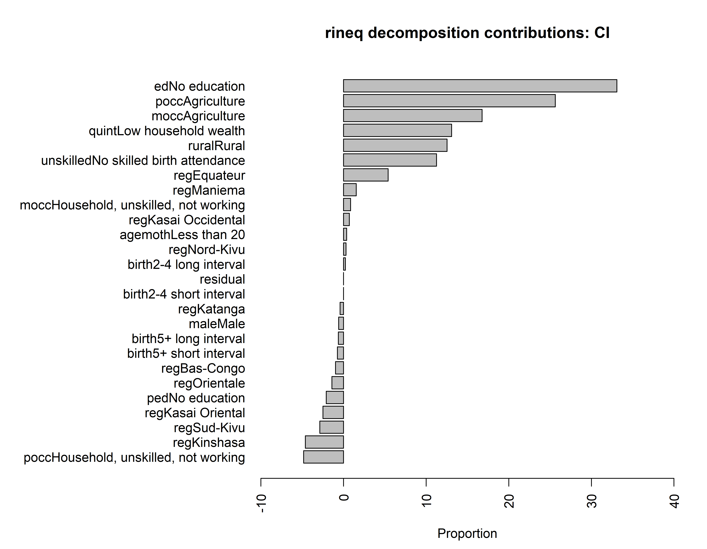

``` r
rineq_cig_decomp <- build_margins_rineq_decomposition("CIg")
rineq_cig_summary <- decomposition_to_table(rineq_cig_decomp, digits = 4L)
classical_cig_table <- summarise_rineq_decomposition(rineq_cig_decomp, "CIg")
```

``` r
report_compact_table(
  rineq_cig_summary,
  digits = 4,
  caption = "rineq decomposition summary: CIg"
)
```

| term | Contribution (%) | Contribution (Abs) | Elasticity | Concentration Index | lower 5% | upper 5% | Corrected |
|----|----|----|----|----|----|----|----|
| residual | -447.2147 | 0.0533 | 0.0000 | NA | NA | NA |  |
| quintLow household wealth | 53.7892 | -0.0064 | 0.0260 | -0.2461 | -0.2505 | -0.2417 | no |
| unskilledNo skilled birth attendance | 60.0693 | -0.0072 | 0.0983 | -0.0728 | -0.0789 | -0.0668 | no |
| maleMale | -2.7752 | 0.0003 | 0.1042 | 0.0032 | -0.0030 | 0.0094 | no |
| birth2-4 short interval | -0.0064 | 0.0000 | -0.0004 | -0.0019 | -0.0057 | 0.0020 | no |
| birth2-4 long interval | 0.6846 | -0.0001 | -0.1463 | 0.0006 | -0.0053 | 0.0064 | no |
| birth5+ short interval | -0.9848 | 0.0001 | 0.0508 | 0.0023 | -0.0014 | 0.0061 | no |
| birth5+ long interval | -1.5648 | 0.0002 | -0.0919 | -0.0020 | -0.0075 | 0.0034 | no |
| agemothLess than 20 | 1.5225 | -0.0002 | 0.0124 | -0.0147 | -0.0208 | -0.0085 | no |
| ruralRural | 71.7600 | -0.0086 | 0.0480 | -0.1783 | -0.1835 | -0.1731 | no |
| edNo education | 170.9743 | -0.0204 | 0.1616 | -0.1261 | -0.1320 | -0.1202 | no |
| pedNo education | -5.2849 | 0.0006 | -0.0084 | -0.0754 | -0.0812 | -0.0695 | no |
| moccHousehold, unskilled, not working | 1.7485 | -0.0002 | -0.0033 | 0.0623 | 0.0567 | 0.0679 | no |
| moccAgriculture | 87.3305 | -0.0104 | 0.0680 | -0.1529 | -0.1587 | -0.1472 | no |
| poccHousehold, unskilled, not working | -5.6917 | 0.0007 | 0.0258 | 0.0263 | 0.0219 | 0.0307 | no |
| poccAgriculture | 117.9789 | -0.0141 | 0.0963 | -0.1460 | -0.1520 | -0.1400 | no |
| regBas-Congo | -0.3597 | 0.0000 | 0.0089 | 0.0048 | 0.0023 | 0.0073 | no |
| regEquateur | 6.3709 | -0.0008 | 0.0274 | -0.0277 | -0.0321 | -0.0233 | no |
| regKasai Occidental | 0.6484 | -0.0001 | 0.0090 | -0.0086 | -0.0124 | -0.0047 | no |
| regKasai Oriental | -2.9507 | 0.0004 | 0.0167 | 0.0210 | 0.0167 | 0.0254 | no |
| regKatanga | -0.4461 | 0.0001 | 0.0503 | 0.0011 | -0.0027 | 0.0048 | no |
| regKinshasa | -3.6205 | 0.0004 | 0.0059 | 0.0727 | 0.0672 | 0.0782 | no |
| regManiema | 0.5473 | -0.0001 | 0.0161 | -0.0040 | -0.0064 | -0.0017 | no |
| regNord-Kivu | 0.0878 | 0.0000 | -0.0069 | 0.0015 | -0.0009 | 0.0039 | no |
| regOrientale | -1.3137 | 0.0002 | -0.0072 | -0.0216 | -0.0258 | -0.0175 | no |
| regSud-Kivu | -1.2988 | 0.0002 | 0.0126 | 0.0123 | 0.0094 | 0.0152 | no |

rineq decomposition summary: CIg

``` r
plot(
  rineq_cig_decomp,
  horiz = TRUE,
  decreasing = FALSE,
  main = "rineq decomposition contributions: CIg"
)
```

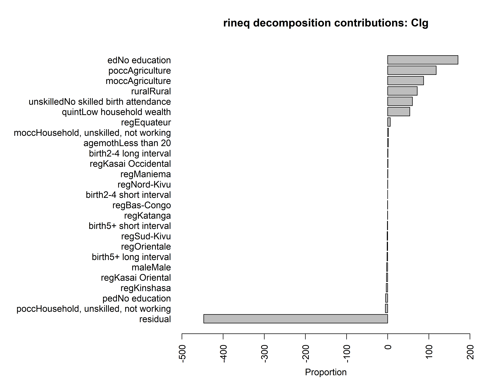

``` r
rineq_cic_decomp <- build_margins_rineq_decomposition("CIc")
rineq_cic_summary <- decomposition_to_table(rineq_cic_decomp, digits = 4L)
classical_cic_table <- summarise_rineq_decomposition(rineq_cic_decomp, "CIc")
```

``` r
report_compact_table(
  rineq_cic_summary,
  digits = 4,
  caption = "rineq decomposition summary: CIc"
)
```

| term | Contribution (%) | Contribution (Abs) | Elasticity | Concentration Index | lower 5% | upper 5% | Corrected |
|----|----|----|----|----|----|----|----|
| residual | -447.2147 | 0.2132 | 0.0000 | NA | NA | NA |  |
| quintLow household wealth | 53.7892 | -0.0256 | 0.0260 | -0.9843 | -1.0019 | -0.9667 | no |
| unskilledNo skilled birth attendance | 60.0693 | -0.0286 | 0.0983 | -0.2913 | -0.3156 | -0.2670 | no |
| maleMale | -2.7752 | 0.0013 | 0.1042 | 0.0127 | -0.0122 | 0.0375 | no |
| birth2-4 short interval | -0.0064 | 0.0000 | -0.0004 | -0.0074 | -0.0228 | 0.0079 | no |
| birth2-4 long interval | 0.6846 | -0.0003 | -0.1463 | 0.0022 | -0.0213 | 0.0258 | no |
| birth5+ short interval | -0.9848 | 0.0005 | 0.0508 | 0.0092 | -0.0058 | 0.0243 | no |
| birth5+ long interval | -1.5648 | 0.0007 | -0.0919 | -0.0081 | -0.0300 | 0.0138 | no |
| agemothLess than 20 | 1.5225 | -0.0007 | 0.0124 | -0.0587 | -0.0833 | -0.0340 | no |
| ruralRural | 71.7600 | -0.0342 | 0.0480 | -0.7131 | -0.7340 | -0.6922 | no |
| edNo education | 170.9743 | -0.0815 | 0.1616 | -0.5044 | -0.5281 | -0.4806 | no |
| pedNo education | -5.2849 | 0.0025 | -0.0084 | -0.3014 | -0.3248 | -0.2780 | no |
| moccHousehold, unskilled, not working | 1.7485 | -0.0008 | -0.0033 | 0.2490 | 0.2267 | 0.2714 | no |
| moccAgriculture | 87.3305 | -0.0416 | 0.0680 | -0.6118 | -0.6349 | -0.5886 | no |
| poccHousehold, unskilled, not working | -5.6917 | 0.0027 | 0.0258 | 0.1053 | 0.0878 | 0.1227 | no |
| poccAgriculture | 117.9789 | -0.0562 | 0.0963 | -0.5840 | -0.6080 | -0.5601 | no |
| regBas-Congo | -0.3597 | 0.0002 | 0.0089 | 0.0193 | 0.0094 | 0.0293 | no |
| regEquateur | 6.3709 | -0.0030 | 0.0274 | -0.1108 | -0.1284 | -0.0932 | no |
| regKasai Occidental | 0.6484 | -0.0003 | 0.0090 | -0.0343 | -0.0497 | -0.0188 | no |
| regKasai Oriental | -2.9507 | 0.0014 | 0.0167 | 0.0841 | 0.0667 | 0.1015 | no |
| regKatanga | -0.4461 | 0.0002 | 0.0503 | 0.0042 | -0.0109 | 0.0193 | no |
| regKinshasa | -3.6205 | 0.0017 | 0.0059 | 0.2909 | 0.2690 | 0.3129 | no |
| regManiema | 0.5473 | -0.0003 | 0.0161 | -0.0162 | -0.0255 | -0.0068 | no |
| regNord-Kivu | 0.0878 | 0.0000 | -0.0069 | 0.0061 | -0.0035 | 0.0157 | no |
| regOrientale | -1.3137 | 0.0006 | -0.0072 | -0.0865 | -0.1031 | -0.0699 | no |
| regSud-Kivu | -1.2988 | 0.0006 | 0.0126 | 0.0492 | 0.0376 | 0.0608 | no |

rineq decomposition summary: CIc

``` r
plot(
  rineq_cic_decomp,
  horiz = TRUE,
  decreasing = FALSE,
  main = "rineq decomposition contributions: CIc"
)
```

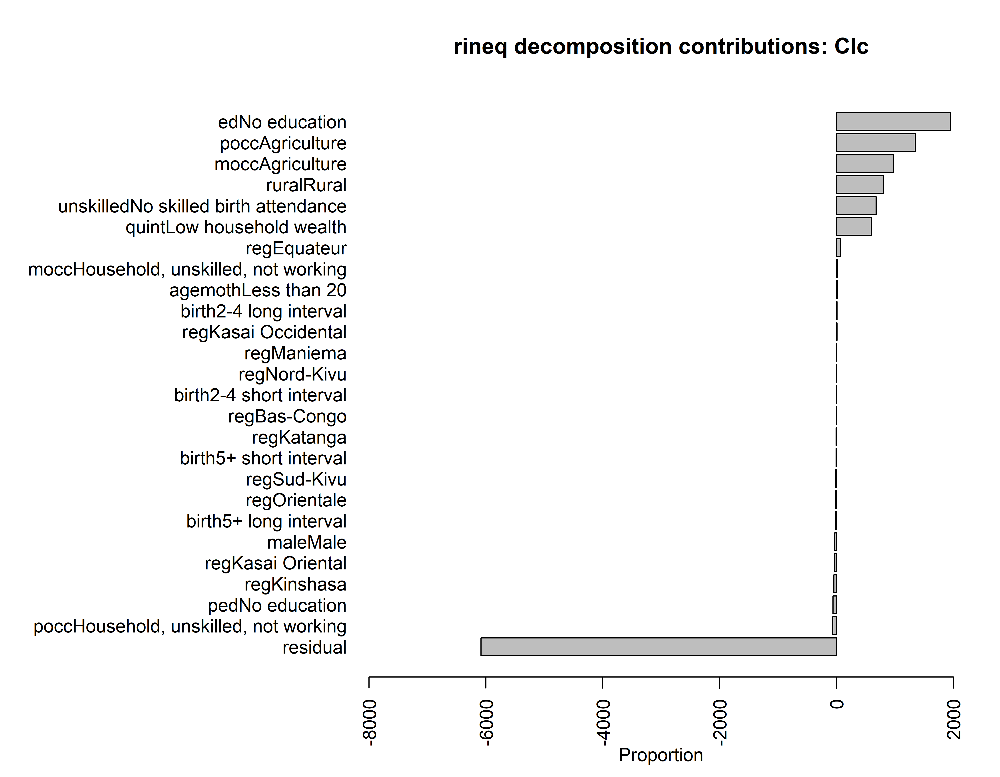

``` r
rineq_ciw_decomp <- build_margins_rineq_decomposition("CIw")
rineq_ciw_summary <- decomposition_to_table(rineq_ciw_decomp, digits = 4L)
classical_ciw_table <- summarise_rineq_decomposition(rineq_ciw_decomp, "CIw")
```

``` r
report_compact_table(
  rineq_ciw_summary,
  digits = 4,
  caption = "rineq decomposition summary: CIw"
)
```

| term | Contribution (%) | Contribution (Abs) | Elasticity | Concentration Index | lower 5% | upper 5% | Corrected |
|----|----|----|----|----|----|----|----|
| residual | -99.7634 | 0.1285 | 0.0000 | NA | NA | NA |  |
| quintLow household wealth | 20.2304 | -0.0261 | 0.0260 | -1.0001 | -1.0180 | -0.9822 | no |
| unskilledNo skilled birth attendance | 22.7747 | -0.0293 | 0.0983 | -0.2984 | -0.3233 | -0.2735 | no |
| maleMale | -1.0274 | 0.0013 | 0.1042 | 0.0127 | -0.0122 | 0.0376 | no |
| birth2-4 short interval | -0.0062 | 0.0000 | -0.0004 | -0.0196 | -0.0599 | 0.0208 | no |
| birth2-4 long interval | 0.2828 | -0.0004 | -0.1463 | 0.0025 | -0.0238 | 0.0287 | no |
| birth5+ short interval | -0.9967 | 0.0013 | 0.0508 | 0.0253 | -0.0159 | 0.0664 | no |
| birth5+ long interval | -0.7483 | 0.0010 | -0.0919 | -0.0105 | -0.0387 | 0.0178 | no |
| agemothLess than 20 | 0.5742 | -0.0007 | 0.0124 | -0.0598 | -0.0849 | -0.0347 | no |
| ruralRural | 28.0736 | -0.0361 | 0.0480 | -0.7537 | -0.7758 | -0.7316 | no |
| edNo education | 64.3679 | -0.0829 | 0.1616 | -0.5130 | -0.5371 | -0.4889 | no |
| pedNo education | -2.4835 | 0.0032 | -0.0084 | -0.3827 | -0.4124 | -0.3529 | no |
| moccHousehold, unskilled, not working | 0.9086 | -0.0012 | -0.0033 | 0.3496 | 0.3182 | 0.3810 | no |
| moccAgriculture | 32.7732 | -0.0422 | 0.0680 | -0.6202 | -0.6437 | -0.5968 | no |
| poccHousehold, unskilled, not working | -4.7020 | 0.0061 | 0.0258 | 0.2349 | 0.1959 | 0.2739 | no |
| poccAgriculture | 43.6729 | -0.0562 | 0.0963 | -0.5841 | -0.6081 | -0.5601 | no |
| regBas-Congo | -0.8648 | 0.0011 | 0.0089 | 0.1255 | 0.0609 | 0.1902 | no |
| regEquateur | 5.2659 | -0.0068 | 0.0274 | -0.2474 | -0.2866 | -0.2082 | no |
| regKasai Occidental | 0.6316 | -0.0008 | 0.0090 | -0.0902 | -0.1309 | -0.0495 | no |
| regKasai Oriental | -2.3662 | 0.0030 | 0.0167 | 0.1822 | 0.1445 | 0.2200 | no |
| regKatanga | -0.4465 | 0.0006 | 0.0503 | 0.0114 | -0.0294 | 0.0523 | no |
| regKinshasa | -4.0471 | 0.0052 | 0.0059 | 0.8786 | 0.8123 | 0.9449 | no |
| regManiema | 1.4914 | -0.0019 | 0.0161 | -0.1190 | -0.1878 | -0.0503 | no |
| regNord-Kivu | 0.2170 | -0.0003 | -0.0069 | 0.0407 | -0.0237 | 0.1051 | no |
| regOrientale | -1.1901 | 0.0015 | -0.0072 | -0.2118 | -0.2524 | -0.1712 | no |
| regSud-Kivu | -2.6222 | 0.0034 | 0.0126 | 0.2682 | 0.2050 | 0.3314 | no |

rineq decomposition summary: CIw

``` r
plot(
  rineq_ciw_decomp,
  horiz = TRUE,
  decreasing = FALSE,
  main = "rineq decomposition contributions: CIw"
)
```

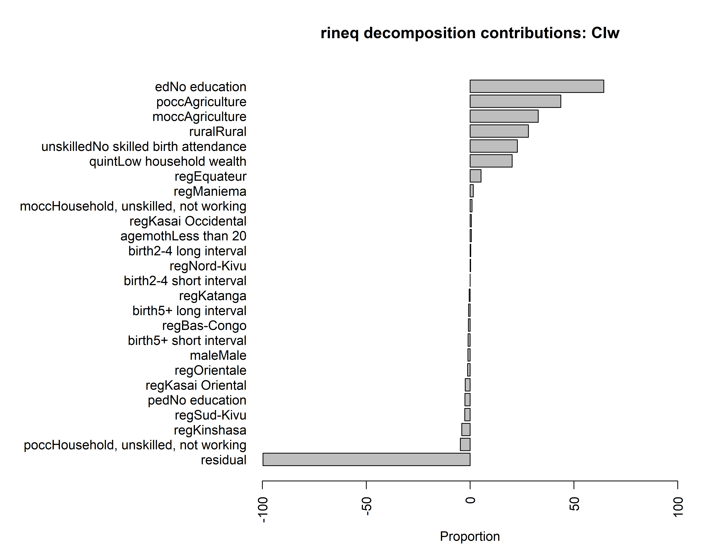

``` r
rineq_decomp_by_type <- list(
  CI = rineq_ci_decomp,
  CIg = rineq_cig_decomp,
  CIc = rineq_cic_decomp,
  CIw = rineq_ciw_decomp
)

rineq_summary_by_type <- list(
  CI = rineq_ci_summary,
  CIg = rineq_cig_summary,
  CIc = rineq_cic_summary,
  CIw = rineq_ciw_summary
)

rineq_summary <- rbindlist(lapply(names(rineq_summary_by_type), function(type) {
  out <- copy(rineq_summary_by_type[[type]])
  out[, criterion := type]
  setcolorder(out, c("criterion", setdiff(names(out), "criterion")))
  out
}), fill = TRUE)

classical_decomposition_table <- rbindlist(
  list(classical_ci_table, classical_cig_table, classical_cic_table, classical_ciw_table),
  fill = TRUE
)
```

``` r
published_drc_table3_reference <- rbindlist(list(
  data.table(
    criterion = "G",
    determinant = c(
      "Household wealth",
      "Skilled birth attendance",
      "Sex of the child",
      "Birth order and interval",
      "Mother's age at birth",
      "Type of residence",
      "Mother's education",
      "Father's education",
      "Mother's occupation",
      "Father's occupation",
      "Region"
    ),
    published_index = -0.128,
    published_percent = c(2.4, 7.3, 5.3, 35.6, 0.4, 3.4, 17.4, -0.7, 5.8, 9.1, 14.0)
  ),
  data.table(
    criterion = "C",
    determinant = c(
      "Household wealth",
      "Skilled birth attendance",
      "Sex of the child",
      "Birth order and interval",
      "Mother's age at birth",
      "Type of residence",
      "Mother's education",
      "Father's education",
      "Mother's occupation",
      "Father's occupation",
      "Region"
    ),
    published_index = 0.057,
    published_percent = c(13.1, 11.3, -0.6, -1.2, 0.4, 12.5, 33.1, -2.1, 17.6, 20.8, -4.9)
  )
))

determinant_map <- data.table(
  variable = c("quint", "unskilled", "male", "birth", "agemoth", "rural", "ed", "ped", "mocc", "pocc", "reg"),
  raw_variable = c("quint", "unskilled", "male", "birth", "agemoth", "rural", "ed", "ped", "mocc", "pocc", "reg"),
  determinant = c(
    "Household wealth",
    "Skilled birth attendance",
    "Sex of the child",
    "Birth order and interval",
    "Mother's age at birth",
    "Type of residence",
    "Mother's education",
    "Father's education",
    "Mother's occupation",
    "Father's occupation",
    "Region"
  )
)
determinant_map <- rbindlist(
  list(
    determinant_map,
    merge(
      indicator_level_map[, .(variable, raw_variable)],
      determinant_map[, .(raw_variable, determinant)],
      by = "raw_variable",
      all.x = TRUE,
      sort = FALSE
    )[, .(variable, raw_variable, determinant)]
  ),
  fill = TRUE
)

classical_decomposition_grouped <- classical_decomposition_table[
  determinant_map,
  on = "variable",
  nomatch = 0L
][
  ,
  .(
    regression_contribution = sum(regression_contribution, na.rm = TRUE),
    regression_pct_contribution = sum(regression_pct_contribution, na.rm = TRUE)
  ),
  by = .(criterion, determinant)
]

published_drc_table3_comparison <- merge(
  published_drc_table3_reference[criterion == "C"],
  classical_decomposition_grouped[criterion == "CI"],
  by = "determinant",
  all.x = TRUE,
  sort = FALSE
)
published_drc_table3_comparison[
  ,
  difference_from_published := regression_pct_contribution - published_percent
]
```

``` r
report_compact_table(
  published_drc_table3_comparison[
    ,
    .(
      determinant,
      paper_c_percent = published_percent,
      generated_ci_percent = regression_pct_contribution,
      difference_from_published
    )
  ],
  digits = 2,
  caption = "Published DRCongo 2007 concentration-index decomposition compared with generated regression decomposition"
)
```

| determinant | paper_c_percent | generated_ci_percent | difference_from_published |
|----|----|----|----|
| Household wealth | 13.1 | 12.70 | -0.40 |
| Skilled birth attendance | 11.3 | 10.74 | -0.56 |
| Sex of the child | -0.6 | -0.58 | 0.02 |
| Birth order and interval | -1.2 | -1.41 | -0.21 |
| Mother’s age at birth | 0.4 | 0.36 | -0.04 |
| Type of residence | 12.5 | 12.02 | -0.48 |
| Mother’s education | 33.1 | 31.23 | -1.87 |
| Father’s education | -2.1 | -2.02 | 0.08 |
| Mother’s occupation | 17.6 | 16.91 | -0.69 |
| Father’s occupation | 20.8 | 19.55 | -1.25 |
| Region | -4.9 | -4.13 | 0.77 |

Published DRCongo 2007 concentration-index decomposition compared with
generated regression decomposition

# Fit Concentration-Index Trees

This is the core generator step. The grid is cross-validated, then each
criterion is refitted at its selected setting.

``` r
tree_grid <- ci_tree_control_grid(
    minsplit = c(500L), # 750L worked
    minbucket = c(100L), # 100 worked
    minprob = 0.01,
    maxdepth = 10L,
    min_gain = 0.0001,
    min_relative_gain = c(0.15,  0.20, 0.25,  0.30)
)


# filter where minbucket is at least 50% of minsplit to avoid invalid settings
tree_grid <- tree_grid[minbucket <= 0.5 * minsplit]
```

``` r
make_psu_fold_id <- function(psu,
                             outcome,
                             weights = NULL,
                             v = 10L,
                             seed = 20260508) {
    psu <- as.integer(psu)
    outcome <- as.integer(outcome)
    if (length(psu) != length(outcome)) {
        stop("`psu` and `outcome` must have the same length.", call. = FALSE)
    }
    if (anyNA(psu)) {
        stop("`psu` cannot contain missing values.", call. = FALSE)
    }
    if (is.null(weights)) {
        weights <- rep(1, length(psu))
    }
    weights <- as.numeric(weights)

    psu_frame <- data.table(
        PSU = psu,
        outcome = outcome,
        weight = weights
    )[
        ,
        .(
            rows = .N,
            deaths = sum(outcome == 1L, na.rm = TRUE),
            weighted_deaths = sum(weight * outcome, na.rm = TRUE),
            weighted_rows = sum(weight, na.rm = TRUE)
        ),
        by = PSU
    ]

    v <- max(2L, as.integer(v[1L]))
    v <- min(v, nrow(psu_frame))

    set.seed(seed)
    psu_frame[, random_order := runif(.N)]
    setorder(psu_frame, -deaths, -weighted_deaths, random_order)
    psu_frame[, fold_id := NA_integer_]

    fold_load <- data.table(
        fold_id = seq_len(v),
        deaths = 0,
        weighted_deaths = 0,
        rows = 0,
        weighted_rows = 0
    )

    for (i in seq_len(nrow(psu_frame))) {
        setorder(fold_load, deaths, weighted_deaths, rows, fold_id)
        chosen_fold <- fold_load$fold_id[1L]
        psu_frame[i, fold_id := chosen_fold]
        fold_load[
            fold_id == chosen_fold,
            `:=`(
                deaths = deaths + psu_frame$deaths[i],
                weighted_deaths = weighted_deaths + psu_frame$weighted_deaths[i],
                rows = rows + psu_frame$rows[i],
                weighted_rows = weighted_rows + psu_frame$weighted_rows[i]
            )
        ]
    }

    row_frame <- data.table(row_id = seq_along(psu), PSU = psu)
    row_frame[psu_frame[, .(PSU, fold_id)], on = "PSU", fold_id := i.fold_id]
    row_frame$fold_id
}

tree_psu_fold_id <- make_psu_fold_id(
    psu = raw_congo_model_dt$PSU,
    outcome = congo_model_dt$deadu5_num,
    weights = congo_model_dt$sample_weight,
    v = runtime_params$tuning_folds,
    seed = 20260508
)

psu_fold_check <- data.table(
    PSU = raw_congo_model_dt$PSU,
    fold_id = tree_psu_fold_id
)[, .(fold_count = uniqueN(fold_id)), by = PSU]
if (any(psu_fold_check$fold_count > 1L)) {
    stop("At least one PSU was assigned to more than one fold.", call. = FALSE)
}

tree_psu_fold_summary <- data.table(
    fold_id = tree_psu_fold_id,
    PSU = raw_congo_model_dt$PSU,
    deadu5_num = congo_model_dt$deadu5_num,
    sample_weight = congo_model_dt$sample_weight
)[
    ,
    .(
        rows = .N,
        psus = uniqueN(PSU),
        deaths = sum(deadu5_num == 1L, na.rm = TRUE),
        non_deaths = sum(deadu5_num == 0L, na.rm = TRUE),
        weighted_death_percent =
            100 * weighted.mean(deadu5_num, sample_weight, na.rm = TRUE)
    ),
    by = fold_id
][order(fold_id)]
```

``` r
ci_tuning_metrics <- c(
    "validation_gain",
    "relative_validation_gain",
    "percent_validation_root_recovered",
    "brier",
    "log_loss",
    "roc_auc"
)

tree_tuning <- tune_ci_tree(
    formula = congo_ci_formula,
    data = congo_model_dt,
    rank_name = "wealth",
    outcome_name = "deadu5_num",
    weights = congo_model_dt$sample_weight,
    type = criterion_types,
    control_grid = tree_grid,
    fold_id = tree_psu_fold_id,
    seed = 20260508,
    metric = ci_tuning_metrics,
    refit = FALSE,
    control = control_ci_tune(save_pred = TRUE)
)


save(tree_tuning, file = tree_tuning_file)
load(tree_tuning_file)
```

``` r
tree_best_by_type <- ci_select_best(tree_tuning,
    metric = "relative_validation_gain"
)
tree_selection_table <- ci_fit_summary_table(
    tree_tuning,
    selected = tree_best_by_type,
    metrics = unique(tree_tuning$summary$metric),
    include_percent = FALSE
)
tree_selection_table[
    tree_best_by_type,
    terminal_nodes := i.mean_terminal_nodes,
    on = c("type", "grid_id")
]
tree_selection_table[, selection_basis := paste(
    runtime_params$tuning_folds,
    "PSU-held-out folds"
)]
report_compact_table(
    tree_selection_table,
    digits = 4,
    caption = "Summary of the concentration-index tree selection results across criteria"
)
```

| type | grid_id | minsplit | minbucket | minprob | maxdepth | min_gain | min_relative_gain | mean_brier | mean_log_loss | mean_percent_validation_root_recovered | mean_roc_auc | mean_train_gain | mean_train_relative_gain | mean_validation_gain | mean_validation_relative_gain | n_brier | n_log_loss | n_percent_validation_root_recovered | n_roc_auc | n_train_gain | n_train_relative_gain | n_validation_gain | n_validation_relative_gain | std_err_brier | std_err_log_loss | std_err_percent_validation_root_recovered | std_err_roc_auc | std_err_train_gain | std_err_train_relative_gain | std_err_validation_gain | std_err_validation_relative_gain | mean_root_objective | n_root_objective | std_err_root_objective | terminal_nodes | selection_basis |
|----|----|----|----|----|----|----|----|----|----|----|----|----|----|----|----|----|----|----|----|----|----|----|----|----|----|----|----|----|----|----|----|----|----|----|----|----|
| CI | 3 | 500 | 100 | 0.01 | 10 | 1e-04 | 0.25 | 0.0984 | 0.3484 | -11.5715 | 0.5503 | 0.0960 | 0.8331 | -0.0234 | -11.5715 | 10 | 10 | 10 | 10 | 10 | 10 | 10 | 10 | 0.0062 | 0.0167 | 11.3187 | 0.0155 | 0.0044 | 0.0162 | 0.0189 | 11.3187 | 0.1293 | 10 | 0.0265 | 6.9 | 10 PSU-held-out folds |
| CIc | 12 | 500 | 100 | 0.01 | 10 | 1e-04 | 0.30 | 0.0983 | 0.3480 | -10.5802 | 0.5528 | 0.0388 | 0.8157 | -0.0030 | -10.5802 | 10 | 10 | 10 | 10 | 10 | 10 | 10 | 10 | 0.0063 | 0.0171 | 10.3952 | 0.0168 | 0.0019 | 0.0211 | 0.0077 | 10.3952 | 0.0591 | 10 | 0.0149 | 6.0 | 10 PSU-held-out folds |
| CIg | 8 | 500 | 100 | 0.01 | 10 | 1e-04 | 0.30 | 0.0983 | 0.3480 | -10.5802 | 0.5528 | 0.0097 | 0.8157 | -0.0007 | -10.5802 | 10 | 10 | 10 | 10 | 10 | 10 | 10 | 10 | 0.0063 | 0.0171 | 10.3952 | 0.0168 | 0.0005 | 0.0211 | 0.0019 | 10.3952 | 0.0148 | 10 | 0.0037 | 6.0 | 10 PSU-held-out folds |
| L | 15 | 500 | 100 | 0.01 | 10 | 1e-04 | 0.25 | 0.0986 | 0.3494 | 0.6449 | 0.5331 | 0.1995 | 0.9819 | 1.7776 | 0.6449 | 10 | 10 | 10 | 10 | 10 | 10 | 10 | 10 | 0.0063 | 0.0170 | 0.1132 | 0.0173 | 0.0174 | 0.0036 | 1.6048 | 0.1132 | 1.8028 | 10 | 1.6055 | 7.5 | 10 PSU-held-out folds |

Summary of the concentration-index tree selection results across
criteria

``` r
tree_models_by_type <- setNames(
    lapply(seq_len(nrow(tree_best_by_type)), function(i) {
        setting <- tree_best_by_type[i]
        ci_tree(
            formula = congo_ci_formula,
            data = congo_model_dt,
            rank_name = "wealth",
            outcome_name = "deadu5_num",
            weights = congo_model_dt$sample_weight,
            type = setting$type[1L],
            control = ci_control_from_row(setting)
        )
    }),
    tree_best_by_type$type
)
```

``` r
selected_tree_type <- tree_selection_table[order(-mean_validation_relative_gain)][1L, type]
selected_tree_fit <- tree_models_by_type[[selected_tree_type]]
selected_tree_summary <- as.data.table(ci_tree_terminal_summary(selected_tree_fit))

all_tree_terminal_summaries <- rbindlist(lapply(names(tree_models_by_type), function(type) {
    out <- as.data.table(ci_tree_terminal_summary(tree_models_by_type[[type]]))
    out[, criterion := type]
    setcolorder(out, "criterion")
    out
}), fill = TRUE)
```

``` r
tree_variable_importance <- collect_variable_importance(tree_models_by_type)

tree_best_controls <- tree_best_by_type[
    ,
    .(type, minsplit, minbucket, minprob, maxdepth, min_gain, min_relative_gain)
]

tree_complexity_metrics <- collect_complexity_metrics(tree_tuning)
tree_min_relative_gain_path <- min_relative_gain_path(tree_complexity_metrics,
    selected = tree_best_by_type
)

tree_fit_wide <- ci_fit_summary_table(
    tree_tuning,
    selected = tree_best_by_type,
    metrics = unique(tree_tuning$summary$metric),
    include_percent = FALSE
)
tree_fit_table <- ci_collect_metrics(
    tree_tuning,
    selected = tree_best_by_type,
    metric = unique(tree_tuning$summary$metric),
    format = "tidy",
    include_train = TRUE
)
```

``` r
report_compact_table(
  tree_selection_table,
  digits = 4,
  caption = "Selection summary for the fitted concentration-index trees"
)
```

| type | grid_id | minsplit | minbucket | minprob | maxdepth | min_gain | min_relative_gain | mean_brier | mean_log_loss | mean_percent_validation_root_recovered | mean_roc_auc | mean_train_gain | mean_train_relative_gain | mean_validation_gain | mean_validation_relative_gain | n_brier | n_log_loss | n_percent_validation_root_recovered | n_roc_auc | n_train_gain | n_train_relative_gain | n_validation_gain | n_validation_relative_gain | std_err_brier | std_err_log_loss | std_err_percent_validation_root_recovered | std_err_roc_auc | std_err_train_gain | std_err_train_relative_gain | std_err_validation_gain | std_err_validation_relative_gain | mean_root_objective | n_root_objective | std_err_root_objective | terminal_nodes | selection_basis |
|----|----|----|----|----|----|----|----|----|----|----|----|----|----|----|----|----|----|----|----|----|----|----|----|----|----|----|----|----|----|----|----|----|----|----|----|----|
| CI | 3 | 500 | 100 | 0.01 | 10 | 1e-04 | 0.25 | 0.0984 | 0.3484 | -11.5715 | 0.5503 | 0.0960 | 0.8331 | -0.0234 | -11.5715 | 10 | 10 | 10 | 10 | 10 | 10 | 10 | 10 | 0.0062 | 0.0167 | 11.3187 | 0.0155 | 0.0044 | 0.0162 | 0.0189 | 11.3187 | 0.1293 | 10 | 0.0265 | 6.9 | 10 PSU-held-out folds |
| CIc | 12 | 500 | 100 | 0.01 | 10 | 1e-04 | 0.30 | 0.0983 | 0.3480 | -10.5802 | 0.5528 | 0.0388 | 0.8157 | -0.0030 | -10.5802 | 10 | 10 | 10 | 10 | 10 | 10 | 10 | 10 | 0.0063 | 0.0171 | 10.3952 | 0.0168 | 0.0019 | 0.0211 | 0.0077 | 10.3952 | 0.0591 | 10 | 0.0149 | 6.0 | 10 PSU-held-out folds |
| CIg | 8 | 500 | 100 | 0.01 | 10 | 1e-04 | 0.30 | 0.0983 | 0.3480 | -10.5802 | 0.5528 | 0.0097 | 0.8157 | -0.0007 | -10.5802 | 10 | 10 | 10 | 10 | 10 | 10 | 10 | 10 | 0.0063 | 0.0171 | 10.3952 | 0.0168 | 0.0005 | 0.0211 | 0.0019 | 10.3952 | 0.0148 | 10 | 0.0037 | 6.0 | 10 PSU-held-out folds |
| L | 15 | 500 | 100 | 0.01 | 10 | 1e-04 | 0.25 | 0.0986 | 0.3494 | 0.6449 | 0.5331 | 0.1995 | 0.9819 | 1.7776 | 0.6449 | 10 | 10 | 10 | 10 | 10 | 10 | 10 | 10 | 0.0063 | 0.0170 | 0.1132 | 0.0173 | 0.0174 | 0.0036 | 1.6048 | 0.1132 | 1.8028 | 10 | 1.6055 | 7.5 | 10 PSU-held-out folds |

Selection summary for the fitted concentration-index trees

``` r
ci_report_tree_plot(
    fit = selected_tree_fit,
    data = congo_model_dt,
    outcome_name = "deadu5_num",
    outcome_label = "U5 death",
    ci_type = "L",
    var_labels = congo_var_labels
)
```

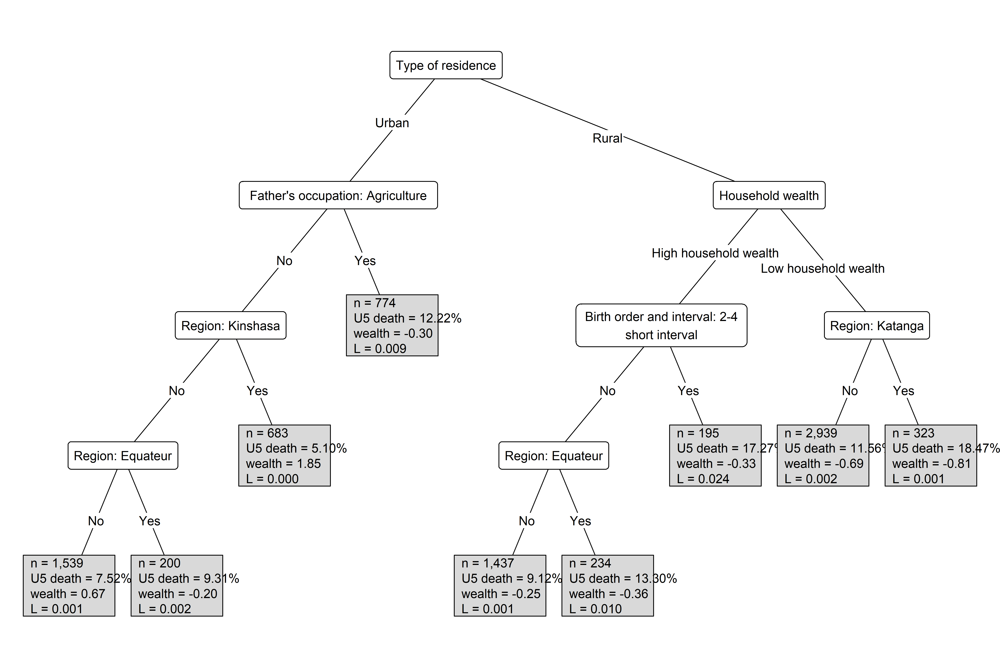

``` r
ci_report_tree_plot(
    fit = tree_models_by_type[["CI"]],
    data = congo_model_dt,
    outcome_name = "deadu5_num",
    outcome_label = "U5 death",
    ci_type = "CI",
    var_labels = congo_var_labels
)
```

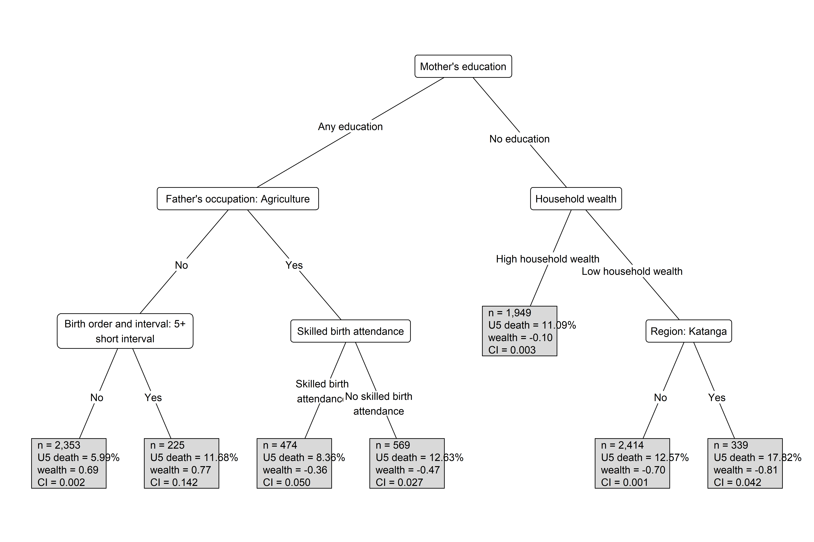

``` r
ci_report_tree_plot(
    fit = tree_models_by_type[["CIg"]],
    data = congo_model_dt,
    outcome_name = "deadu5_num",
    outcome_label = "U5 death",
    ci_type = "CIg",
    var_labels = congo_var_labels
)
```


``` r
ci_report_tree_plot(
    fit = tree_models_by_type[["CIc"]],
    data = congo_model_dt,
    outcome_name = "deadu5_num",
    outcome_label = "U5 death",
    ci_type = "CIc",
    var_labels = congo_var_labels
)
```

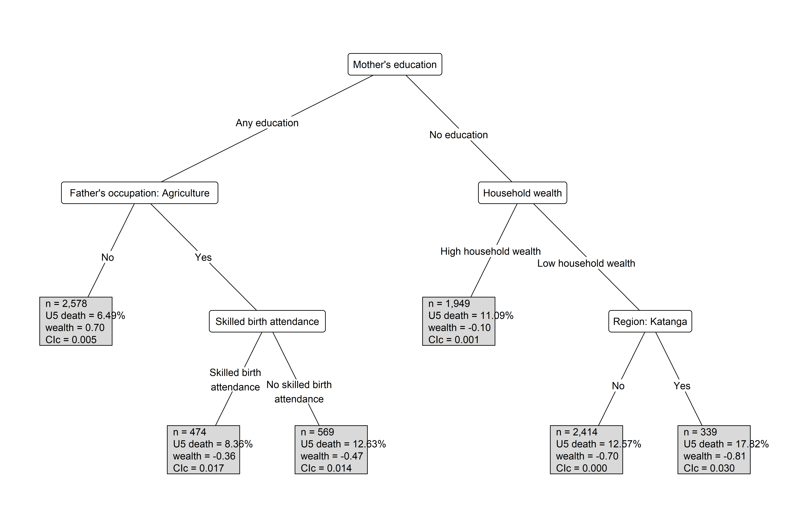

# Fit Lecturer Rpart Comparison Trees

The benchmark rpart trees are retained because they are easy to discuss
beside the inequality-driven tree.

``` r
lecturer_rpart_models <- fit_ci_rpart_comparison(
  data = congo_model_dt,
  predictors = congo_predictors,
  outcome = "deadu5_num",
  rank = "wealth",
  weights = "sample_weight"
)
lecturer_rpart_summary <- summarise_ci_rpart_comparison(lecturer_rpart_models)
```

``` r
rpart_summary_out <- copy(lecturer_rpart_summary)[is_terminal == TRUE]

report_compact_table(
  rpart_summary_out,
  digits = 4,
  caption = "Terminal-node summaries for the lecturer rpart comparison trees"
)
```

| method     | node | var    | n    | weight    | deviance | mean_y | CI      | CI_loss | is_terminal |
|------------|------|--------|------|-----------|----------|--------|---------|---------|-------------|
| simple_abs | 16   | <leaf> | 907  | 926.0304  | 1.9375   | 0.0515 | 0.0021  | 0.0021  | TRUE        |
| simple_abs | 17   | <leaf> | 1400 | 1571.0357 | 5.7339   | 0.0672 | 0.0036  | 0.0036  | TRUE        |
| simple_abs | 18   | <leaf> | 43   | 18.3142   | 2.9358   | 0.1029 | 0.1603  | 0.1603  | TRUE        |
| simple_abs | 38   | <leaf> | 14   | 5.4715    | 0.0000   | 0.0000 | 0.0000  | 0.0000  | TRUE        |
| simple_abs | 78   | <leaf> | 7    | 2.8597    | 0.0000   | 0.0000 | 0.0000  | 0.0000  | TRUE        |
| simple_abs | 79   | <leaf> | 120  | 54.3952   | 3.6348   | 0.2231 | 0.0668  | 0.0668  | TRUE        |
| simple_abs | 10   | <leaf> | 68   | 86.5707   | 23.9450  | 0.1015 | -0.2766 | 0.2766  | TRUE        |
| simple_abs | 22   | <leaf> | 775  | 849.0024  | 5.0031   | 0.1014 | -0.0059 | 0.0059  | TRUE        |
| simple_abs | 23   | <leaf> | 77   | 108.0709  | 0.6296   | 0.1540 | 0.0058  | 0.0058  | TRUE        |
| simple_abs | 6    | <leaf> | 2013 | 1948.8103 | 5.3891   | 0.1109 | -0.0028 | 0.0028  | TRUE        |
| simple_abs | 28   | <leaf> | 6    | 6.6534    | 0.0000   | 0.0000 | 0.0000  | 0.0000  | TRUE        |
| simple_abs | 29   | <leaf> | 2512 | 2407.0755 | 0.3082   | 0.1260 | -0.0001 | 0.0001  | TRUE        |
| simple_abs | 30   | <leaf> | 162  | 145.1661  | 0.1906   | 0.1444 | -0.0013 | 0.0013  | TRUE        |
| simple_abs | 62   | <leaf> | 62   | 62.1253   | 0.4429   | 0.1359 | 0.0071  | 0.0071  | TRUE        |
| simple_abs | 63   | <leaf> | 130  | 131.5099  | 8.6060   | 0.2354 | -0.0654 | 0.0654  | TRUE        |
| robust_abs | 8    | <leaf> | 1961 | 2025.0841 | 30.8769  | 0.0675 | -0.0152 | 0.0152  | TRUE        |
| robust_abs | 9    | <leaf> | 530  | 553.0227  | 8.0311   | 0.0552 | -0.0145 | 0.0145  | TRUE        |
| robust_abs | 10   | <leaf> | 374  | 474.3692  | 23.8352  | 0.0836 | -0.0502 | 0.0502  | TRUE        |
| robust_abs | 11   | <leaf> | 546  | 569.2748  | 15.4815  | 0.1263 | -0.0272 | 0.0272  | TRUE        |
| robust_abs | 6    | <leaf> | 2013 | 1948.8103 | 6.1032   | 0.1109 | -0.0031 | 0.0031  | TRUE        |
| robust_abs | 14   | <leaf> | 2518 | 2413.7289 | 1.4054   | 0.1257 | 0.0006  | 0.0006  | TRUE        |
| robust_abs | 15   | <leaf> | 354  | 338.8012  | 14.2296  | 0.1782 | -0.0420 | 0.0420  | TRUE        |

Terminal-node summaries for the lecturer rpart comparison trees

``` r
plot_labels <- c(
    simple_abs = "Lecturer rpart method 1: absolute CI impurity",
    robust_abs = "Lecturer rpart method 2: robust absolute CI impurity"
)
plot_fontsize <- c(simple_abs = 4.2, robust_abs = 4.6)

for (method_name in names(lecturer_rpart_models)) {
    cat("\n\n### ", plot_labels[[method_name]] %||% method_name, "\n\n", sep = "")
    ci_report_tree_plot(
        fit = lecturer_rpart_models[[method_name]],
        data = congo_model_dt,
        outcome_name = "deadu5_num",
        outcome_label = "U5 death",
        ci_type = "CI",
        var_labels = congo_var_labels,
        fontsize = plot_fontsize[[method_name]]
    )
}
```

### Lecturer rpart method 1: absolute CI impurity

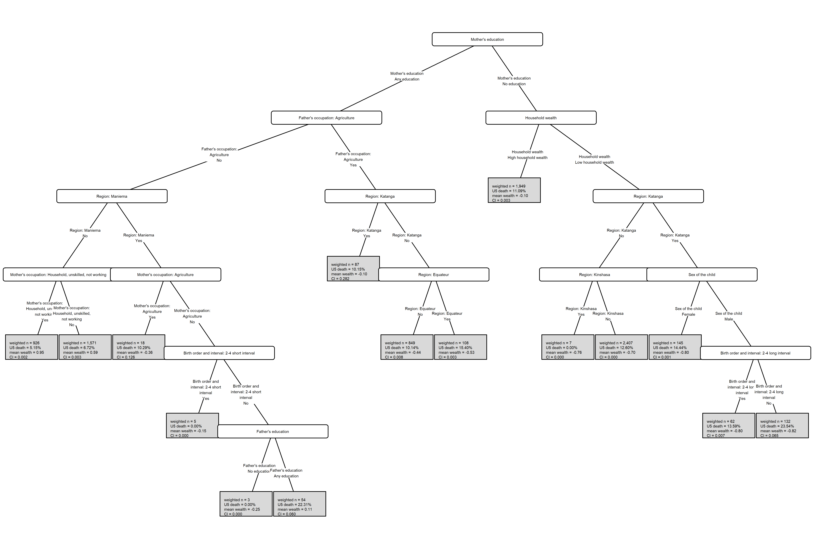

### Lecturer rpart method 2: robust absolute CI impurity

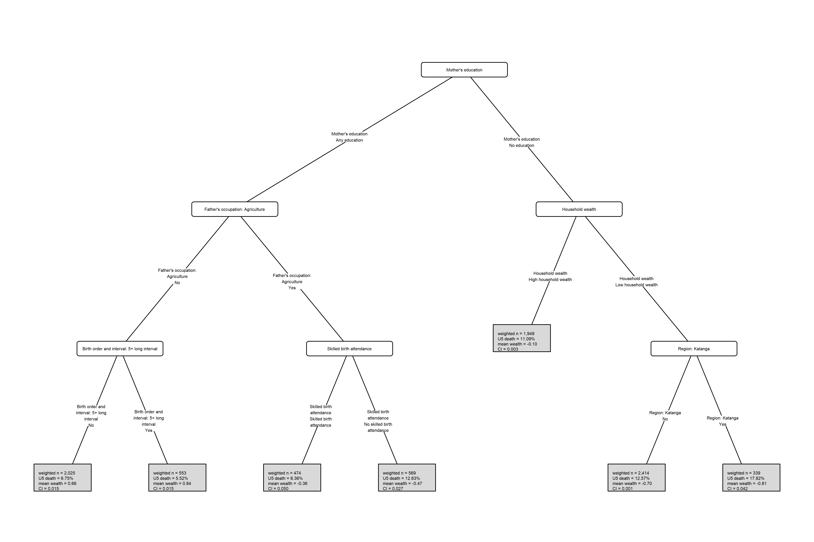

# Forest and SHAP Objects

``` r
# min_relative_gain =       c( 0.25, 0.30, 0.35, 0.40)
#minisplit = 500 #minibucket 
p <- length(congo_predictors)
forest_grid <- ci_tree_control_grid(
    minsplit = 500L, # 1000
    minbucket = 100L, # 300
    minprob = 0.01,
    maxdepth = 15L,
    min_gain = 0.00001,
    min_relative_gain = c(0.10, 0.15, 0.20, 0.25), #0.3,0.35,
    mtry = c(15),
    ntree = c(50L, 100L)
)
```

``` r
# forest_tuning <- run_forest_tuning_batches(
#   formula = congo_ci_formula,
#   data = congo_model_dt,
#   forest_grid = forest_grid,
#   criterion_types = criterion_types,
#   tuning_metrics = ci_tuning_metrics,
#   tuning_selection_metric = "relative_validation_gain",
#   rank_name = "wealth",
#   outcome_name = "deadu5_num",
#   weights = congo_model_dt$sample_weight,
#   folds = runtime_params$tuning_folds,
#   workers = 4L,
#   fold_id = tree_psu_fold_id,
#   progress_steps = min(20L, nrow(forest_grid)),
#   log_file = here("logs", "forest_tuning.log"),
#   seed = 20260508,
#   perturb = list(replace = FALSE, fraction = 0.7)
# )


# library(here)
# save(forest_tuning, file = here("data", "forest_tuning.rdata"))

load(here("data", "forest_tuning.rdata"))
```

``` r
#roc_auc
#relative_validation_gain
forest_best_by_type <- ci_select_best(
  forest_tuning,
  metric = "relative_validation_gain"
)
```

``` r
set.seed(20260509)
# forest_models_by_type <- setNames(
#   lapply(seq_len(nrow(forest_best_by_type)), function(i) {
#     setting <- forest_best_by_type[i]
#     ci_forest(
#       formula = congo_ci_formula,
#       data = congo_model_dt,
#       rank_name = "wealth",
#       outcome_name = "deadu5_num",
#       weights = congo_model_dt$sample_weight,
#       type = setting$type[1L],
#       control = ci_control_from_row(setting, include_mtry = FALSE),
#       ntree = as.integer(setting$ntree[1L]),
#       mtry = as.integer(setting$mtry[1L]),
#       perturb = list(replace = FALSE, fraction = 0.632)
#     )
#   }),
#   forest_best_by_type$type
# )

# save(forest_models_by_type, file = here("data", "forest_models_by_type.rdata"))
load(here("data", "forest_models_by_type.rdata"))

selected_forest_fit <- forest_models_by_type[[selected_tree_type]]
forest_variable_importance <- collect_variable_importance(forest_models_by_type)
```

``` r
forest_complexity_metrics <- collect_complexity_metrics(forest_tuning)
forest_min_relative_gain_path <- min_relative_gain_path(
  forest_complexity_metrics,
  selected = forest_best_by_type
)
```

``` r
forest_selection_table <- ci_fit_summary_table(
    forest_tuning,
    selected = forest_best_by_type,
    metrics = unique(forest_tuning$summary$metric),
    include_percent = FALSE
)
forest_selection_table <- merge(
    forest_selection_table,
    forest_best_by_type[, .(type, ntree, mtry)],
    by = "type",
    all.x = TRUE,
    sort = FALSE
)
forest_selection_table[
    forest_best_by_type,
    `:=`(
        mean_terminal_nodes = i.mean_terminal_nodes,
        mean_max_depth = i.maxdepth
    ),
    on = "type"
]
forest_selection_table[, selection_basis := paste(
    runtime_params$tuning_folds,
    "fold cross-validation"
)]

forest_fit_wide <- copy(forest_selection_table)
forest_fit_table <- ci_collect_metrics(
    forest_tuning,
    selected = forest_best_by_type,
    metric = unique(forest_tuning$summary$metric),
    format = "tidy",
    include_train = TRUE
)
forest_best_controls <- forest_best_by_type[
    ,
    .(
        type, ntree, mtry, minsplit, minbucket,
        minprob, maxdepth,
        min_gain, min_relative_gain
    )
]
```

``` r
forest_surrogates_by_type <- setNames(
  lapply(seq_len(nrow(forest_best_by_type)), function(i) {
    #setting <- copy(forest_best_by_type[i])
    # use same tree settings
    setting <- copy(tree_best_by_type[type == forest_best_by_type$type[i]])
    type = setting$type[1L]

    if (type == "CIc"){
      setting$min_relative_gain <- 0.15
      #setting$minsplit <- 500L
      #setting$minbucket <- 200L
    }else if (type == "L"){
      setting$min_relative_gain <- 0.3
      # setting$minsplit <- 1000L
      #setting$minbucket <- 200L
      setting$maxdepth <- 3L
    } else {
      setting$min_relative_gain <- 0.3
      setting$maxdepth <- 4L
      #setting$minsplit <- 1000L
      #setting$minbucket <- 200L
      #setting$min_gain <- 0.001
    }

    # # setting$minsplit <- 500L
    setting$minbucket <- 500L
    # # setting$maxdepth <- 6L
    ci_forest_surrogate(
      forest_fit = forest_models_by_type[[setting$type[1L]]],
      data = congo_model_dt,
      formula = congo_ci_formula,
      rank_name = "wealth",
      weights = congo_model_dt$sample_weight,
      type = setting$type[1L],
      control = ci_control_from_row(setting, include_mtry = FALSE),
      prediction_name = "forest_risk"
    )
  }),
  forest_best_by_type$type
)
selected_forest_surrogate <- forest_surrogates_by_type[[selected_tree_type]]
selected_forest_surrogate_summary <- as.data.table(
  ci_tree_terminal_summary(selected_forest_surrogate$fit)
)
```

``` r
ci_report_tree_plot(
  fit = forest_surrogates_by_type[["CI"]]$fit,
  data = forest_surrogates_by_type[["CI"]]$data,
  outcome_name = forest_surrogates_by_type[["CI"]]$prediction_name,
  outcome_label = "U5",
  ci_type = "CI",
  var_labels = congo_var_labels
)
```

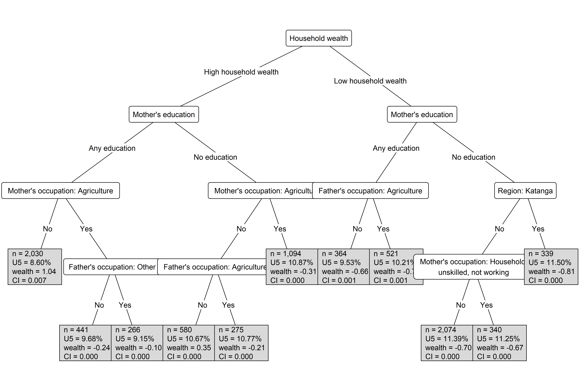

``` r
ci_report_tree_plot(
  fit = forest_surrogates_by_type[["CIg"]]$fit,
  data = forest_surrogates_by_type[["CIg"]]$data,
  outcome_name = forest_surrogates_by_type[["CIg"]]$prediction_name,
  outcome_label = "U5",
  ci_type = "CIg",
  var_labels = congo_var_labels
)
```

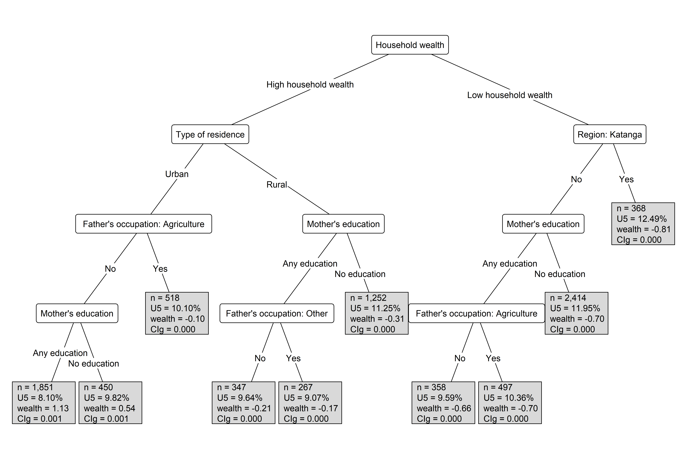

``` r
ci_report_tree_plot(
  fit = forest_surrogates_by_type[["CIc"]]$fit,
  data = forest_surrogates_by_type[["CIc"]]$data,
  outcome_name = forest_surrogates_by_type[["CIc"]]$prediction_name,
  outcome_label = "U5",
  ci_type = "CIc",
  var_labels = congo_var_labels
)
```

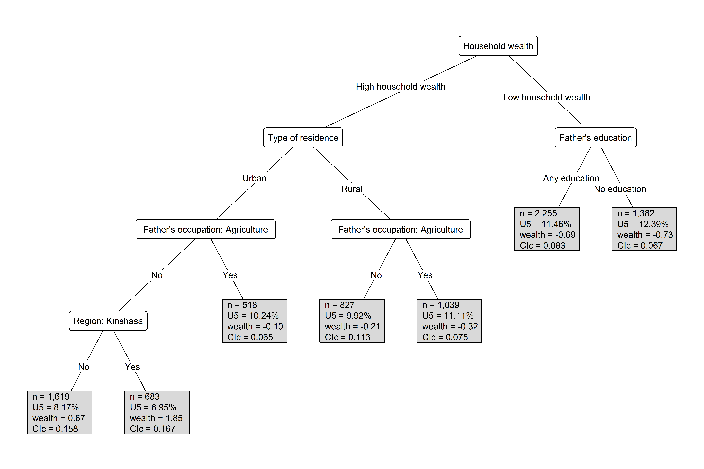

``` r
ci_report_tree_plot(
  fit = forest_surrogates_by_type[["L"]]$fit,
  data = forest_surrogates_by_type[["L"]]$data,
  outcome_name = forest_surrogates_by_type[["L"]]$prediction_name,
  outcome_label = "U5",
  ci_type = "L",
  var_labels = congo_var_labels
)
```

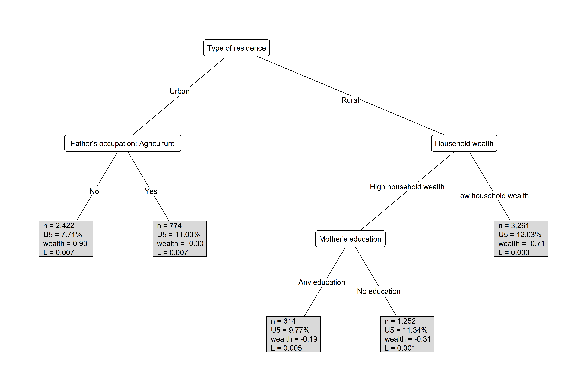

``` r
library(tidymodels)
ranger_analysis <- build_ranger_analysis_data(
  data = data.table(
    raw_congo_model_dt[, .(PSU)],
    congo_model_dt
  ),
  predictor_terms = congo_predictors,
  undersample = runtime_params$undersample,
  outcome_labels = outcome_labels
)
list2env(ranger_analysis, envir = environment())
```

    <environment: R_GlobalEnv>

``` r
ranger_recipe <- recipe(deadu5_factor ~ ., data = ranger_fit_df)
```

``` r
ranger_model_spec <- rand_forest(
  mtry = tune(),
  min_n = tune(),
  trees = 500L
) |>
  set_mode("classification") |>
  set_engine("ranger", probability = TRUE, importance = "impurity")
```

``` r
make_manual_fold_rset <- function(data, fold_id) {
  fold_values <- sort(unique(as.integer(fold_id)))
  splits <- lapply(fold_values, function(fold_value) {
    rsample::make_splits(
      list(
        analysis = as.integer(which(fold_id != fold_value)),
        assessment = as.integer(which(fold_id == fold_value))
      ),
      data = data
    )
  })
  rsample::manual_rset(
    splits,
    ids = sprintf("Fold%02d", seq_along(fold_values))
  )
}

ranger_psu_fold_id <- make_psu_fold_id(
  psu = ranger_dt$PSU,
  outcome = as.integer(ranger_dt$deadu5_factor == "Died"),
  weights = ranger_dt$sample_weight,
  v = runtime_params$tuning_folds,
  seed = 20260508
)

ranger_psu_fold_check <- data.table(
  PSU = ranger_dt$PSU,
  fold_id = ranger_psu_fold_id
)[, .(fold_count = uniqueN(fold_id)), by = PSU]
if (any(ranger_psu_fold_check$fold_count > 1L)) {
  stop("At least one ranger PSU was assigned to more than one fold.", call. = FALSE)
}

ranger_psu_fold_summary <- data.table(
  fold_id = ranger_psu_fold_id,
  PSU = ranger_dt$PSU,
  deadu5_factor = ranger_dt$deadu5_factor,
  sample_weight = ranger_dt$sample_weight
)[
  ,
  .(
    rows = .N,
    psus = uniqueN(PSU),
    deaths = sum(deadu5_factor == "Died", na.rm = TRUE),
    non_deaths = sum(deadu5_factor == "Survived", na.rm = TRUE),
    weighted_death_percent =
      100 * weighted.mean(deadu5_factor == "Died", sample_weight, na.rm = TRUE)
  ),
  by = fold_id
][order(fold_id)]

ranger_resamples <- make_manual_fold_rset(
  data = ranger_fit_df,
  fold_id = ranger_psu_fold_id
)
```

``` r
ranger_workflow <- workflow() |>
  add_model(ranger_model_spec) |>
  add_recipe(ranger_recipe) |>
  add_case_weights(sample_weight_case)
```

``` r
ranger_parameter_set <- hardhat::extract_parameter_set_dials(ranger_workflow) |>
  update(
    mtry = dials::mtry(range = c(10L, length(ranger_predictor_terms))),
    min_n = dials::min_n(range = c(200L, 800L))
  )
ranger_grid <- dials::grid_regular(
  ranger_parameter_set,
  levels = c(mtry = 4, min_n = 3)
)
```

``` r
ranger_metric_set <- yardstick::metric_set(
  yardstick::roc_auc,
  yardstick::accuracy,
  yardstick::sens,
  yardstick::spec,
  yardstick::f_meas
)
ranger_tune_results <- tune_grid(
  ranger_workflow,
  resamples = ranger_resamples,
  grid = ranger_grid,
  metrics = ranger_metric_set,
  control = control_grid(save_pred = TRUE)
)
ranger_tuning <- as.data.table(collect_metrics(ranger_tune_results))
ranger_cv_predictions <- as.data.table(collect_predictions(ranger_tune_results))
```

``` r
ranger_threshold_grid <- seq(0.05, 0.95, by = 0.01)

ranger_threshold_performance <- rbindlist(lapply(ranger_threshold_grid, function(cutoff) {
  threshold_dt <- copy(ranger_cv_predictions)

  threshold_dt[, pred_threshold := factor(
    fifelse(.pred_Died >= cutoff, "Died", "Survived"),
    levels = levels(deadu5_factor)
  )]

  threshold_dt[
    ,
    .(
      threshold = cutoff,
      accuracy = mean(pred_threshold == deadu5_factor),
      sensitivity = yardstick::sens_vec(
        truth = deadu5_factor,
        estimate = pred_threshold,
        event_level = "first"
      ),
      specificity = yardstick::spec_vec(
        truth = deadu5_factor,
        estimate = pred_threshold,
        event_level = "first"
      ),
      f_meas = yardstick::f_meas_vec(
        truth = deadu5_factor,
        estimate = pred_threshold,
        event_level = "first"
      ),
      predicted_died = mean(pred_threshold == "Died"),
      observed_died = mean(deadu5_factor == "Died")
    ),
    by = .config
  ]
}))
# knitr::kable(
#   ranger_threshold_performance,
#   caption = "Performance metrics across probability thresholds for the cross-validated ranger models"
# )
```

``` r
report_compact_table(
  ranger_tuning,
  digits = 4,
  caption = "Predictive ranger cross-validation summary"
)
```

| mtry | min_n | .metric  | .estimator | mean   | n   | std_err | .config          |
|------|-------|----------|------------|--------|-----|---------|------------------|
| 10   | 200   | accuracy | binary     | 0.5781 | 10  | 0.0184  | pre0_mod01_post0 |
| 10   | 200   | f_meas   | binary     | 0.3380 | 10  | 0.0207  | pre0_mod01_post0 |
| 10   | 200   | roc_auc  | binary     | 0.5980 | 10  | 0.0103  | pre0_mod01_post0 |
| 10   | 200   | sens     | binary     | 0.2627 | 10  | 0.0269  | pre0_mod01_post0 |
| 10   | 200   | spec     | binary     | 0.8227 | 10  | 0.0208  | pre0_mod01_post0 |
| 10   | 500   | accuracy | binary     | 0.5820 | 10  | 0.0223  | pre0_mod02_post0 |
| 10   | 500   | f_meas   | binary     | 0.2769 | 10  | 0.0305  | pre0_mod02_post0 |
| 10   | 500   | roc_auc  | binary     | 0.6012 | 10  | 0.0114  | pre0_mod02_post0 |
| 10   | 500   | sens     | binary     | 0.1986 | 10  | 0.0307  | pre0_mod02_post0 |
| 10   | 500   | spec     | binary     | 0.8783 | 10  | 0.0178  | pre0_mod02_post0 |
| 10   | 800   | accuracy | binary     | 0.5896 | 10  | 0.0221  | pre0_mod03_post0 |
| 10   | 800   | f_meas   | binary     | 0.1924 | 10  | 0.0348  | pre0_mod03_post0 |
| 10   | 800   | roc_auc  | binary     | 0.5993 | 10  | 0.0120  | pre0_mod03_post0 |
| 10   | 800   | sens     | binary     | 0.1240 | 10  | 0.0280  | pre0_mod03_post0 |
| 10   | 800   | spec     | binary     | 0.9457 | 10  | 0.0152  | pre0_mod03_post0 |
| 16   | 200   | accuracy | binary     | 0.5806 | 10  | 0.0170  | pre0_mod04_post0 |
| 16   | 200   | f_meas   | binary     | 0.3627 | 10  | 0.0216  | pre0_mod04_post0 |
| 16   | 200   | roc_auc  | binary     | 0.5997 | 10  | 0.0093  | pre0_mod04_post0 |
| 16   | 200   | sens     | binary     | 0.2913 | 10  | 0.0284  | pre0_mod04_post0 |
| 16   | 200   | spec     | binary     | 0.8045 | 10  | 0.0217  | pre0_mod04_post0 |
| 16   | 500   | accuracy | binary     | 0.5765 | 10  | 0.0214  | pre0_mod05_post0 |
| 16   | 500   | f_meas   | binary     | 0.2945 | 10  | 0.0296  | pre0_mod05_post0 |
| 16   | 500   | roc_auc  | binary     | 0.5995 | 10  | 0.0101  | pre0_mod05_post0 |
| 16   | 500   | sens     | binary     | 0.2204 | 10  | 0.0330  | pre0_mod05_post0 |
| 16   | 500   | spec     | binary     | 0.8539 | 10  | 0.0218  | pre0_mod05_post0 |
| 16   | 800   | accuracy | binary     | 0.5836 | 10  | 0.0203  | pre0_mod06_post0 |
| 16   | 800   | f_meas   | binary     | 0.2315 | 10  | 0.0360  | pre0_mod06_post0 |
| 16   | 800   | roc_auc  | binary     | 0.6002 | 10  | 0.0111  | pre0_mod06_post0 |
| 16   | 800   | sens     | binary     | 0.1653 | 10  | 0.0384  | pre0_mod06_post0 |
| 16   | 800   | spec     | binary     | 0.9127 | 10  | 0.0227  | pre0_mod06_post0 |
| 22   | 200   | accuracy | binary     | 0.5849 | 10  | 0.0166  | pre0_mod07_post0 |
| 22   | 200   | f_meas   | binary     | 0.3776 | 10  | 0.0214  | pre0_mod07_post0 |
| 22   | 200   | roc_auc  | binary     | 0.5986 | 10  | 0.0099  | pre0_mod07_post0 |
| 22   | 200   | sens     | binary     | 0.3074 | 10  | 0.0296  | pre0_mod07_post0 |
| 22   | 200   | spec     | binary     | 0.8005 | 10  | 0.0229  | pre0_mod07_post0 |
| 22   | 500   | accuracy | binary     | 0.5782 | 10  | 0.0209  | pre0_mod08_post0 |
| 22   | 500   | f_meas   | binary     | 0.3195 | 10  | 0.0300  | pre0_mod08_post0 |
| 22   | 500   | roc_auc  | binary     | 0.5991 | 10  | 0.0094  | pre0_mod08_post0 |
| 22   | 500   | sens     | binary     | 0.2467 | 10  | 0.0345  | pre0_mod08_post0 |
| 22   | 500   | spec     | binary     | 0.8367 | 10  | 0.0230  | pre0_mod08_post0 |
| 22   | 800   | accuracy | binary     | 0.5808 | 10  | 0.0161  | pre0_mod09_post0 |
| 22   | 800   | f_meas   | binary     | 0.2442 | 10  | 0.0374  | pre0_mod09_post0 |
| 22   | 800   | roc_auc  | binary     | 0.5983 | 10  | 0.0104  | pre0_mod09_post0 |
| 22   | 800   | sens     | binary     | 0.1860 | 10  | 0.0477  | pre0_mod09_post0 |
| 22   | 800   | spec     | binary     | 0.8967 | 10  | 0.0323  | pre0_mod09_post0 |
| 29   | 200   | accuracy | binary     | 0.5767 | 10  | 0.0153  | pre0_mod10_post0 |
| 29   | 200   | f_meas   | binary     | 0.3730 | 10  | 0.0209  | pre0_mod10_post0 |
| 29   | 200   | roc_auc  | binary     | 0.5980 | 10  | 0.0092  | pre0_mod10_post0 |
| 29   | 200   | sens     | binary     | 0.3074 | 10  | 0.0287  | pre0_mod10_post0 |
| 29   | 200   | spec     | binary     | 0.7859 | 10  | 0.0216  | pre0_mod10_post0 |
| 29   | 500   | accuracy | binary     | 0.5844 | 10  | 0.0191  | pre0_mod11_post0 |
| 29   | 500   | f_meas   | binary     | 0.3358 | 10  | 0.0258  | pre0_mod11_post0 |
| 29   | 500   | roc_auc  | binary     | 0.5977 | 10  | 0.0088  | pre0_mod11_post0 |
| 29   | 500   | sens     | binary     | 0.2593 | 10  | 0.0322  | pre0_mod11_post0 |
| 29   | 500   | spec     | binary     | 0.8365 | 10  | 0.0224  | pre0_mod11_post0 |
| 29   | 800   | accuracy | binary     | 0.5757 | 10  | 0.0158  | pre0_mod12_post0 |
| 29   | 800   | f_meas   | binary     | 0.2498 | 10  | 0.0393  | pre0_mod12_post0 |
| 29   | 800   | roc_auc  | binary     | 0.5994 | 10  | 0.0094  | pre0_mod12_post0 |
| 29   | 800   | sens     | binary     | 0.1987 | 10  | 0.0543  | pre0_mod12_post0 |
| 29   | 800   | spec     | binary     | 0.8826 | 10  | 0.0364  | pre0_mod12_post0 |

Predictive ranger cross-validation summary

``` r
selected_ranger_setting <- select_best(ranger_tune_results, metric = "f_meas")

selected_ranger_threshold <- ranger_threshold_performance[
  .config == selected_ranger_setting$.config
][
  order(-f_meas, -sensitivity, -specificity, threshold)
][1L]
```

``` r
report_compact_table(
  as.data.table(as.data.frame(selected_ranger_setting)),
  digits = 4,
  caption = "Selected predictive ranger setting"
)
```

| mtry | min_n | .config          |
|------|-------|------------------|
| 22   | 200   | pre0_mod07_post0 |

Selected predictive ranger setting

``` r
plot_threshold_dt <- ranger_threshold_performance[
  .config == selected_ranger_setting$.config,
  .(threshold, F1 = specificity, Sensitivity = sensitivity)
]

plot_threshold_long <- melt(
  plot_threshold_dt,
  id.vars = "threshold",
  variable.name = "Metric",
  value.name = "value"
)

ggplot(plot_threshold_long, aes(x = threshold, y = value, colour = Metric)) +
  geom_line(linewidth = 0.8) +
  geom_point(size = 1.4) +
  geom_vline(
    xintercept = selected_ranger_threshold$threshold,
    linetype = "dashed",
    colour = "grey40"
  ) +
  scale_x_continuous(
    breaks = seq(0.05, 0.95, by = 0.10),
    labels = scales::percent_format(accuracy = 1)
  ) +
  scale_y_continuous(limits = c(0, 1)) +
  labs(
    title = "F1 and Sensitivity vs Probability Threshold",
    x = "Probability threshold for predicting death",
    y = "Metric value",
    colour = "Metric"
  ) +
  theme_minimal()
```

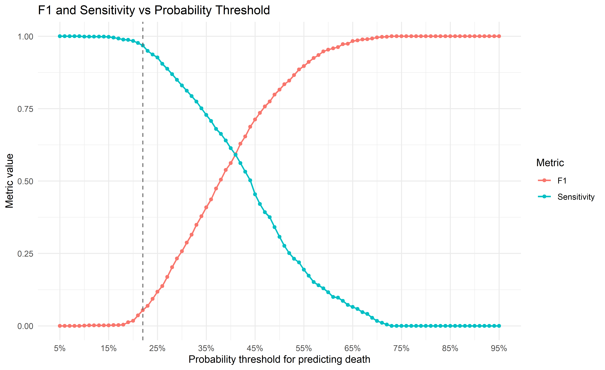

``` r
report_compact_table(
  selected_ranger_threshold,
  digits = 4,
  caption = "Selected predictive ranger probability threshold"
)
```

| .config | threshold | accuracy | sensitivity | specificity | f_meas | predicted_died | observed_died |
|----|----|----|----|----|----|----|----|
| pre0_mod07_post0 | 0.05 | 0.4063 | 1 | 0 | 0.5779 | 1 | 0.4063 |

Selected predictive ranger probability threshold

``` r
final_ranger_workflow <- finalize_workflow(ranger_workflow, selected_ranger_setting)
predictive_forest_fit <- workflows::fit(final_ranger_workflow, data = ranger_fit_df)
```

``` r
predict_ranger_risk <- function(object, newdata) {
  pred <- workflows:::predict.workflow(
    object,
    new_data = as.data.frame(newdata),
    type = "prob"
  )
  as.numeric(pred$.pred_Died)
}

predict_ranger_class <- function(
  object,
  newdata,
  threshold = selected_ranger_threshold$threshold
) {
  factor(
    ifelse(predict_ranger_risk(object, newdata) >= threshold, "Died", "Survived"),
    levels = c("Died", "Survived")
  )
}
```

``` r
if (!requireNamespace("fastshap", quietly = TRUE)) {
  stop(
    paste(
      "Package fastshap is required for SHAP estimation.",
      "Install it from GitHub with:",
      "remotes::install_github('bgreenwell/fastshap')"
    ),
    call. = FALSE
  )
}

shap_rows <- if (shap_rows_requested == 0L) {
  seq_len(nrow(ranger_fit_df))
} else {
  seq_len(min(shap_rows_requested, nrow(ranger_fit_df)))
}
shap_x_background <- ranger_fit_df[, ranger_predictor_terms, drop = FALSE]
shap_x_eval <- ranger_fit_df[shap_rows, ranger_predictor_terms, drop = FALSE]
shap_prediction <- as.numeric(predict_ranger_risk(predictive_forest_fit, shap_x_eval))
shap_parallel_config <- data.table(
  requested_rows = shap_rows_requested,
  explanation_rows = nrow(shap_x_eval),
  nsim = max(2L, shap_n_mc_samples),
  workers = 1L,
  backend = "fastshap serial"
)
```

``` r
selected_forest_shap <- estimate_fastshap_values(
  object = predictive_forest_fit,
  x_train = shap_x_background,
  x_explain = shap_x_eval,
  pred_wrapper = predict_ranger_risk,
  seed = shap_seed,
  nsim = shap_n_mc_samples,
  adjust = TRUE
)
colnames(selected_forest_shap) <- canonicalize_model_terms(
  colnames(selected_forest_shap),
  congo_predictors
)

shap_feature_values <- copy(as.data.table(shap_x_eval))
shap_feature_values[, observation_id := seq_len(.N)]
selected_forest_shap_dt <- as.data.table(selected_forest_shap)
selected_forest_shap_dt[, observation_id := seq_len(.N)]

shap_summary_long <- melt(
  selected_forest_shap_dt,
  id.vars = "observation_id",
  variable.name = "feature",
  value.name = "shap_value",
  variable.factor = FALSE
)
shap_value_long <- melt(
  shap_feature_values,
  id.vars = "observation_id",
  variable.name = "feature",
  value.name = "feature_value",
  variable.factor = FALSE
)
shap_summary_long <- merge(
  shap_summary_long,
  shap_value_long,
  by = c("observation_id", "feature"),
  all.x = TRUE,
  sort = FALSE
)
shap_summary_long[
  ,
  feature_value_numeric := suppressWarnings(as.numeric(as.character(feature_value)))
]
shap_summary_long[
  is.na(feature_value_numeric),
  feature_value_numeric := as.numeric(factor(feature_value)) - 1
]
shap_summary_long[
  ,
  feature_value_scaled := {
    range_value <- range(feature_value_numeric, na.rm = TRUE)
    fifelse(
      rep(all(is.finite(range_value)) && diff(range_value) > .Machine$double.eps, .N),
      (feature_value_numeric - range_value[1L]) / diff(range_value),
      0.5
    )
  },
  by = feature
]
shap_summary_long[, feature_label := format_variable_label(feature)]
shap_summary_long[
  ,
  mean_abs_shap := mean(abs(shap_value), na.rm = TRUE),
  by = feature
]
setcolorder(
  shap_summary_long,
  c(
    "feature",
    "feature_label",
    "observation_id",
    "shap_value",
    "feature_value",
    "feature_value_numeric",
    "feature_value_scaled",
    "mean_abs_shap"
  )
)
```

``` r
shap_ci_decomp <- shap_conc_decomp(
  shap = selected_forest_shap,
  rank = ranger_dt$wealth[shap_rows],
  type = "CI",
  prediction = shap_prediction,
  weights = ranger_dt$sample_weight[shap_rows]
)
```

``` r
shap_ci_diag <- as.data.table(shap_ci_decomp$diagnostics)
shap_ci_contrib <- as.data.table(shap_ci_decomp$contributions)[order(pct_contribution)]
report_compact_table(
  shap_ci_diag,
  digits = 4,
  caption = "SHAP decomposition diagnostics: CI"
)
```

| n | weight_sum | type | mean_prediction | concentration_index | signed_concentration_index | score_direction | shap_sum | additivity_gap | centered_rank_sum | prediction_source |
|----|----|----|----|----|----|----|----|----|----|----|
| 200 | 237.2114 | CI | 0.3416 | 0.0979 | -0.0979 | -1 | 0.0979 | 0 | 0 | prediction |

SHAP decomposition diagnostics: CI

``` r
report_compact_table(
  shap_ci_contrib,
  digits = 4,
  caption = "SHAP decomposition contributions: CI"
)
```

| feature | D_k_SHAP | pct_contribution | abs_contribution |
|----|----|----|----|
| birth_2.4.short.interval | -0.0062 | -6.3100 | 0.0062 |
| reg_Sud.Kivu | -0.0034 | -3.5196 | 0.0034 |
| birth_5..long.interval | -0.0019 | -1.9870 | 0.0019 |
| male | -0.0016 | -1.6381 | 0.0016 |
| birth_2.4.long.interval | -0.0011 | -1.1035 | 0.0011 |
| reg_Kasai.Occidental | -0.0008 | -0.8212 | 0.0008 |
| mocc_Household..unskilled..not.working | -0.0007 | -0.7481 | 0.0007 |
| pocc_Household..unskilled..not.working | -0.0007 | -0.6668 | 0.0007 |
| reg_Orientale | -0.0005 | -0.5453 | 0.0005 |
| birth_5..short.interval | -0.0001 | -0.1053 | 0.0001 |
| reg_Bas.Congo | 0.0005 | 0.5349 | 0.0005 |
| agemoth | 0.0006 | 0.6506 | 0.0006 |
| birth_First.birth | 0.0007 | 0.7259 | 0.0007 |
| reg_Nord.Kivu | 0.0011 | 1.1276 | 0.0011 |
| reg_Kasai.Oriental | 0.0015 | 1.5476 | 0.0015 |
| reg_Katanga | 0.0021 | 2.1247 | 0.0021 |
| ped | 0.0021 | 2.1855 | 0.0021 |
| reg_Kinshasa | 0.0031 | 3.2038 | 0.0031 |
| reg_Bandundu | 0.0036 | 3.6992 | 0.0036 |
| reg_Equateur | 0.0040 | 4.1157 | 0.0040 |
| mocc_Other | 0.0045 | 4.5601 | 0.0045 |
| unskilled | 0.0063 | 6.4149 | 0.0063 |
| mocc_Agriculture | 0.0067 | 6.8638 | 0.0067 |
| reg_Maniema | 0.0075 | 7.6439 | 0.0075 |
| ed | 0.0079 | 8.1014 | 0.0079 |
| quint | 0.0082 | 8.3350 | 0.0082 |
| pocc_Agriculture | 0.0084 | 8.5372 | 0.0084 |
| rural | 0.0190 | 19.4180 | 0.0190 |
| pocc_Other | 0.0271 | 27.6550 | 0.0271 |

SHAP decomposition contributions: CI

``` r
ggplot(shap_ci_contrib, aes(x = pct_contribution, y = reorder(feature, pct_contribution))) +
  geom_col(fill = "#3268A8") +
  geom_vline(xintercept = 0, color = "black", linewidth = 0.4) +
  labs(x = "Contribution (%)", y = NULL, title = "SHAP concentration decomposition: CI") +
  theme_minimal(base_size = 11) +
  theme(panel.grid.minor = element_blank())
```


``` r
shap_cig_decomp <- shap_conc_decomp(
  shap = selected_forest_shap,
  rank = ranger_dt$wealth[shap_rows],
  type = "CIg",
  prediction = shap_prediction,
  weights = ranger_dt$sample_weight[shap_rows]
)
```

``` r
shap_cig_diag <- as.data.table(shap_cig_decomp$diagnostics)
shap_cig_contrib <- as.data.table(shap_cig_decomp$contributions)[order(pct_contribution)]
report_compact_table(
  shap_cig_diag,
  digits = 4,
  caption = "SHAP decomposition diagnostics: CIg"
)
```

| n | weight_sum | type | mean_prediction | concentration_index | signed_concentration_index | score_direction | shap_sum | additivity_gap | centered_rank_sum | prediction_source |
|----|----|----|----|----|----|----|----|----|----|----|
| 200 | 237.2114 | CIg | 0.3416 | 0.0334 | -0.0334 | -1 | 0.0334 | 0 | 0 | prediction |

SHAP decomposition diagnostics: CIg

``` r
report_compact_table(
  shap_cig_contrib,
  digits = 4,
  caption = "SHAP decomposition contributions: CIg"
)
```

| feature | D_k_SHAP | pct_contribution | abs_contribution |
|----|----|----|----|
| birth_2.4.short.interval | -0.0021 | -6.3100 | 0.0021 |
| reg_Sud.Kivu | -0.0012 | -3.5196 | 0.0012 |
| birth_5..long.interval | -0.0007 | -1.9870 | 0.0007 |
| male | -0.0005 | -1.6381 | 0.0005 |
| birth_2.4.long.interval | -0.0004 | -1.1035 | 0.0004 |
| reg_Kasai.Occidental | -0.0003 | -0.8212 | 0.0003 |
| mocc_Household..unskilled..not.working | -0.0003 | -0.7481 | 0.0003 |
| pocc_Household..unskilled..not.working | -0.0002 | -0.6668 | 0.0002 |
| reg_Orientale | -0.0002 | -0.5453 | 0.0002 |
| birth_5..short.interval | 0.0000 | -0.1053 | 0.0000 |
| reg_Bas.Congo | 0.0002 | 0.5349 | 0.0002 |
| agemoth | 0.0002 | 0.6506 | 0.0002 |
| birth_First.birth | 0.0002 | 0.7259 | 0.0002 |
| reg_Nord.Kivu | 0.0004 | 1.1276 | 0.0004 |
| reg_Kasai.Oriental | 0.0005 | 1.5476 | 0.0005 |
| reg_Katanga | 0.0007 | 2.1247 | 0.0007 |
| ped | 0.0007 | 2.1855 | 0.0007 |
| reg_Kinshasa | 0.0011 | 3.2038 | 0.0011 |
| reg_Bandundu | 0.0012 | 3.6992 | 0.0012 |
| reg_Equateur | 0.0014 | 4.1157 | 0.0014 |
| mocc_Other | 0.0015 | 4.5601 | 0.0015 |
| unskilled | 0.0021 | 6.4149 | 0.0021 |
| mocc_Agriculture | 0.0023 | 6.8638 | 0.0023 |
| reg_Maniema | 0.0026 | 7.6439 | 0.0026 |
| ed | 0.0027 | 8.1014 | 0.0027 |
| quint | 0.0028 | 8.3350 | 0.0028 |
| pocc_Agriculture | 0.0029 | 8.5372 | 0.0029 |
| rural | 0.0065 | 19.4180 | 0.0065 |
| pocc_Other | 0.0092 | 27.6550 | 0.0092 |

SHAP decomposition contributions: CIg

``` r
ggplot(shap_cig_contrib, aes(x = pct_contribution, y = reorder(feature, pct_contribution))) +
  geom_col(fill = "#3268A8") +
  geom_vline(xintercept = 0, color = "black", linewidth = 0.4) +
  labs(x = "Contribution (%)", y = NULL, title = "SHAP concentration decomposition: CIg") +
  theme_minimal(base_size = 11) +
  theme(panel.grid.minor = element_blank())
```

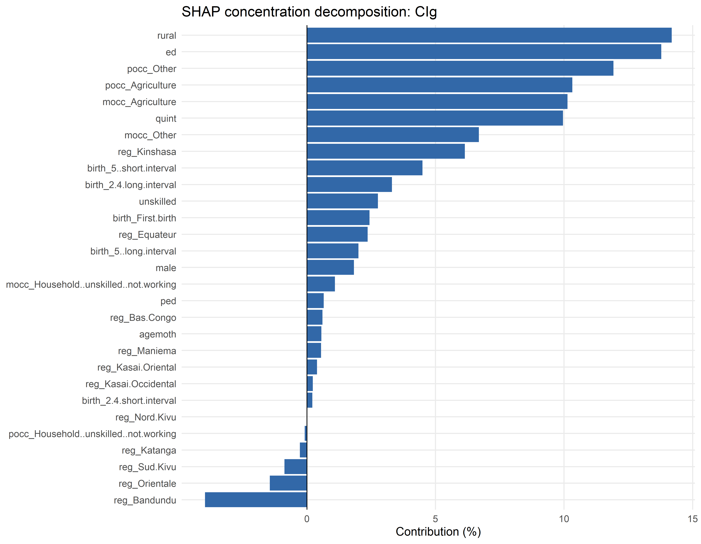

``` r
shap_cic_decomp <- shap_conc_decomp(
  shap = selected_forest_shap,
  rank = ranger_dt$wealth[shap_rows],
  type = "CIc",
  prediction = shap_prediction,
  weights = ranger_dt$sample_weight[shap_rows]
)
```

``` r
shap_cic_diag <- as.data.table(shap_cic_decomp$diagnostics)
shap_cic_contrib <- as.data.table(shap_cic_decomp$contributions)[order(pct_contribution)]
report_compact_table(
  shap_cic_diag,
  digits = 4,
  caption = "SHAP decomposition diagnostics: CIc"
)
```

| n | weight_sum | type | mean_prediction | concentration_index | signed_concentration_index | score_direction | shap_sum | additivity_gap | centered_rank_sum | prediction_source |
|----|----|----|----|----|----|----|----|----|----|----|
| 200 | 237.2114 | CIc | 0.3416 | 0.2443 | -0.2443 | -1 | 0.2443 | 0 | 0 | prediction |

SHAP decomposition diagnostics: CIc

``` r
report_compact_table(
  shap_cic_contrib,
  digits = 4,
  caption = "SHAP decomposition contributions: CIc"
)
```

| feature | D_k_SHAP | pct_contribution | abs_contribution |
|----|----|----|----|
| birth_2.4.short.interval | -0.0154 | -6.3100 | 0.0154 |
| reg_Sud.Kivu | -0.0086 | -3.5196 | 0.0086 |
| birth_5..long.interval | -0.0049 | -1.9870 | 0.0049 |
| male | -0.0040 | -1.6381 | 0.0040 |
| birth_2.4.long.interval | -0.0027 | -1.1035 | 0.0027 |
| reg_Kasai.Occidental | -0.0020 | -0.8212 | 0.0020 |
| mocc_Household..unskilled..not.working | -0.0018 | -0.7481 | 0.0018 |
| pocc_Household..unskilled..not.working | -0.0016 | -0.6668 | 0.0016 |
| reg_Orientale | -0.0013 | -0.5453 | 0.0013 |
| birth_5..short.interval | -0.0003 | -0.1053 | 0.0003 |
| reg_Bas.Congo | 0.0013 | 0.5349 | 0.0013 |
| agemoth | 0.0016 | 0.6506 | 0.0016 |
| birth_First.birth | 0.0018 | 0.7259 | 0.0018 |
| reg_Nord.Kivu | 0.0028 | 1.1276 | 0.0028 |
| reg_Kasai.Oriental | 0.0038 | 1.5476 | 0.0038 |
| reg_Katanga | 0.0052 | 2.1247 | 0.0052 |
| ped | 0.0053 | 2.1855 | 0.0053 |
| reg_Kinshasa | 0.0078 | 3.2038 | 0.0078 |
| reg_Bandundu | 0.0090 | 3.6992 | 0.0090 |
| reg_Equateur | 0.0101 | 4.1157 | 0.0101 |
| mocc_Other | 0.0111 | 4.5601 | 0.0111 |
| unskilled | 0.0157 | 6.4149 | 0.0157 |
| mocc_Agriculture | 0.0168 | 6.8638 | 0.0168 |
| reg_Maniema | 0.0187 | 7.6439 | 0.0187 |
| ed | 0.0198 | 8.1014 | 0.0198 |
| quint | 0.0204 | 8.3350 | 0.0204 |
| pocc_Agriculture | 0.0209 | 8.5372 | 0.0209 |
| rural | 0.0474 | 19.4180 | 0.0474 |
| pocc_Other | 0.0675 | 27.6550 | 0.0675 |

SHAP decomposition contributions: CIc

``` r
ggplot(shap_cic_contrib, aes(x = pct_contribution, y = reorder(feature, pct_contribution))) +
  geom_col(fill = "#3268A8") +
  geom_vline(xintercept = 0, color = "black", linewidth = 0.4) +
  labs(x = "Contribution (%)", y = NULL, title = "SHAP concentration decomposition: CIc") +
  theme_minimal(base_size = 11) +
  theme(panel.grid.minor = element_blank())
```

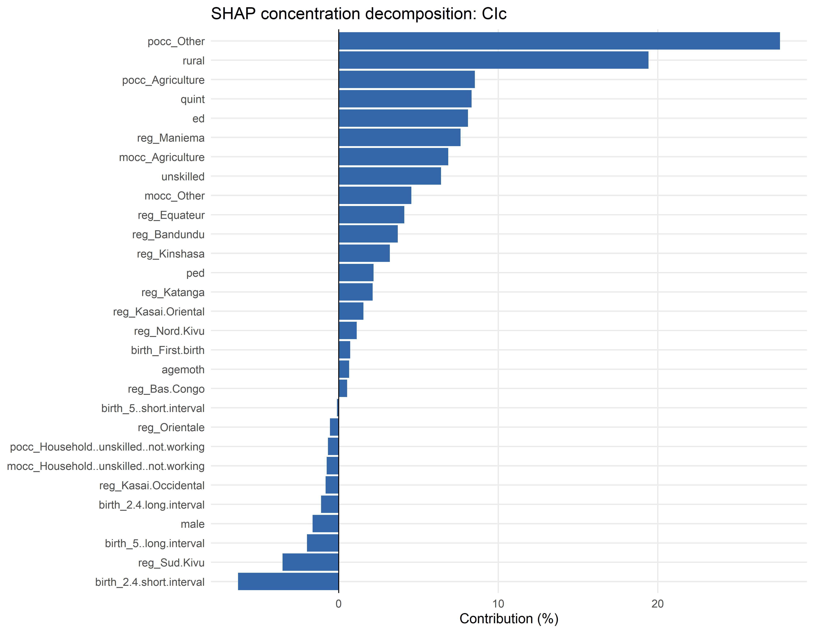

``` r
shap_l_decomp <- shap_conc_decomp(
  shap = selected_forest_shap,
  rank = ranger_dt$wealth[shap_rows],
  type = "L",
  prediction = shap_prediction,
  weights = ranger_dt$sample_weight[shap_rows]
)
```

``` r
shap_l_diag <- as.data.table(shap_l_decomp$diagnostics)
shap_l_contrib <- as.data.table(shap_l_decomp$contributions)[order(pct_contribution)]
report_compact_table(
  shap_l_diag,
  digits = 4,
  caption = "SHAP decomposition diagnostics: L"
)
```

| n | weight_sum | type | mean_prediction | concentration_index | signed_concentration_index | score_direction | shap_sum | additivity_gap | centered_rank_sum | prediction_source |
|----|----|----|----|----|----|----|----|----|----|----|
| 200 | 237.2114 | L | 0.3416 | 0.4928 | 0.4928 | 1 | 0.4928 | 0 | 0 | prediction |

SHAP decomposition diagnostics: L

``` r
report_compact_table(
  shap_l_contrib,
  digits = 4,
  caption = "SHAP decomposition contributions: L"
)
```

| feature | D_k_SHAP | pct_contribution | abs_contribution |
|----|----|----|----|
| birth_2.4.short.interval | -0.0318 | -6.4608 | 0.0318 |
| reg_Sud.Kivu | -0.0204 | -4.1367 | 0.0204 |
| birth_2.4.long.interval | -0.0143 | -2.9070 | 0.0143 |
| birth_5..long.interval | -0.0130 | -2.6291 | 0.0130 |
| birth_First.birth | -0.0086 | -1.7398 | 0.0086 |
| reg_Bandundu | -0.0079 | -1.5953 | 0.0079 |
| mocc_Household..unskilled..not.working | -0.0061 | -1.2365 | 0.0061 |
| pocc_Household..unskilled..not.working | -0.0052 | -1.0493 | 0.0052 |
| agemoth | -0.0050 | -1.0150 | 0.0050 |
| reg_Orientale | -0.0019 | -0.3767 | 0.0019 |
| reg_Kasai.Occidental | -0.0013 | -0.2589 | 0.0013 |
| male | 0.0017 | 0.3429 | 0.0017 |
| reg_Bas.Congo | 0.0037 | 0.7490 | 0.0037 |
| reg_Nord.Kivu | 0.0054 | 1.0943 | 0.0054 |
| reg_Kasai.Oriental | 0.0059 | 1.1916 | 0.0059 |
| unskilled | 0.0067 | 1.3623 | 0.0067 |
| reg_Katanga | 0.0121 | 2.4512 | 0.0121 |
| reg_Equateur | 0.0164 | 3.3267 | 0.0164 |
| ped | 0.0169 | 3.4239 | 0.0169 |
| birth_5..short.interval | 0.0229 | 4.6413 | 0.0229 |
| reg_Kinshasa | 0.0301 | 6.1023 | 0.0301 |
| quint | 0.0303 | 6.1553 | 0.0303 |
| mocc_Other | 0.0309 | 6.2785 | 0.0309 |
| mocc_Agriculture | 0.0332 | 6.7299 | 0.0332 |
| reg_Maniema | 0.0441 | 8.9549 | 0.0441 |
| ed | 0.0469 | 9.5175 | 0.0469 |
| pocc_Agriculture | 0.0475 | 9.6329 | 0.0475 |
| rural | 0.1182 | 23.9919 | 0.1182 |
| pocc_Other | 0.1353 | 27.4586 | 0.1353 |

SHAP decomposition contributions: L

``` r
ggplot(shap_l_contrib, aes(x = pct_contribution, y = reorder(feature, pct_contribution))) +
  geom_col(fill = "#3268A8") +
  geom_vline(xintercept = 0, color = "black", linewidth = 0.4) +
  labs(x = "Contribution (%)", y = NULL, title = "SHAP concentration decomposition: L") +
  theme_minimal(base_size = 11) +
  theme(panel.grid.minor = element_blank())
```

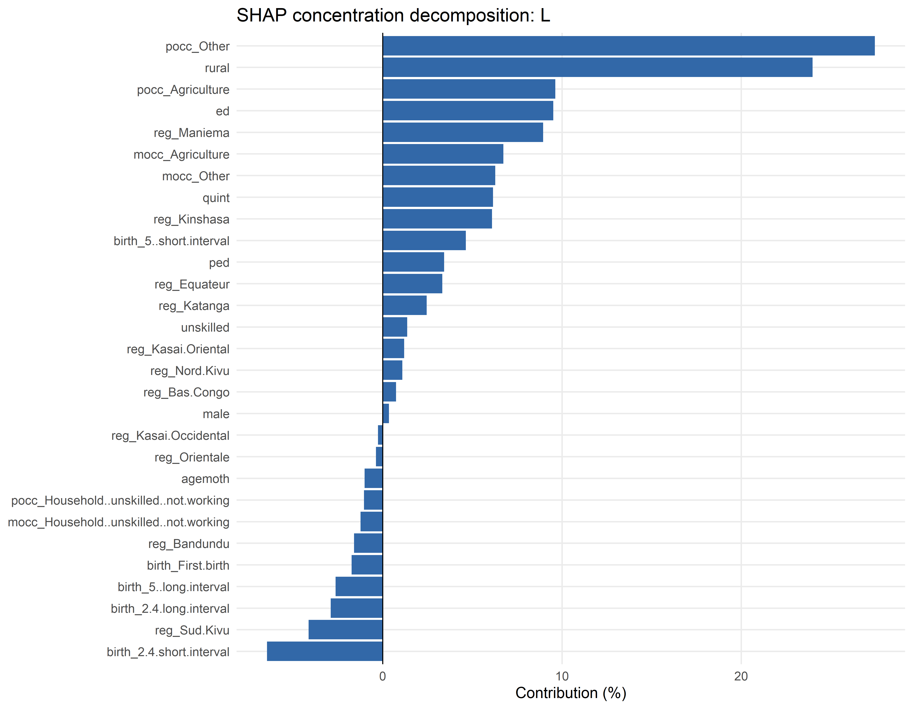

``` r
selected_shap_contributions <- rbindlist(list(
  as.data.table(shap_ci_decomp$contributions)[, criterion := "CI"],
  as.data.table(shap_cig_decomp$contributions)[, criterion := "CIg"],
  as.data.table(shap_cic_decomp$contributions)[, criterion := "CIc"],
  as.data.table(shap_l_decomp$contributions)[, criterion := "L"]
), fill = TRUE)
selected_shap_contributions[, feature := canonicalize_model_terms(feature, congo_predictors)]
setcolorder(selected_shap_contributions, c("criterion", setdiff(names(selected_shap_contributions), "criterion")))

selected_shap_diagnostics <- rbindlist(list(
  as.data.table(shap_ci_decomp$diagnostics)[, criterion := "CI"],
  as.data.table(shap_cig_decomp$diagnostics)[, criterion := "CIg"],
  as.data.table(shap_cic_decomp$diagnostics)[, criterion := "CIc"],
  as.data.table(shap_l_decomp$diagnostics)[, criterion := "L"]
), fill = TRUE)
setcolorder(selected_shap_diagnostics, c("criterion", setdiff(names(selected_shap_diagnostics), "criterion")))
```

``` r
forest_importance_out <- copy(forest_variable_importance)
forest_importance_out[, variable_label := fifelse(
  variable %in% names(congo_var_labels),
  congo_var_labels[variable],
  variable
)]

report_compact_table(
  forest_importance_out,
  digits = 4,
  caption = "Forest variable importance preview"
)
```

| criterion | variable | importance | rank | variable_label |
|----|----|----|----|----|
| CI | ed | 0.0279 | 1 | Mother’s education |
| CI | quint | 0.0157 | 2 | Household wealth |
| CI | pocc_Agriculture | 0.0124 | 3 | Father’s occupation: Agriculture |
| CI | mocc_Agriculture | 0.0096 | 4 | Mother’s occupation: Agriculture |
| CI | pocc_Other | 0.0079 | 5 | Father’s occupation: Other |
| CI | reg_Kinshasa | 0.0069 | 6 | Region: Kinshasa |
| CI | rural | 0.0051 | 7 | Type of residence |
| CI | reg_Katanga | 0.0038 | 8 | Region: Katanga |
| CI | unskilled | 0.0025 | 9 | Skilled birth attendance |
| CI | mocc_Other | 0.0025 | 10 | Mother’s occupation: Other |
| CI | mocc_Household..unskilled..not.working | 0.0016 | 11 | Mother’s occupation: Household, unskilled, not working |
| CI | reg_Kasai.Occidental | 0.0012 | 12 | Region: Kasai Occidental |
| CIc | ed | 0.0136 | 1 | Mother’s education |
| CIc | quint | 0.0085 | 2 | Household wealth |
| CIc | pocc_Agriculture | 0.0044 | 3 | Father’s occupation: Agriculture |
| CIc | rural | 0.0036 | 4 | Type of residence |
| CIc | mocc_Agriculture | 0.0031 | 5 | Mother’s occupation: Agriculture |
| CIc | pocc_Other | 0.0030 | 6 | Father’s occupation: Other |
| CIc | reg_Kinshasa | 0.0029 | 7 | Region: Kinshasa |
| CIc | reg_Katanga | 0.0019 | 8 | Region: Katanga |
| CIc | mocc_Other | 0.0007 | 9 | Mother’s occupation: Other |
| CIc | unskilled | 0.0006 | 10 | Skilled birth attendance |
| CIc | pocc_Household..unskilled..not.working | 0.0003 | 11 | Father’s occupation: Household, unskilled, not working |
| CIc | reg_Equateur | 0.0003 | 12 | Region: Equateur |
| CIg | ed | 0.0030 | 1 | Mother’s education |
| CIg | quint | 0.0018 | 2 | Household wealth |
| CIg | pocc_Agriculture | 0.0010 | 3 | Father’s occupation: Agriculture |
| CIg | mocc_Agriculture | 0.0010 | 4 | Mother’s occupation: Agriculture |
| CIg | pocc_Other | 0.0009 | 5 | Father’s occupation: Other |
| CIg | rural | 0.0009 | 6 | Type of residence |
| CIg | reg_Kinshasa | 0.0008 | 7 | Region: Kinshasa |
| CIg | reg_Katanga | 0.0007 | 8 | Region: Katanga |
| CIg | mocc_Other | 0.0002 | 9 | Mother’s occupation: Other |
| CIg | unskilled | 0.0001 | 10 | Skilled birth attendance |
| CIg | mocc_Household..unskilled..not.working | 0.0001 | 11 | Mother’s occupation: Household, unskilled, not working |
| CIg | reg_Kasai.Oriental | 0.0001 | 12 | Region: Kasai Oriental |
| L | rural | 0.0797 | 1 | Type of residence |
| L | mocc_Agriculture | 0.0462 | 2 | Mother’s occupation: Agriculture |
| L | ed | 0.0286 | 3 | Mother’s education |
| L | quint | 0.0249 | 4 | Household wealth |
| L | pocc_Agriculture | 0.0158 | 5 | Father’s occupation: Agriculture |
| L | pocc_Other | 0.0098 | 6 | Father’s occupation: Other |
| L | reg_Kinshasa | 0.0022 | 7 | Region: Kinshasa |
| L | reg_Katanga | 0.0005 | 8 | Region: Katanga |
| L | reg_Equateur | 0.0004 | 9 | Region: Equateur |
| L | unskilled | 0.0004 | 10 | Skilled birth attendance |
| L | pocc_Household..unskilled..not.working | 0.0003 | 11 | Father’s occupation: Household, unskilled, not working |
| L | mocc_Household..unskilled..not.working | 0.0002 | 12 | Mother’s occupation: Household, unskilled, not working |

Forest variable importance preview

# Compare Methods

Once the regression, tree, forest, and SHAP objects exist, the next step
is to rank variables and assemble the comparison tables used in the main
report.

``` r
linear_rank <- classical_decomposition_table[
  criterion == "CI"
][
  order(-abs(regression_pct_contribution)),
  .(variable, method = "Linear decomposition", rank = seq_len(.N))
]
tree_rank <- rank_from_named_vector(selected_tree_fit$variable.importance, "Selected CI-tree")
forest_rank <- rank_from_named_vector(selected_forest_fit$variable.importance, "Selected CI-forest")
shap_rank <- selected_shap_contributions[
  criterion == "CI"
][
  order(-abs_contribution),
  .(variable = feature, method = "Selected forest SHAP", rank = seq_len(.N))
]
importance_long <- rbindlist(list(linear_rank, tree_rank, forest_rank, shap_rank), fill = TRUE)

selected_variables <- classical_decomposition_table[
  criterion == "CI"
][
  order(-abs(regression_pct_contribution))
]$variable[seq_len(max(15L, classical_decomposition_table[criterion == "CI", .N]))]
selected_variables <- selected_variables[!is.na(selected_variables) & nzchar(selected_variables)]

method_comparison_table <- data.table(variable = selected_variables)
method_comparison_table[, variable_label := format_variable_label(variable)]
regression_wide <- dcast(
  classical_decomposition_table[
    criterion %in% c("CI", "CIg", "CIc"),
    .(variable, criterion, regression_pct_contribution)
  ],
  variable ~ criterion,
  value.var = "regression_pct_contribution"
)
method_comparison_table <- merge(
  method_comparison_table,
  regression_wide[
    ,
    .(
      variable,
      regression_ci_pct_contribution = CI,
      regression_cig_pct_contribution = CIg,
      regression_cic_pct_contribution = CIc
    )
  ],
  by = "variable",
  all.x = TRUE
)
shap_wide <- dcast(
  selected_shap_contributions[
    criterion %in% criterion_types,
    .(variable = feature, criterion, pct_contribution)
  ],
  variable ~ criterion,
  value.var = "pct_contribution"
)
shap_wide <- shap_wide[
  ,
  .(
    variable,
    forest_shap_ci_pct_contribution = CI,
    forest_shap_cig_pct_contribution = CIg,
    forest_shap_cic_pct_contribution = CIc,
    forest_shap_l_pct_contribution = L
  )
]
method_comparison_table <- merge(
  method_comparison_table,
  shap_wide,
  by = "variable",
  all.x = TRUE
)
method_comparison_table <- method_comparison_table[
  order(-abs(regression_ci_pct_contribution), -abs(forest_shap_ci_pct_contribution))
]

importance_wide <- dcast(
  importance_long,
  rank ~ method,
  value.var = "variable",
  fun.aggregate = function(x) paste(unique(x), collapse = ", ")
)
for (col in setdiff(names(importance_wide), "rank")) {
  importance_wide[, (col) := format_variable_label(get(col))]
}
importance_wide <- importance_wide[rank <= 10L]
```

``` r
report_compact_table(
  method_comparison_table,
  digits = 3,
  caption = "Selected percentage-contribution comparison table"
)
```

| variable | variable_label | regression_ci_pct_contribution | regression_cig_pct_contribution | regression_cic_pct_contribution | forest_shap_ci_pct_contribution | forest_shap_cig_pct_contribution | forest_shap_cic_pct_contribution | forest_shap_l_pct_contribution |
|----|----|----|----|----|----|----|----|----|
| ed | Mother’s education | 31.232 | 170.974 | 170.974 | 8.101 | 8.101 | 8.101 | 9.518 |
| pocc_Agriculture | Father’s occupation: Agriculture | 24.119 | 117.979 | 117.979 | 8.537 | 8.537 | 8.537 | 9.633 |
| mocc_Agriculture | Mother’s occupation: Agriculture | 16.135 | 87.330 | 87.330 | 6.864 | 6.864 | 6.864 | 6.730 |
| quint | Household wealth | 12.699 | 53.789 | 53.789 | 8.335 | 8.335 | 8.335 | 6.155 |
| rural | Type of residence | 12.019 | 71.760 | 71.760 | 19.418 | 19.418 | 19.418 | 23.992 |
| unskilled | Skilled birth attendance | 10.741 | 60.069 | 60.069 | 6.415 | 6.415 | 6.415 | 1.362 |
| reg_Equateur | Region: Equateur | 5.118 | 6.371 | 6.371 | 4.116 | 4.116 | 4.116 | 3.327 |
| pocc_Household..unskilled..not.working | Father’s occupation: Household, unskilled, not working | -4.569 | -5.692 | -5.692 | -0.667 | -0.667 | -0.667 | -1.049 |
| reg_Kinshasa | Region: Kinshasa | -4.102 | -3.621 | -3.621 | 3.204 | 3.204 | 3.204 | 6.102 |
| reg_Sud.Kivu | Region: Sud-Kivu | -2.783 | -1.299 | -1.299 | -3.520 | -3.520 | -3.520 | -4.137 |
| reg_Kasai.Oriental | Region: Kasai Oriental | -2.287 | -2.951 | -2.951 | 1.548 | 1.548 | 1.548 | 1.192 |
| ped | Father’s education | -2.023 | -5.285 | -5.285 | 2.185 | 2.185 | 2.185 | 3.424 |
| reg_Maniema | Region: Maniema | 1.604 | 0.547 | 0.547 | 7.644 | 7.644 | 7.644 | 8.955 |
| reg_Orientale | Region: Orientale | -1.174 | -1.314 | -1.314 | -0.545 | -0.545 | -0.545 | -0.377 |
| birth_5..short.interval | Birth order and interval: 5+ short interval | -0.998 | -0.985 | -0.985 | -0.105 | -0.105 | -0.105 | 4.641 |
| reg_Bas.Congo | Region: Bas-Congo | -0.926 | -0.360 | -0.360 | 0.535 | 0.535 | 0.535 | 0.749 |
| mocc_Household..unskilled..not.working | Mother’s occupation: Household, unskilled, not working | 0.778 | 1.749 | 1.749 | -0.748 | -0.748 | -0.748 | -1.236 |
| reg_Kasai.Occidental | Region: Kasai Occidental | 0.629 | 0.648 | 0.648 | -0.821 | -0.821 | -0.821 | -0.259 |
| birth_5..long.interval | Birth order and interval: 5+ long interval | -0.615 | -1.565 | -1.565 | -1.987 | -1.987 | -1.987 | -2.629 |
| male | Sex of the child | -0.581 | -2.775 | -2.775 | -1.638 | -1.638 | -1.638 | 0.343 |
| reg_Katanga | Region: Katanga | -0.447 | -0.446 | -0.446 | 2.125 | 2.125 | 2.125 | 2.451 |
| agemoth | Mother’s age at birth | 0.364 | 1.522 | 1.522 | 0.651 | 0.651 | 0.651 | -1.015 |
| reg_Nord.Kivu | Region: Nord-Kivu | 0.233 | 0.088 | 0.088 | 1.128 | 1.128 | 1.128 | 1.094 |
| birth_2.4.long.interval | Birth order and interval: 2-4 long interval | 0.208 | 0.685 | 0.685 | -1.104 | -1.104 | -1.104 | -2.907 |
| birth_2.4.short.interval | Birth order and interval: 2-4 short interval | -0.006 | -0.006 | -0.006 | -6.310 | -6.310 | -6.310 | -6.461 |

Selected percentage-contribution comparison table

``` r
report_compact_table(
  importance_wide,
  caption = "Ranked variables across decomposition and tree-based methods"
)
```

| rank | Linear decomposition | Selected CI-forest | Selected CI-tree | Selected forest SHAP |
|----|----|----|----|----|
| 1 | Mother’s education | Type of residence | Type of residence | Father’s occupation: Other |
| 2 | Father’s occupation: Agriculture | Mother’s occupation: Agriculture | Father’s occupation: Agriculture | Type of residence |
| 3 | Mother’s occupation: Agriculture | Mother’s education | Region: Kinshasa | Father’s occupation: Agriculture |
| 4 | Household wealth | Household wealth | Region: Equateur | Household wealth |
| 5 | Type of residence | Father’s occupation: Agriculture | Household wealth | Mother’s education |
| 6 | Skilled birth attendance | Father’s occupation: Other | Birth order and interval: 2-4 short interval | Region: Maniema |
| 7 | Region: Equateur | Region: Kinshasa | Region: Katanga | Mother’s occupation: Agriculture |
| 8 | Father’s occupation: Household, unskilled, not working | Region: Katanga | NA | Skilled birth attendance |
| 9 | Region: Kinshasa | Region: Equateur | NA | Birth order and interval: 2-4 short interval |
| 10 | Region: Sud-Kivu | Skilled birth attendance | NA | Mother’s occupation: Other |

Ranked variables across decomposition and tree-based methods

# Save Results Objects

The last chunk assembles the full object list and writes it to disk for
the main report to consume.

``` r
drc_results_objects <- list(
  generation_params = runtime_params,
  source_data_file = source_data_file,
  paper_reference_file = paper_reference_file,
  outcome_labels = outcome_labels,
  congo_model_dt = congo_model_dt,
  raw_congo_model_dt = raw_congo_model_dt,
  congo_var_labels = congo_var_labels,
  raw_congo_var_labels = raw_congo_var_labels,
  congo_predictors = congo_predictors,
  raw_congo_predictors = raw_congo_predictors,
  indicator_level_map = indicator_level_map,
  congo_ci_formula = congo_ci_formula,
  data_summary = drc_data_summary_table,
  outcome_distribution = outcome_plot_dt,
  candidate_predictors = candidate_predictor_table,
  root_ci = drc_root_ci_table,
  regression_model_summary = regression_model_summary,
  classical_decomposition = classical_decomposition_table,
  classical_decomposition_grouped = classical_decomposition_grouped,
  published_drc_table3_reference = published_drc_table3_reference,
  published_drc_table3_comparison = published_drc_table3_comparison,
  rineq_summary = rineq_summary,
  tree_psu_fold_id = tree_psu_fold_id,
  tree_psu_fold_summary = tree_psu_fold_summary,
  tree_tuning = tree_tuning,
  tree_best_by_type = tree_best_by_type,
  tree_best_controls = tree_best_controls,
  tree_selection = tree_selection_table,
  tree_fit_table = tree_fit_table,
  tree_complexity_metrics = tree_complexity_metrics,
  tree_min_relative_gain_path = tree_min_relative_gain_path,
  tree_models_by_type = tree_models_by_type,
  selected_tree_type = selected_tree_type,
  selected_tree_fit = selected_tree_fit,
  selected_tree_summary = selected_tree_summary,
  all_tree_terminal_summaries = all_tree_terminal_summaries,
  tree_variable_importance = tree_variable_importance,
  lecturer_rpart_models = lecturer_rpart_models,
  lecturer_rpart_summary = lecturer_rpart_summary,
  forest_tuning = forest_tuning,
  forest_best_by_type = forest_best_by_type,
  forest_best_controls = forest_best_controls,
  forest_fit_table = forest_fit_table,
  forest_complexity_metrics = forest_complexity_metrics,
  forest_min_relative_gain_path = forest_min_relative_gain_path,
  selected_forest_fit = selected_forest_fit,
  forest_surrogates_by_type = forest_surrogates_by_type,
  selected_forest_surrogate = selected_forest_surrogate,
  selected_forest_surrogate_summary = selected_forest_surrogate_summary,
  forest_selection = forest_selection_table,
  forest_variable_importance = forest_variable_importance,
  predictive_forest_tuning = ranger_tuning,
  predictive_forest_cv_predictions = ranger_cv_predictions,
  predictive_forest_threshold_performance = ranger_threshold_performance,
  selected_predictive_forest_threshold = selected_ranger_threshold,
  predictive_forest_sampling = ranger_sampling_summary,
  predictive_forest_psu_fold_id = ranger_psu_fold_id,
  predictive_forest_psu_fold_summary = ranger_psu_fold_summary,
  predictive_forest_feature_lookup = ranger_feature_lookup,
  predictive_forest_fit = predictive_forest_fit,
  shap_parallel_config = shap_parallel_config,
  shap_contributions = selected_shap_contributions,
  shap_diagnostics = selected_shap_diagnostics,
  shap_summary_long = shap_summary_long,
  method_comparison = method_comparison_table,
  importance_wide = importance_wide
)

save(drc_results_objects, file = results_object_file)

data.table(
  saved_to = results_object_file,
  object_count = length(drc_results_objects),
  object_names = paste(names(drc_results_objects), collapse = ", ")
)
```

                                                                                         saved_to
                                                                                           <char>
    1: C:/Users/moses.mburu.FIND/Pictures/personal/thesis-mse/data/drc_report_results_objects.rda
       object_count
              <int>
    1:           66
                                                                                                                                                                                                                                                                                                                                                                                                                                                                                                                                                                                                                                                                                                                                                                                                                                                                                                                                                                                                                                                                                                                                                                                                                                                                                                                                                                                                                                                                                                                                                                          object_names
                                                                                                                                                                                                                                                                                                                                                                                                                                                                                                                                                                                                                                                                                                                                                                                                                                                                                                                                                                                                                                                                                                                                                                                                                                                                                                                                                                                                                                                                                                                                                                                <char>
    1: generation_params, source_data_file, paper_reference_file, outcome_labels, congo_model_dt, raw_congo_model_dt, congo_var_labels, raw_congo_var_labels, congo_predictors, raw_congo_predictors, indicator_level_map, congo_ci_formula, data_summary, outcome_distribution, candidate_predictors, root_ci, regression_model_summary, classical_decomposition, classical_decomposition_grouped, published_drc_table3_reference, published_drc_table3_comparison, rineq_summary, tree_psu_fold_id, tree_psu_fold_summary, tree_tuning, tree_best_by_type, tree_best_controls, tree_selection, tree_fit_table, tree_complexity_metrics, tree_min_relative_gain_path, tree_models_by_type, selected_tree_type, selected_tree_fit, selected_tree_summary, all_tree_terminal_summaries, tree_variable_importance, lecturer_rpart_models, lecturer_rpart_summary, forest_tuning, forest_best_by_type, forest_best_controls, forest_fit_table, forest_complexity_metrics, forest_min_relative_gain_path, selected_forest_fit, forest_surrogates_by_type, selected_forest_surrogate, selected_forest_surrogate_summary, forest_selection, forest_variable_importance, predictive_forest_tuning, predictive_forest_cv_predictions, predictive_forest_threshold_performance, selected_predictive_forest_threshold, predictive_forest_sampling, predictive_forest_psu_fold_id, predictive_forest_psu_fold_summary, predictive_forest_feature_lookup, predictive_forest_fit, shap_parallel_config, shap_contributions, shap_diagnostics, shap_summary_long, method_comparison, importance_wide
